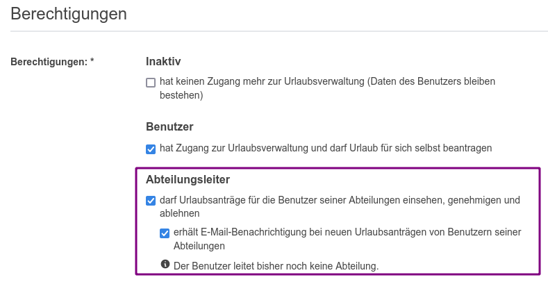
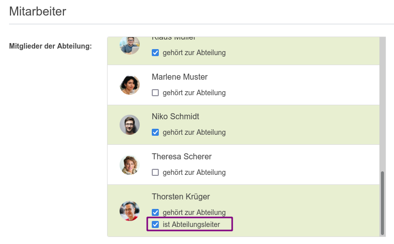

# Die Bedeutung von Abteilungen in der urlaubsverwaltung.cloud

Abteilungen sind eine gruppierung von Mitarbeitenden, 
die in der Regel ein berechtigtes Interesse daran haben die Abwesenheiten anderer Abteilungsmitglieder zu sehen,
um Urlaubsanträge untereinander abzustimmen. 
Zusätzlich kommt mit einer Abteilung die Möglichkeit einher, einen Abteilungsleiter benennen zu können,
der Abwesenheiten für die Mitglieder seiner Abteilungen einsehen, genehmigen und ablehnen darf.

## Wie kann eine Abteilung angelegt werden?

In der Menüleiste gibt es einen Punkt "Abteilungen". Hier kann man die
bestehenden Abteilungen sehen und über das "+"-Symbol neue Abteilungen anlegen.

## Wie werden Abteilungen Mitarbeiter zugeordnet?

Sowohl beim Anlegen einer neuen Abteilung als auch beim Bearbeiten einer
bestehenden Abteilung können die Mitarbeiter zu der Abteilung zugeordnet werden.

## Wie werden den Abteilungen Abteilungsleiter zugeordnet?

Damit ein Mitarbeiter überhaupt Abteilungsleiter werden kann, muss er die
entsprechende Berechtigung _Abteilungsleiter_ erhalten. Die Konfiguration von Berechtigungen wird [hier](../benutzer/#wie-stelle-ich-die-berechtigungen-eines-benutzers-ein) beschrieben.

  <picture>
    <source srcset="abteilungsleiter-berechtigung.avif" type="image/avif" />
    <source srcset="abteilungsleiter-berechtigung.webp" type="image/webp" />
    
  </picture>

Nun geht man über die Menüleiste zu den "Abteilungen". Hier bearbeitet man eine
bestehende Abteilung oder legt eine neue an. Beim Zuordnen der Mitarbeiter zu
einer Abteilung hat man nun bei den Benutzern, die die entsprechende
Berechtigung haben, die zusätzliche Auswahlmöglichkeit "ist Abteilungsleiter".
Wählt man diese aus und speichert die Zuordnung, ist der entsprechende Benutzer
nun Abteilungsleiter dieser Abteilung.

  <picture>
    <source srcset="abteilungsleiter-abteilung.avif" type="image/avif" />
    <source srcset="abteilungsleiter-abteilung.webp" type="image/webp" />
    
  </picture>

