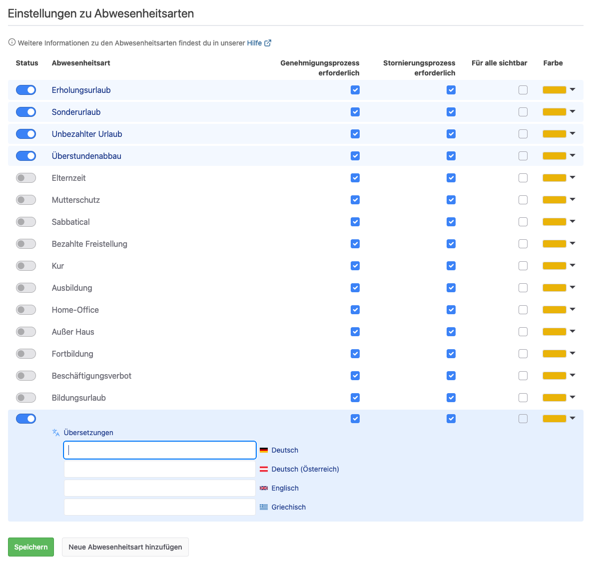

## Wer genehmigt eine Abwesenheit?

Der einfache Genehmigungsprozess für Abwesenheiten sieht vor, dass
Abwesenheitsanträge von einem Abteilungsleiter oder Chef genehmigt werden.

Außerdem gibt in der Urlaubsverwaltung auch
einen [zweistufigen Genehmigungsprozess](#wie-funktioniert-der-zweistufige-genehmigungsprozess-von-abwesenheitsantraegen)
.

## Wer wird informiert, wenn ein Abwesenheitsantrag gestellt wurde?

Wenn ein Abwesenheitsantrag gestellt wurde, erhält der betroffene Mitarbeitende sowie alle Personen, die ein berechtigtes Interesse
an dieser Information haben, wie der Abteilungsleiter und Freigabe-Verantwortlicher des Mitarbeitenden als auch globale 
Chefs eine E-Mail-Benachrichtigung.

Vorausgesetzt bei diesen Personen ist die entsprechende E-Mail-Benachrichtigung aktiviert.

## Wer wird informiert, wenn ein Abwesenheitsantrag genehmigt wurde?

Wenn ein Abwesenheitsantrag genehmigt wurde, erhalten sowohl der betroffene Mitarbeitende, sowie alle Personen die ein
berechtigtes Interesse an dieser Information haben, wie der Abteilungsleiter und Freigabe-Verantwortlicher des Mitarbeitenden als 
auch die Office-Mitarbeitenden eine E-Mail-Benachrichtigung.

Vorausgesetzt beim Office-Benutzer ist die entsprechende E-Mail-Benachrichtigung aktiviert.

## Wer wird informiert, wenn ein Abwesenheitsantrag abgelehnt wurde?

Wenn ein Abwesenheitsantrag abgelehnt wurde, erhält nur der betroffene Mitarbeiter
eine E-Mail.

## Kann eine Vertretung angegeben werden?

Ja, bei der Antragsstellung können optional eine oder mehrere Vertretungen angegeben werden. Für jede Vertretung kann
eine eigene Notiz hinterlegt werden. Die ausgewählten Personen werden über die Vertretung per E-Mail benachrichtigt.

  <picture>
    <source srcset="vertretung.avif" type="image/avif" />
    <source srcset="vertretung.webp" type="image/webp" />
    
  </picture>

Außerdem ist für die Vertretung unter dem Menü-Punkt "Abwesenheiten" im Abschnitt "Aktuelle und zukünftige Vertretungen"
eine Übersicht aller Vertretungen einsehbar.

  <picture>
    <source srcset="uebersicht-vertretungen.avif" type="image/avif" />
    <source srcset="uebersicht-vertretungen.webp" type="image/webp" />
    
  </picture>

## Wird die Vertretung informiert?

Die Vertretung erhält eine Mitteilung per E-Mail. Die E-Mail enthält zusätzlich einen Kalendereintrag als Anhang für den
Import in den eigenen Kalender.

## Wie funktioniert der zweistufige Genehmigungsprozess von Abwesenheiten?

Der einfache Genehmigungsprozess für Abwesenheitsanträge sieht vor, dass
die Anträge von einem Abteilungsleiter oder Chef genehmigt werden.

Beim zweistufigen Genehmigungsprozess ist der Antrag nach der
Genehmigung durch den zuständigen Abteilungsleiter nur vorläufig genehmigt.
Die endgültige Freigabe erfolgt durch einen Benutzer mit der Berechtigung zur
Freigabe.

Voraussetzungen: Wie beim Abteilungsleiter muss der Freigabe Verantwortliche der
Abteilung zugeordnet sein, für deren Mitarbeiter er zuständig ist. Des Weiteren
muss der zweistufige Genehmigungsprozess für die einzelnen Abteilungen aktiviert
werden. So lassen sich beide Workflows für jeweils verschiedene Abteilungen
nutzen.

## Welche Abwesenheitsarten gibt es?

Die Urlaubsverwaltung ist mit folgenden Abwesenheitsarten standardmäßig voreingestellt:

* Erholungsurlaub
* Sonderurlaub
* Unbezahlter Urlaub
* Überstundenabbau

Zusätzlich sind viele weitere Abwesenheitsarten in den globalen Einstellungen der Urlaubsverwaltung aktivierbar.

Die Aktivierung und Deaktivierung ist zu jeder Zeit möglich, bitte beachte das durch eine Änderung der Einstellungen
bereits vorhandene Abwesenheiten nicht verändert werden.

## Wie können zusätzliche Abwesenheitsarten konfiguriert werden?

Ja, es ist möglich weitere Abwesenheitsarten zu konfigurieren. Diese können in den globalen Einstellungen der
Urlaubsverwaltung konfiguriert werden. Fehlt dir eine Abwesenheitsart
dann [schreib uns](mailto:info@urlaubsverwaltung.cloud?subject=Weitere%20Abwesenheitsart) einfach!

  <picture>
    <source srcset="abwesenheitsarten.avif" type="image/avif" />
    <source srcset="abwesenheitsarten.webp" type="image/webp" />
    
  </picture>

## Ist es möglich für eine Abwesenheitsart den Genehmigungsprozess zu aktivieren / deaktivieren?

Ja, du kannst pro Abwesenheitsart festlegen, ob eine Genehmigung notwendig ist, z.B. könnte man die Abwesenheitsart 
"Ausbildung" ohne Genehmigungsprozess konfigurieren, wohingegen eine "Fortbildung" genehmigt werden muss.

Bitte beachte zusätzlich, dass der für die Abteilung aktive Genehmigungsprozess verwendet wird.

## Ist es möglich eine bestimmte Abwesenheitsarten für alle Mitarbeitenden sichtbar zu machen?

Ja, du kannst pro Abwesenheitsart festlegen, ob diese für alle Mitarbeitenden sichtbar ist und ohne Informationsverlust
dargestellt wird.  
Was bedeutet das?
Wenn bei einer Abwesenheitsart die Checkbox "sichtbar" deaktiviert ist, werden die Informationen dieser Anträge
lediglich für die Mitarbeitenden dargestellt, welche ein berechtigtes Interesse an der Information haben, dass es sich 
z.B. um einen Erholungsurlaub handelt.
Ist die Checkbox aktiviert, erhalten alle Mitarbeitenden, welche die Anträge der Person sehen können, die Information
über die Abwesenheitsart.

## Ist es möglich die Anzeigefarbe einer Abwesenheitsart anzupassen?

Ja, du kannst bei den Einstellungen zu Abwesenheitsarten die Farbe pro Abwesenheitsart konfigurieren. 
Diese Farbe wird dann in allen Kalendern und in der Abwesenheitsübersicht verwendet.

## Wie kann ich die Art der Abwesenheit bei einem Antrag bearbeiten?

Die Art der Abwesenheit kann noch angepasst werden, solange der Antrag noch nicht genehmigt wurde. Das Bearbeiten kann
durch den Mitarbeiter selbst durchgeführt werden.

  <picture>
    <source srcset="abwesenheit-bearbeiten.avif" type="image/avif" />
    <source srcset="abwesenheit-bearbeiten.webp" type="image/webp" />
    
  </picture>

Um einen bereits genehmigten Antrag zu editieren, muss der bisherige Antrag storniert werden. Ein Benutzer mit der
Berechtigung Office kann den Abwesenheitsantrag stornieren und einen neuen Abwesenheitsantrag mit der korrekten Art der
Abwesenheit für den gleichen Zeitraum erstellen. Alternativ kann der Antragsteller zunächst die Stornierung seines
Antrags anfragen. Sobald diese Stornierungsanfrage genehmigt wurde, kann für den betreffenden Zeitraum ein neuer Antrag
mit der korrekten Art der Abwesenheit erstellt werden.

## Wie funktioniert der Übergang zwischen zwei Jahren?

Der Erholungsurlaub, welcher im bisherigen Jahr noch nicht genommen wurde, wird in das folgende Jahr als Resturlaub mit Verfall zum Stichtag übernommen. Diese
Übernahme passiert in den Standard-Einstellungen am 1.1. des Folgejahres um 05:00 Uhr.
Der übernommene Resturlaub beinhaltet alle bis zum 31.12. nicht genommenen Urlaubstage. Dieser Resturlaub kann dann bis
zum Ende des Monats März genommen werden. Somit verfällt der Resturlaub in den Standardeinstellungen zum 1. April. Dieser Stichtag kann pro Benutzer konfiguriert werden, sodass der Resturlaub zu einem anderen Stichtag genommen werden muss.

## Workflow bei Abwesenheitsanträgen

  <picture>
    <source srcset="absence-workflow.avif" type="image/avif" />
    <source srcset="absence-workflow.webp" type="image/webp" />
    
  </picture>

