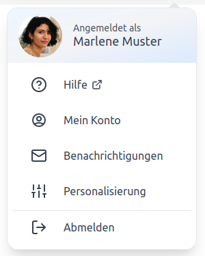
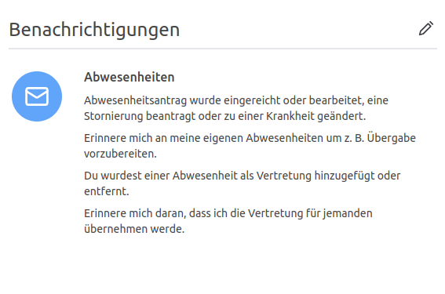

## Wie kann ich den E-Mail-Versand für mich oder einer anderen Person aktivieren oder deaktivieren?

Als Benutzer kann ich jederzeit meine eigenen Benachrichtigungen bzw. mit der Berechtigung _Office_ die einer anderen
Person anpassen. Diese Einstellung ist für sich selbst über das Avatar-Menü bzw. für anderen Personen über das Konto
der Person möglich.

    <picture>
        <source srcset="avatar_menue.avif" type="image/avif" />
        <source srcset="avatar_menue.webp" type="image/webp" />
        
    </picture>
    <picture>
        <source srcset="konto_benachrichtigungen.avif" type="image/avif" />
        <source srcset="konto_benachrichtigungen.webp" type="image/webp" />
        
    </picture>

Benachrichtigungen können pro Person aktiviert bzw. deaktiviert werden. Hier bleibt es ganz der Person
überlassen, welche Nachrichten diese per E-Mail erhalten möchte. Bestimmte Benachrichtigungen können nur mit einer
bestimmten Berechtigung aktiviert werden. Zum Beispiel wird die Benachrichtigung, dass sich eine neue Person angemeldet
hat, wird nur Personen mit der Berechtigung _Office_ bzw. _Chef_ angezeigt.

<picture>
    <source srcset="benachrichtigung.avif" type="image/avif" />
    <source srcset="benachrichtigung.webp" type="image/webp" />
    
</picture>

## Welche Benachrichtigungen gibt es in der Urlaubsverwaltung die ich derzeit noch nicht deaktivieren kann?

Bei folgenden Ereignissen werden Benachrichtigungen an die betreffenden Personen versendet:

- Erinnerung an offene Urlaubsanträge
- Erinnerung an das Ende der Lohnfortzahlung
- Informationen zum vorhandenen Resturlaub bei Jahreswechsel
- Eine neue Person wurde zur Urlaubsverwaltung hinzugefügt
