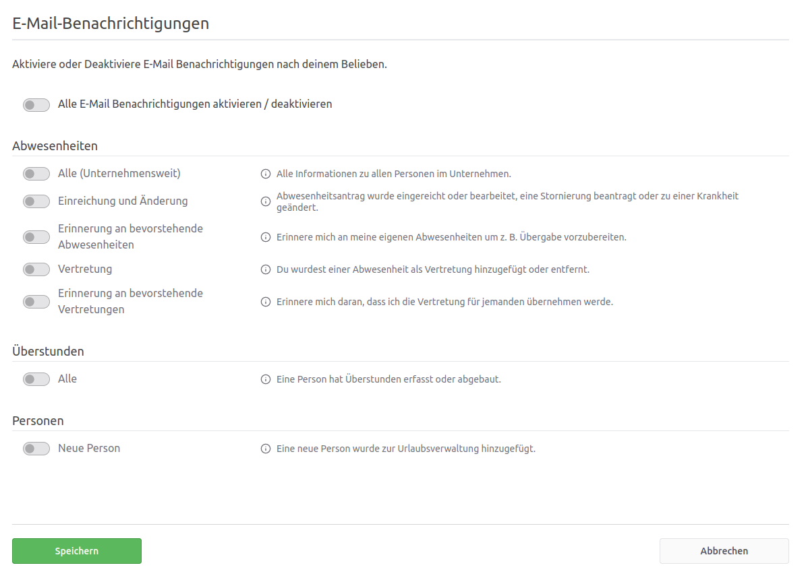

## Wie kann ich den E-Mail-Versand für bestimmte Benutzer deaktivieren?

Als Benutzer mit der Berechtigung _Office_ können die Einstellungen der Benachrichtigungen über das Konto des Benutzers angepasst werden. Diese Einstellung ist bei der Zuordnung von Berechtigungen zu finden. Hier kann man zusätzlich auszuwählen, ob die E-Mail-Benachrichtigung zur jeweiligen Berechtigung aktiv oder nicht aktiv sein soll.

  <picture>
    <source srcset="benachrichtigung.avif" type="image/avif" />
    <source srcset="benachrichtigung.webp" type="image/webp" />
    
  </picture>

Die E-Mail-Benachrichtigung, die
man erhält, wenn der eigene Urlaubsantrag genehmigt/abgelehnt/storniert wurde,
kann man nicht deaktivieren.

## Welche Benachrichtigungen gibt es in der Urlaubsverwaltung?

Bei folgenden Ereignissen werden Benachrichtigungen an die betreffenden Personen versendet:

* Statusänderungen eines Urlaubsantrags
* Information der Urlaubsvertretung
* Erinnerung an offene Urlaubsanträge
* Erfassung von Überstunden
* Erinnerung an das Ende der Lohnfortzahlung
* Informationen zum vorhandenen Resturlaub bei Jahreswechsel
* Neuer Benutzer
