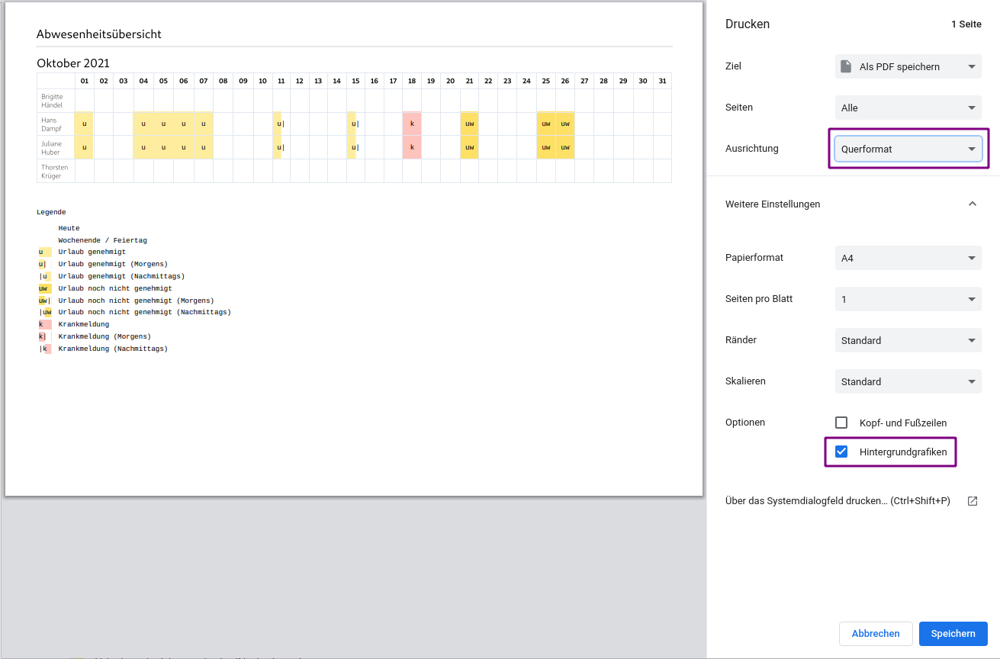

## Gibt es die Möglichkeit Ausdrucke zu erstellen?

Ja, viele Ansichten der Urlaubsverwaltung bieten die Möglichkeit einen Ausdruck zu erstellen über ein "Drucken"-Symbol. Es ist außerdem möglich über die
Standard-Druckfunktion des Browsers zu Drucken. Wie man bspw. im Firefox
Webseiten druckt, kann man [hier](https://support.mozilla.org/de/kb/Eine-Webseite-drucken) nachlesen.

## Welche Optionen werden zum Drucken empfohlen?

Manche Seiten der Urlaubsverwaltung haben sehr viel horizontalen Inhalt, können
daher nur im Querformat sinnvoll gedruckt werden. Beim Auslösen des Drucks ist dann also
darauf zu achten, dass beim Punkt "Ausrichtung" der Wert "Querformat" aktiviert
ist. Zusätzlich gibt es die Option, dass Hintergrundgrafiken dargestellt werden. Diese Option ist z. B. bei der Abwesenheitsübersicht relevant um hier die Markierung der verschiedenen Abwesenheitenarten korrekt darzustellen.

