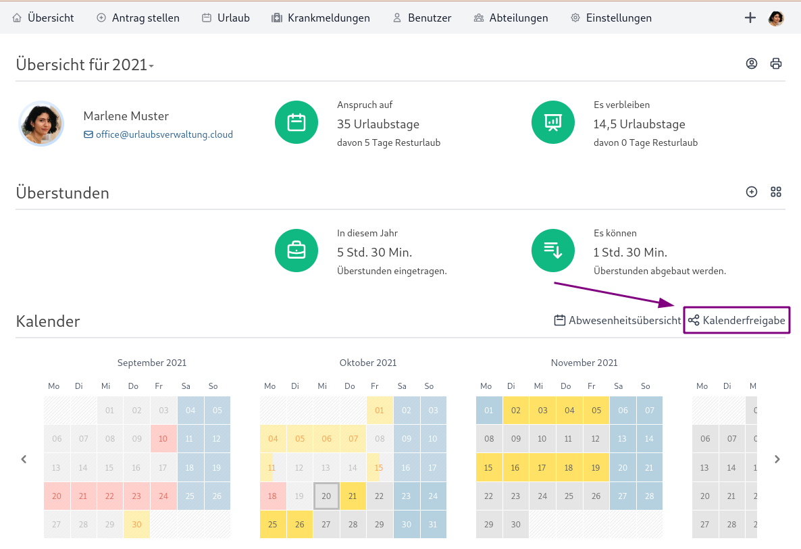
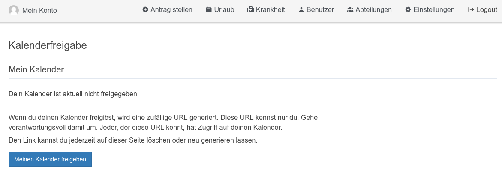
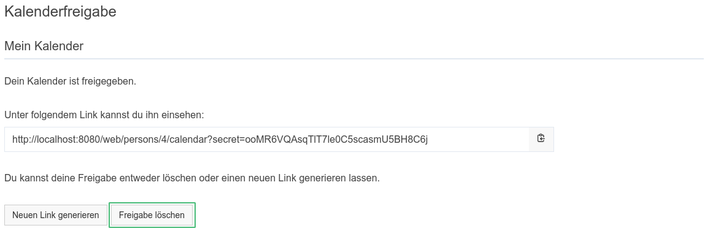

## Kalenderfreigabe

### In welchem Format werden die Kalender der Urlaubsverwaltung freigegeben?

Die Urlaubsverwaltung ermöglicht die Freigabe von Abwesenheiten im iCal-Format.

### Was ist das iCal-Format?

iCal oder auch iCalendar ist ein standardisiertes Datenformat zum Austausch von Kalenderinhalten. Das iCalendar-Format wird von der Mehrzahl von Kalender-Programmen akzeptiert und bietet die Möglichkeit Kalenderdaten einzubinden (abonnieren).

### Welche Formen der Kalenderfreigabe gibt es?

Die Urlaubsverwaltung bietet die folgenden Möglichkeiten für eine Kalenderfreigabe:

* **Mein Kalender**: Der Freigabe-Link enthält nur deine Abwesenheiten
* **Abteilung**: Der Freigabe-Link enthält die Abwesenheiten deiner Abteilung
* **Firma**: Der Freigabe-Link enthält die Abwesenheiten deiner Firma. Diese Freigabe ist nur möglich, wenn ein Office-Benutzer die Konfigurationsmöglichkeit erlaubt hat.

<aside class="wissensbasis-info">
  

    Diesen Freigabe-Link kennst nur du. Gehe verantwortungsvoll damit um. Jeder, der diese URL kennt, hat Zugriff auf deinen Kalender.
  

</aside>

### Wie kann ich einen Kalender freigeben?

Die Kalenderfreigabe kann pro Benutzer konfiguriert werden. Um die Konfiguration in der Urlaubsverwaltung durchzuführen sind folgende Schritte zu tun:
1. Klicke auf "Kalenderfreigabe" in der Übersichtsseite oberhalb des Kalenders

  <picture>
    <source srcset="kalenderfreigabe.avif" type="image/avif" />
    <source srcset="kalenderfreigabe.webp" type="image/webp" />
    
  </picture>

2. Wähle z. B. "Meinen Kalender freigeben"

  <picture>
    <source srcset="kalenderfreigabe-aktivieren.avif" type="image/avif" />
    <source srcset="kalenderfreigabe-aktivieren.webp" type="image/webp" />
    
  </picture>

3. Es wird ein geheimer Link generiert, welchen du jetzt zum Abonnieren verwenden kannst. Weitere Infos über das Abonnieren findest du [hier](#welche-moeglichkeiten-habe-ich-eine-ical-kalenderfreigabe-in-meinem-client-zu-verwenden).

  <picture>
    <source srcset="kalenderfreigabe-link.avif" type="image/avif" />
    <source srcset="kalenderfreigabe-link.webp" type="image/webp" />
    
  </picture>

### Wie kann ich eine Freigabe löschen?

Eine Freigabe kann über folgende Schritte gelöscht werden:
1. Klicke auf "Kalenderfreigabe" in der Übersichtsseite oberhalb des Kalenders

  <picture>
    <source srcset="kalenderfreigabe.avif" type="image/avif" />
    <source srcset="kalenderfreigabe.webp" type="image/webp" />
    
  </picture>

2. Wähle beim betreffenden Kalender "Freigabe löschen". Durch das Löschen ist der Zugriff über den geheimen Link nicht mehr möglich.

  <picture>
    <source srcset="kalenderfreigabe-loeschen.avif" type="image/avif" />
    <source srcset="kalenderfreigabe-loeschen.webp" type="image/webp" />
    
  </picture>

### Welche Möglichkeiten habe ich eine iCal Kalenderfreigabe in meinem Client zu verwenden?

Hier eine Liste von Anleitungen beliebter Kalenderlösungen, welche die iCal Kalenderfreigabe unterstützen:

<ul>
<li><a href="https://support.apple.com/de-de/guide/calendar/icl1022/mac" target="_blank" rel="noopener">Apple Calendar</a></li>
<li><a href="https://support.google.com/calendar/answer/37100" target="_blank" rel="noopener">Google Calendar</a></li>
<li><a href="https://support.microsoft.com/de-de/office/importieren-oder-abonnieren-eines-kalenders-in-outlook-com-cff1429c-5af6-41ec-a5b4-74f2c278e98c" target="_blank" rel="noopener">Apple Calendar</a></li>
<li><a href="https://support.mozilla.org/de/kb/neue-kalender-erstellen#w_icalendar-ics" target="_blank" rel="noopener">Mozilla Thunderbird</a></li>
</ul>

### Wird die iCal Kalenderfreigabe die bisherigen Kalenderintegrationen wie Exchange und Google Calendar ersetzen?

Ja, wir haben die Kalenderintegration für Google Calendar und Exchange in Version 4 der Urlaubsverwaltung als `deprecated` markiert und werden diese in Version 5 entfernen. Die Integration kann aber ohne weitere Einschränkungen durch die iCal Kalenderfreigabe ersetzt werden.

#### Welche Vorteile bringt mir das?

Durch die iCal Kalenderfreigabe können die Berechtigungen und Sichtbarkeiten feingranular konfiguriert werden, wodurch ein Datenschutz-konformer Einsatz möglich wird.

## Microsoft Exchange

<aside class="wissensbasis-info">
  

    Die Kalender Integration mit Microsoft Exchange / Outlook Kalender ist von Microsoft <a target="_blank" href=https://devblogs.microsoft.com/microsoft365dev/upcoming-changes-to-exchange-web-services-ews-api-for-office-365/>abgekündigt</a> und wird daher nicht mehr gepflegt. Wir empfehlen daher die allgemeine <a href="#kalenderfreigabe">Kalenderfreigabe</a>. 
  

</aside>

### Welche Bedingungen muss der Exchange Benutzer erfüllen?

Es wird die E-Mail-Adresse und das Passwort des Exchange / Outlook Benutzers angegeben,
der automatisch Termine anlegen soll. Für diese Zugangsdaten muss der
"auto discovery"-Dienst funktionieren - am Besten dies vorher separat testen.

Außerdem muss der Benutzer über folgende Berechtigungen verfügen:
* Kalender anlegen können
* Termine im angegebenen Kalender anlegen können
* beim Anlegen von Terminen die entsprechenden Benutzer einladen können
(E-Mail-Adresse der Benutzer wird hierzu verwendet)

### Muss der konfigurierte Kalender existieren?

Bei der Synchronisierung wird überprüft, ob es bereits einen Kalender mit dem
angegebenen Namen gibt. Wenn kein Kalender mit diesem Namen existiert, wird
automatisch ein neuer angelegt.

## Google Calendar

<aside class="wissensbasis-info">
  

    Die Google Kalender Integration wird nicht mehr gepflegt und wird demnächst ersetzt mit der 
    allgemeinen <a href="#kalenderfreigabe">Kalenderfreigabe</a>.
  

</aside>

Die Urlaubsverwaltung bietet die Funktionalität Kalendereinträge in einen Kalender innerhalb von Google Calendar zu synchronisieren.
Um die Synchronisation zu konfigurieren müssen folgende Voraussetzungen geschaffen werden:

1. **Google Calendar API** aktivieren ([Enable and disable APIs](https://cloud.google.com/apis/docs/enable-disable-apis))
2. Die **OAuth2 Client Id** als Webanwendung konfigurieren (https://console.developers.google.com).
3. Das **OAuth2 Client Secret** bekommt man durch die Konfiguration des OAuth Clients.
4. Die **Kalender ID** ist die sogenannte "Kalenderadresse" die man in den jeweiligen Kalenderdetails findet.
5. Die **Weiterleitungs-URL** muss beim OAuth Client als "Autorisierte Weiterleitungs-URL" angegeben werden.
