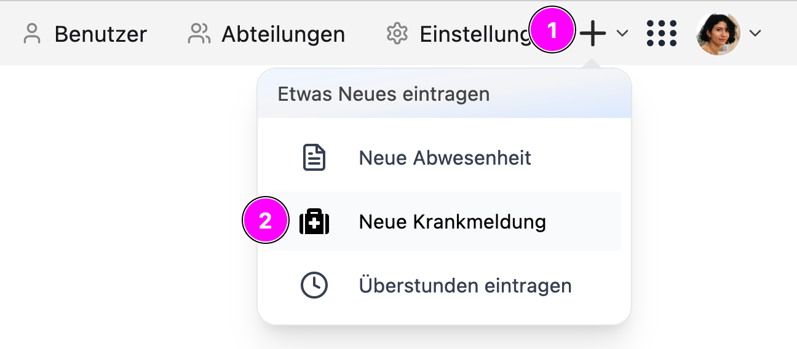
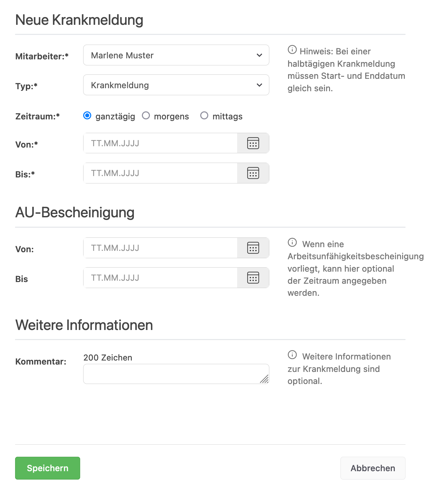
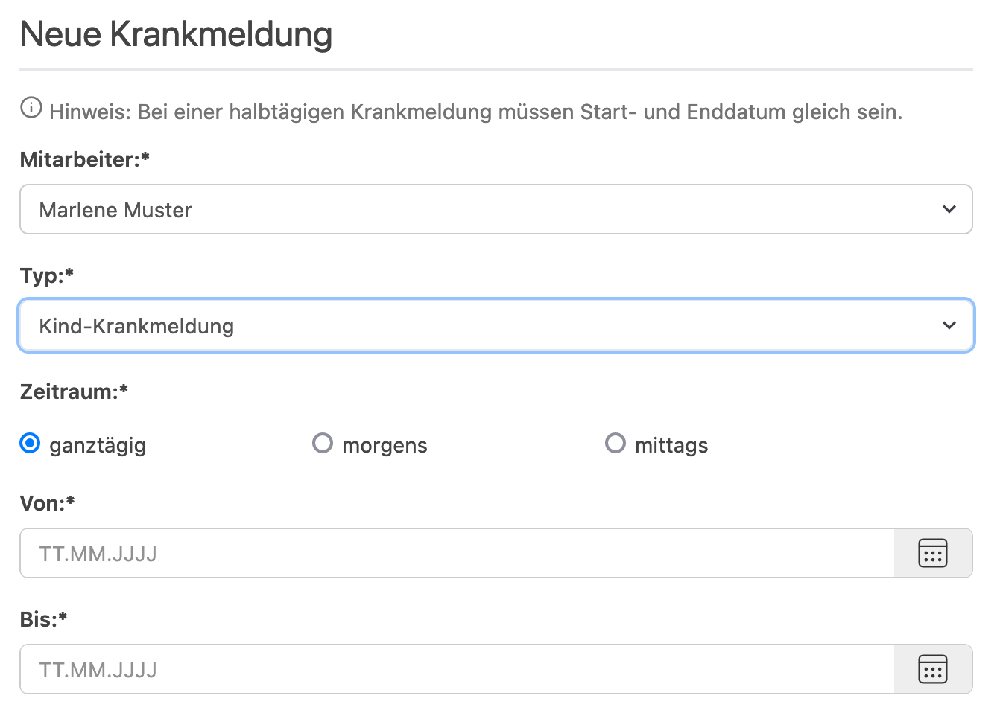
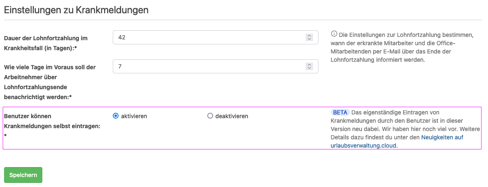
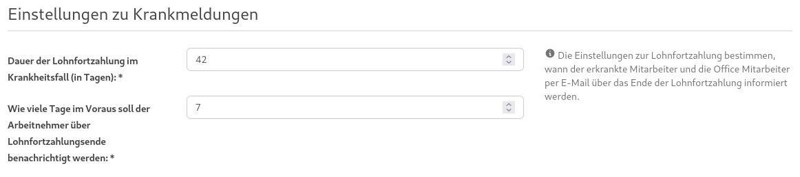

# Krankmeldungen in der urlaubsverwaltung.cloud

## Kann eine Krankmeldung eingetragen werden?

Ja, eine Krankmeldung kann als Benutzende mit der Berechtigung _Office_ oder mit der Berechtigung
_Pflege von Krankmeldungen_ für andere Mitarbeitende eingetragen werden, in dem die Krankmeldung über
das "+"-Symbol _Neue Krankmeldung_ ausgewählt wird.

  <picture>
    <source srcset="krankmeldung-dialog-oeffnen.avif" type="image/avif" />
    <source srcset="krankmeldung-dialog-oeffnen.webp" type="image/webp" />
    
  </picture>

Für eine Krankmeldung können alle relevanten Informationen, wie z.B. den Zeitraum der AU-Bescheinigung, erfasst werden.

  <picture>
    <source srcset="krankmeldung-dialog.avif" type="image/avif" />
    <source srcset="krankmeldung-dialog.webp" type="image/webp" />
    
  </picture>

## Ist es möglich eine Kind-Krankmeldung zu erfassen?

Ja, eine Kind-Krankmeldung kann erfasst werden, indem der Typ von _Krankmeldung_ auf _Kind-Krankmeldung_ umgestellt wird.

  <picture>
    <source srcset="kindkrankmeldung.avif" type="image/avif" />
    <source srcset="kindkrankmeldung.webp" type="image/webp" />
    
  </picture>

## Kann eine Mitarbeitende die Krankmeldung selbst einreichen?

Ja, die Einreichung einer Krankmeldung durch die Mitarbeitende ist mit folgenden Einstellung unter "Abwesenheiten" im Abschnitt "Einstellungen zu Krankmeldungen" möglich:

Weitere Informationen zur Verwendung finden sich in [diesem Blog-Beitrag](https://urlaubsverwaltung.cloud/neuigkeiten/2024-06-14-selbsteintragen-von-krankmeldungen/)

  <picture>
    <source srcset="einstellungen-krankmeldung-selbsteintragen.avif" type="image/avif" />
    
  </picture>

## Wird an das Ende der Lohnfortzahlung erinnert?

Ja, die Urlaubsverwaltung erinnert sowohl den Mitarbeiter als auch Personen mit der Berechtigung 
_Office_ an das Ende der Lohnfortzahlung, sofern der zusammenhängende Zeitraum einer Krankmeldung
sechs Wochen übersteigt.

Hierzu können in den _Einstellungen_ unter _Abwesenheiten_ die entsprechenden Zeiten gepflegt werden:

  <picture>
    <source srcset="krankmeldung-einstellungen.avif" type="image/avif" />
    <source srcset="krankmeldung-einstellungen.webp" type="image/webp" />
    
  </picture>

## Ablauf bei Krankmeldungen

  <picture>
    <source srcset="krankmeldung.avif" type="image/avif" />
    <source srcset="krankmeldung.webp" type="image/webp" />
    
  </picture>

## Was passiert, wenn eine Krankmeldung in einem Urlaubszeitraum angelegt wird?

Wenn eine Krankmeldung innerhalb eines gebuchten Urlaubs angelegt wird, wird
momentan der Urlaub für die Krankheitstage nicht automatisch storniert. Man muss
den Urlaub händisch stornieren und anschließend die Krankmeldung anlegen.

Beispiel: Max Mustermann hat Urlaub vom 23.11. - 27.11. und war nun am 25.11.
krank

Vorgehen:

- Man storniert den kompletten Urlaubsantrag (23.11. - 27.11.)
- Man legt eine Krankmeldung für den 25.11. an
- Man legt Urlaub für 23.11. - 24.11. plus für den 26.11. - 27.11. an