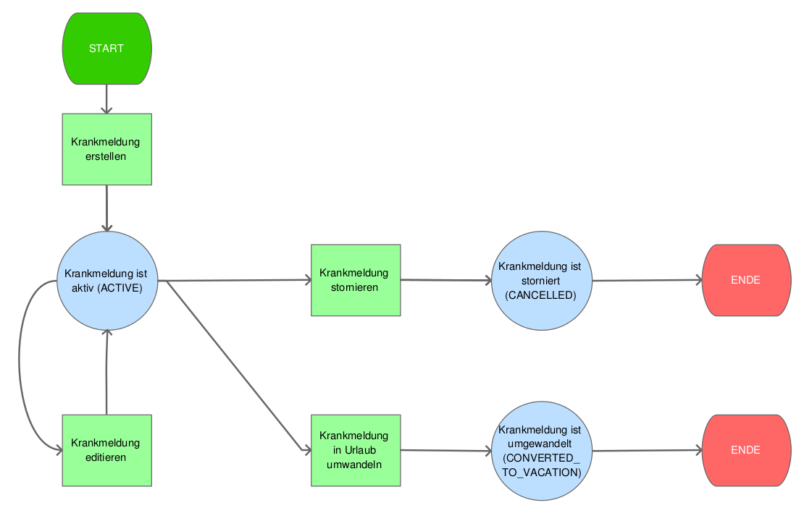

## Wird an das Ende der Lohnfortzahlung erinnert?

Ja, die Urlaubsverwaltung erinnert sowohl den Mitarbeiter als auch Personen mit der Berechtigung Office an das Ende der Lohnfortzahlung sofern der zusammenhängende Zeitraum einer Krankmeldung sechs Wochen übersteigt.

Hierzu können in den _Einstellungen_ unter _Abwesenheiten_ die entsprechenden Zeiten gepflegt werden:

  <picture>
    <source srcset="krankmeldung-einstellungen.avif" type="image/avif" />
    <source srcset="krankmeldung-einstellungen.webp" type="image/webp" />
    
  </picture>

## Ablauf bei Krankmeldungen

  <picture>
    <source srcset="krankmeldung.avif" type="image/avif" />
    <source srcset="krankmeldung.webp" type="image/webp" />
    
  </picture>

## Was passiert, wenn eine Krankmeldung in einem Urlaubszeitraum angelegt wird?

Wenn eine Krankmeldung innerhalb eines gebuchten Urlaubs angelegt wird, wird
momentan der Urlaub für die Krankheitstage nicht automatisch storniert. Man muss
den Urlaub händisch stornieren und anschließend die Krankmeldung anlegen.

Beispiel: Max Mustermann hat Urlaub vom 23.11. - 27.11. und war nun am 25.11.
krank

Vorgehen:
* Man storniert den kompletten Urlaubsantrag (23.11. - 27.11.)
* Man legt eine Krankmeldung für den 25.11. an
* Man legt Urlaub für 23.11. - 24.11. plus für den 26.11. - 27.11. an
