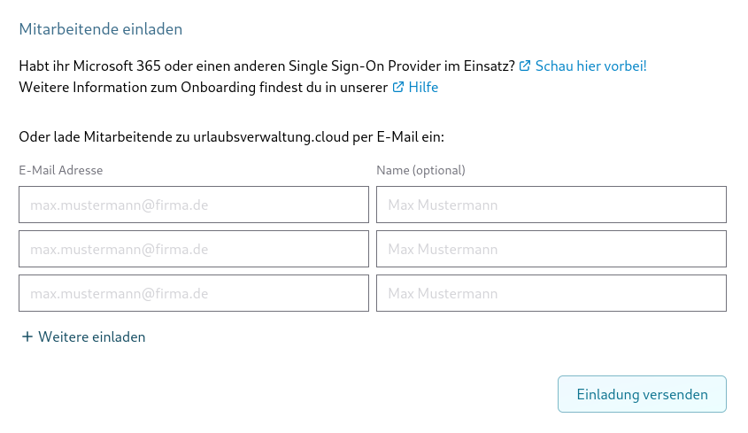

## Onboarding deiner Mitarbeitenden in deine Urlaubsverwaltung

Es gibt drei unterschiedliche Möglichkeiten Mitarbeitende in deine Urlaubsverwaltung aufzunehmen.

### Mitarbeitende einladen

Nachdem deine Urlaubsverwaltung bereitgestellt wurde, erhälst du von uns per E-Mail einen Link zu deinem Kundenportal.
Alternativ findest du das Kundenportal direkt über die Anmeldung (oben rechts) auf https://urlaubsverwaltung.cloud.
Danach weiter auf "Mein Kundenportal".
Im Kundenportal kannst du neue Mitarbeitende per E-Mail-Adresse eine Einladung zu deiner Urlaubsverwaltung versenden. Die Funktion findest du unter "Meine Urlaubsverwaltung" » "Neue Mitarbeitende einladen".
Die Mitarbeitenden erhalten darauf eine Einladung per E-Mail und können sich ausschließlich mit dieser bei deiner Urlaubsverwaltung registrieren.

  <picture>
    <source srcset="invite-form.avif" type="image/avif" />
    <source srcset="invite-form.webp" type="image/webp" />
    
  </picture>

### Single Sing-On konfigurieren

Die Urlaubsverwaltung nutzt zur Verwaltung von Benutzern einen konfigurierbaren Security Provider.
Verwendet ihr Microsoft 365 oder einen anderen OpenID Connect Anbieter, dann
kannst du ihn einfach im Portal konfigurieren, sodass ihr euren gewohnten Login benutzen könnt.
Details zur Konfiguration findest du unter [Single Sign-On](/hilfe/sso).

### CSV-Datei senden

Hast du viele Mitarbeitende, jedoch keinen Single Sing-On Provider, kannst du uns auch einfach eine [CSV-Datei](https://urlaubsverwaltung.cloud/neuigkeiten/2021-11-19-onboarding-csv/) zukommen lassen.
