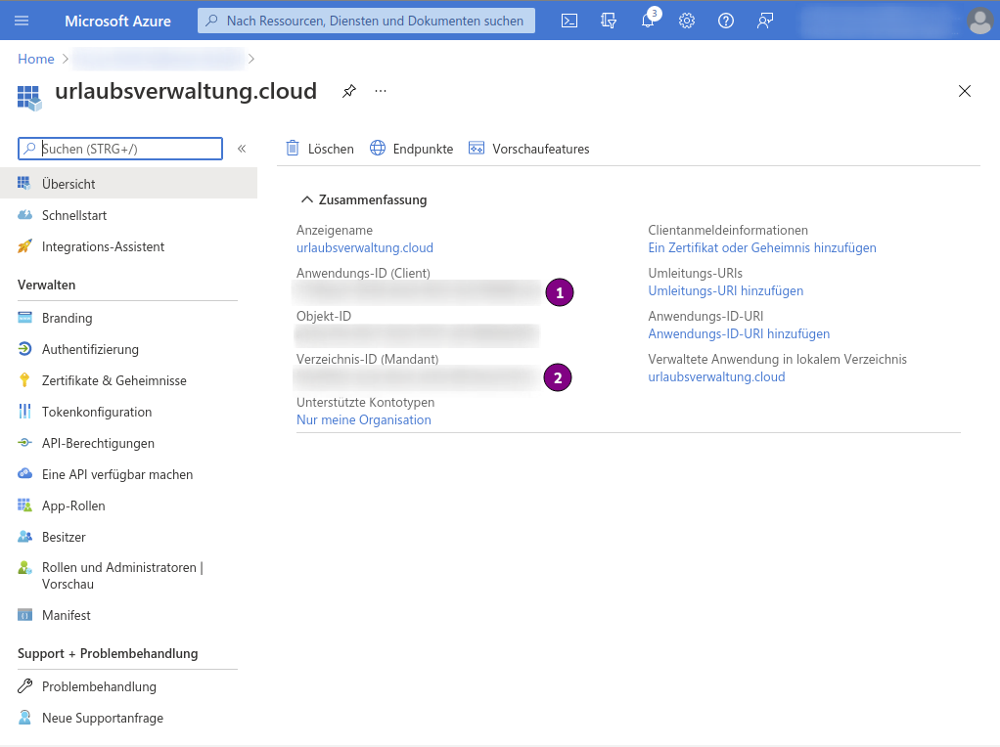
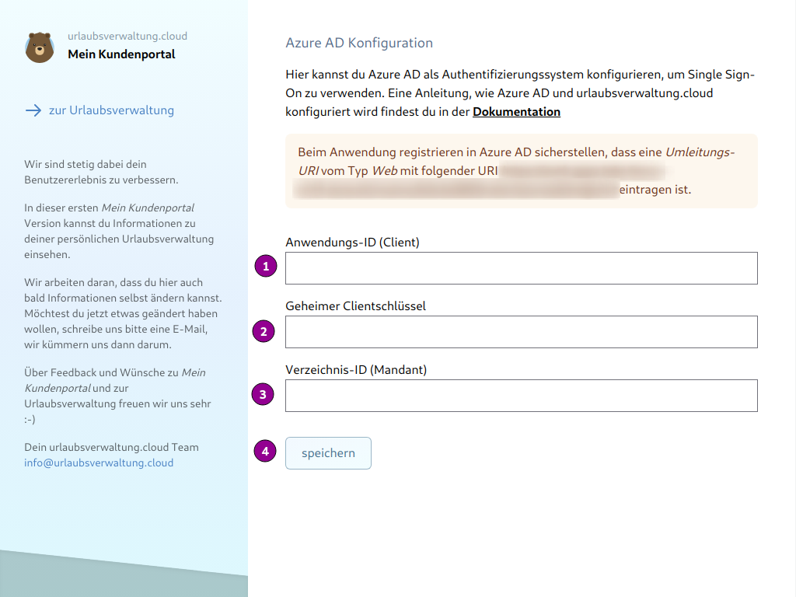
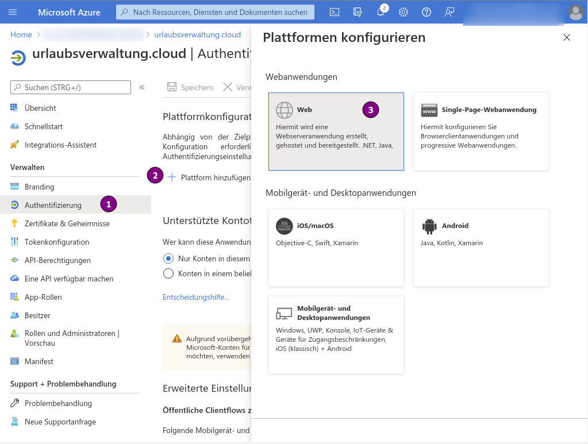
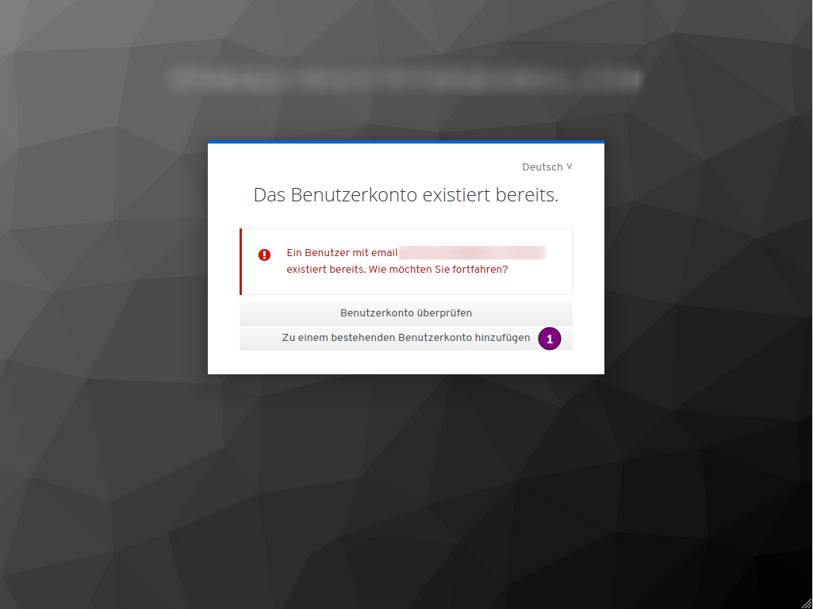
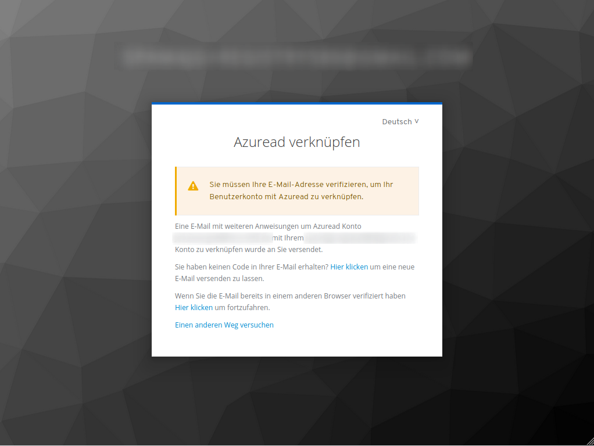
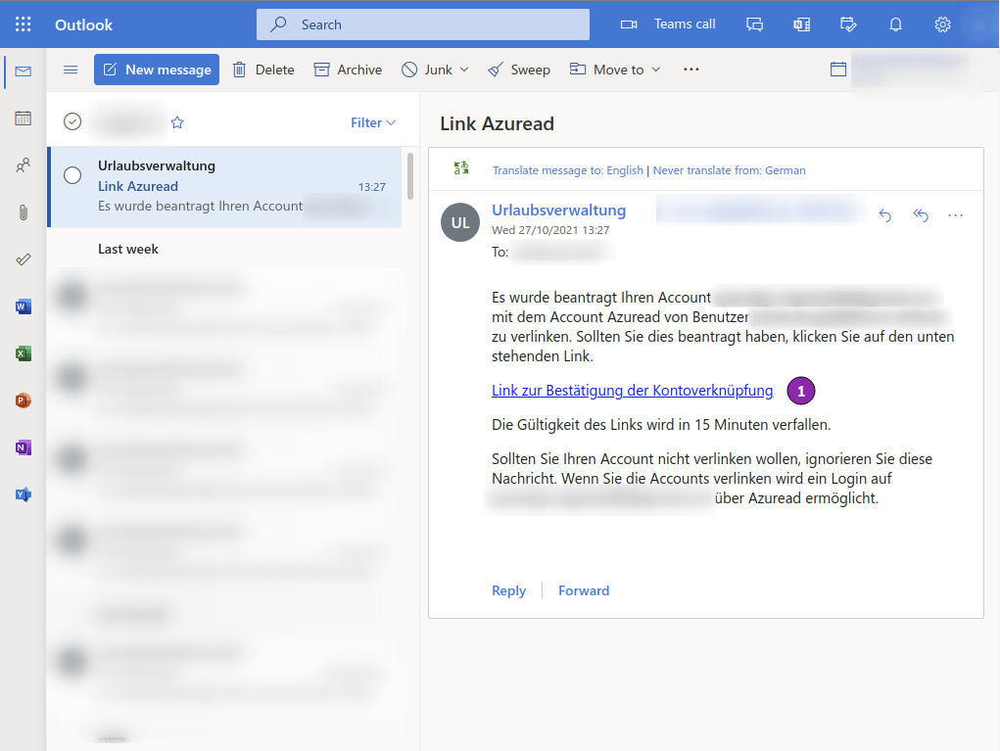

# Single Sign-On mit Azure Active Directory (Azure AD)

## Welcher Benutzer darf die Azure AD Anbindung konfigurieren?

Die Konfiguration kann nur von dem Benutzer durchgeführt werden, welcher die Registrierung zu
urlaubsverwaltung.cloud durchgeführt hat. Dieser Benutzer hat die Berechtigung auf _Mein Kundenportal_, über
welches die Konfiguration durchgeführt werden kann.

Zu _Mein Kundenportal_ gelangst du über _[urlaubsverwaltung.cloud](https://urlaubsverwaltung.cloud)_ > _Login_ und nach erfolgreichem Login über die Kachel _Mein Kundenportal_.

## Wie können Benutzer aus Active Directory verwendet werden?

Eine direkte Anbindung von einer lokalen Active Directory Instanz zu urlaubsverwaltung.cloud wird nicht
unterstützt. Jedoch ist es möglich Benutzer aus deinem Active Directory zu verwenden, wenn dieses via Azure
AD Connect mit Azure AD synchronisiert wird.
Details dazu findest du bei Microsoft in der Dokumentation [Installation von Azure AD Connect](https://docs.microsoft.com/de-de/azure/active-directory/hybrid/how-to-connect-install-express).

## Welche Daten eines Benutzers aus Azure AD werden verwendet?

Bei der Anbindung von Azure AD erhalten wir über den _ID Token_ Zugriff auf folgende Attribute:

- _email_: Die E-Mail-Adresse des Benutzers
- _family_name_: Der Nachname des Benutzers
- _given_name_: Der Vorname des Benutzers

### Welche API Berechtigungen von Microsoft werden verwendet?

Durch die Ansprüche im _ID Token_ benötigt die registrierte App folgende Berechtigungen auf die _Microsoft Graph_-API:

- _email_
- _openid_
- _profile_
- _User.Read_

## Wie kann ich die Azure AD Anbindung konfigurieren?

Dazu sind folgende Schritte notwendig:

- [Schritt 1: Neue App-Registrierung im Azure AD durchführen](#schritt-1-neue-app-registrierung-im-azure-ad-durchfuehren)
- [Schritt 2: Auf Mein Kundenportal die Anbindung konfigurieren](#schritt-2-auf-mein-kundenportal-die-anbindung-konfigurieren)
- [Schritt 3: Für App-Registrierung Umleitungs-URI konfigurieren](#schritt-3-fuer-app-registrierung-umleitungs-uri-konfigurieren)
- [Schritt 4: Anmelden via Azure AD](#schritt-4-anmeldung-via-azure-ad)

### Schritt 1: Neue App-Registrierung im Azure AD durchführen

Zunächst musst du dich im [Azure-Portal](https://portal.azure.com/) mit deinem Azure-Konto anmelden. Danach
wechselst du zu _Azure Active Directory_ > _App-Registrierungen_ > _Neue Registrierung_ und kannst mit der
Registrierung starten.

  <picture>
    <source srcset="schritt_1_registrieren.avif" type="image/avif" />
    <source srcset="schritt_1_registrieren.webp" type="image/webp" />
    
  </picture>

1. Als _Name_ der Anwendung kann z. B. _urlaubsverwaltung.cloud_ verwendet werden
2. Für den Punkt _Unterstütze Kontotypen_ muss _Nur Konten in diesem Organisationsverzeichnis_ ausgewählt werden
3. Umleitungs-URI überspringen und wird in [Schritt 3](#schritt-3:-fuer-app-registrierung-umleitungs-uri-konfigurieren) konfiguriert
4. Nun auf _Registrieren_ klicken

Nach erfolgreicher Registrierung kommst du auf die Übersichtsseite der App-Registrierung.

  <picture>
    <source srcset="schritt_1_uebersicht.avif" type="image/avif" />
    <source srcset="schritt_1_uebersicht.webp" type="image/webp" />
    
  </picture>

Auf dieser Seite findest du zwei wichtige Informationen, welche in [Schritt 2](#schritt-2:-auf-mein-kundenportal-die-anbindung-konfigurieren) benötigt werden.
Am besten erstellt man eine Datei über einen Texteditor (z.B. Notepad) und kopiert die Werte dort hinein.

1. Wert von _Anwendungs-Id_ kopieren und in Textdatei einfügen
2. Wert von _Verzeichnis-Id_ kopieren und in Textdatei einfügen

Neuer geheimer Clientschlüssel erstellen

  <picture>
    <source srcset="schritt_1_clientsecret.avif" type="image/avif" />
    <source srcset="schritt_1_clientsecret.webp" type="image/webp" />
    
  </picture>

1. Im Menu zu _Zertifikate & Geheimnisse_ wechseln
2. _Neuer geheimer Clientschlüssel_ klicken
3. Unter _Beschreibung_ eine Beschreibung vergeben z.B. _oidc-client-secret-2021-10_
4. _Gültig bis_ die Laufzeit des Clientschlüssels auswählen.

<aside class="wissensbasis-info">
  
Achtung

  

    Hierbei ist darauf zu achten, dass ein paar Tage vor Ablauf des Clientschlüssels ein neuer Clientschlüssel für
    die Anwendung in Azure AD erzeugt werden muss. Dieser neue Clientschlüssel kann danach im Portal von
    urlaubsverwaltung.cloud konfiguriert werden. Falls dies nicht vor Ablauf des Clientschlüssel durchgeführt
    wird, ist kein Zugriff auf die Urlaubsverwaltung mehr möglich ist.
    Solltest du den Zeitpunkt verpasst haben, ist das kein Problem! Melde dich einfach via <a href="mailto:info@urlaubsverwaltung.cloud?subject=Unterstützung%20Client-Secret%20abgelaufen">E-Mail</a> bei uns und wir beheben zusammen das Problem - Daten gehen dabei nicht verloren!
    Am besten richtest du in deinem Kalender 7-14 Tage vor Ablauf des Clientschlüssels eine Erinnerung für den Wechsel ein.
  

</aside>

5. Über einen Klick auf _Hinzufügen_ wird der neue geheime Clientschlüssel angelegt.

Den erzeugten Wert des Clientschlüssels kopieren und ebenfalls in die Textdatei einfügen.

Tokenkonfiguration durchführen: Um Benutzer innerhalb der Urlaubsverwaltung persönlich ansprechen zu
können bzw. für die Zustellung von E-Mails an Benutzer benötigen wir folgende Daten:

  <picture>
    <source srcset="schritt_1_tokenkonfiguration.avif" type="image/avif" />
    <source srcset="schritt_1_tokenkonfiguration.webp" type="image/webp" />
    
  </picture>

1. Im Menu zu _Tokenkonfiguration_ wechseln
2. _Optionalen Anspruch hinzufügen_ klicken
3. Tokentyp _ID_ auswählen
4. _email_
5. _family_name_
6. _given_name_
7. Über einen Klick auf _Hinzufügen_ wird der ID-Token nun mit den benötigen Informationen ausgestattet.

Es wird dabei eine Meldung angezeigt, dass für die Ansprüche _email_, _family_name_ und _given_name_ die
entsprechende Microsoft Graph-Berechtigung aktiviert werden muss.

  <picture>
    <source srcset="schritt_1_tokenkonfiguration_graph_api.avif" type="image/avif" />
    <source srcset="schritt_1_tokenkonfiguration_graph_api.webp" type="image/webp" />
    
  </picture>

### Schritt 2: Auf Mein Kundenportal die Anbindung konfigurieren

Dazu muss man nun zu _Mein Kundenportal_ von [urlaubsverwaltung.cloud](https://urlaubsverwaltung.cloud) via _Login_ und über die Kachel
_Mein Kundenportal_ wechseln. Unter _Single-Sign-On_ > _Azure AD_ gelangst du nun auf die Konfigurationsseite.

Zuerst kopierst du die hervorgehobene URI in die Textdatei, welche in [Schritt 3](#schritt-3:-fuer-app-registrierung-umleitungs-uri-konfigurieren) als Umleitungs-URI konfiguriert wird.

Nun brauchen wir die Werte aus der Textdatei von [Schritt 1](#schritt-1:-neue-app-registrierung-im-azure-ad-durchfuehren):

  <picture>
    <source srcset="schritt_2_konfiguration.avif" type="image/avif" />
    <source srcset="schritt_2_konfiguration.webp" type="image/webp" />
    
  </picture>

1. Wert von _Anwendungs-Id_
2. Wert von _Clientschlüssel_
3. Wert von _Verzeichnis-Id_
4. Ein Klick auf _speichern_ konfiguriert nun die Anbindung von urlaubsverwaltung.cloud zu Azure AD

### Schritt 3: Für App-Registrierung Umleitungs-URI konfigurieren

Bei der registrierten App im Azure AD wird nun eine neue Plattform hinzugefügt:

  <picture>
    <source srcset="schritt_3_plattform.avif" type="image/avif" />
    <source srcset="schritt_3_plattform.webp" type="image/webp" />
    
  </picture>

1. _Authentifizierung_
2. _Plattform hinzufügen_
3. Typ _Web_

Zum Schluss muss noch die Umleitungs-URI konfiguriert werden:

  <picture>
    <source srcset="schritt_3_umleitungsuri.avif" type="image/avif" />
    <source srcset="schritt_3_umleitungsuri.webp" type="image/webp" />
    
  </picture>

1. Die Umleitungs-URI aus der Textdatei als _Umleitungs-URI_ einfügen
2. _Konfigurieren_ klicken

Nun ist die Konfiguration auf Seiten von Azure AD abgeschlossen.

### Schritt 4: Anmeldung via Azure AD

<aside class="wissensbasis-info">
  
Achtung

  

    Ab jetzt bitte alles in einem neuen privaten Browserfenster durchführen.
  

</aside>

Nachdem die Konfiguration von Schritt 1 bis 3 erfolgreich durchgeführt wurde, kann nun die Anmeldung zu
urlaubsverwaltung.cloud via Azure AD erfolgen.
Dazu öffnest du _[urlaubsverwaltung.cloud](https://urlaubsverwaltung.cloud)_ > _Login_, gibst deine E-Mail ein, klickst auf _Weiter_.
Nun wirst du zur Anmelde-Seite von Microsoft umgeleitet und musst dich mit deinem Microsoft Konto anmelden.

Es erscheint eine Meldung, dass der Zugriff auf die Angeforderten Berechtigungen (Details siehe [Schritt 2](#schritt-2:-auf-mein-kundenportal-die-anbindung-konfigurieren))
akzeptiert werden muss.

  <picture>
    <source srcset="schritt_4_berechtigungen.avif" type="image/avif" />
    <source srcset="schritt_4_berechtigungen.webp" type="image/webp" />
    
  </picture>

 
1. _Zustimmung im Name Ihrer Organisation_ anklicken, somit akzeptierst du den Zugriff für alle Personen innerhalb deiner Organisation
2. _Akzeptieren_ anklicken

Danach wirst du auf den Authentifizierungsserver von urlaubsverwaltung.cloud weitergeleitet. Dieser merkt,
dass es zu deiner E-Mail-Adresse schon ein Konto gibt.

  <picture>
    <source srcset="schritt_4_konto_existiert.avif" type="image/avif" />
    <source srcset="schritt_4_konto_existiert.webp" type="image/webp" />
    
  </picture>

1. Durch einen Klick auf _Zu einem bestehenden Benutzerkonto hinzufügen_ weist du den
   Authentifizierungsserver von urlaubsverwaltung.cloud an, dass du das Azure AD Konto mit dem
   urlaubsverwaltung.cloud Konto verknüpfen möchtest.

Der Authentifizierungsserver von urlaubsverwaltung.cloud schickt dir nun eine E-Mail mit einem Link, um
sicher zu stellen, dass die Verknüpfung der Benutzerkonten auch wirklich von dir angefordert wurde und du im
Besitz beider Benutzerkonten bist.

  <picture>
    <source srcset="schritt_4_konto_bestaetigen.avif" type="image/avif" />
    <source srcset="schritt_4_konto_bestaetigen.webp" type="image/webp" />
    
  </picture>

E-Mail mit Link zum Bestätigen der Benutzerkonto-Verknüpfung

  <picture>
    <source srcset="schritt_4_konto_mail.avif" type="image/avif" />
    <source srcset="schritt_4_konto_mail.webp" type="image/webp" />
    
  </picture>

1. Nach einem Klick auf _Link zur Bestätigung der Kontoverknüpfung_ gelangst du nun in das Portal von urlaubsverwaltung.cloud

Nun hast du erfolgreich die Integration von Azure AD und urlaubsverwaltung.cloud durchgeführt.

Die Verknüpfung des Kontos von urlaubsverwaltung.cloud und Azure AD erfolgt nur für deinen Benutzer bzw.
für Benutzer, welche _vor_ der Integration mit Azure AD Zugriff auf urlaubsverwaltung.cloud haben.
Für neue Benutzer ist dies _nicht_ erforderlich und sie können direkt auf die Urlaubsverwaltung zugreifen.
