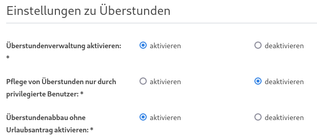
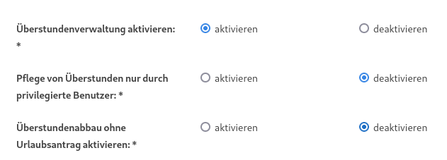
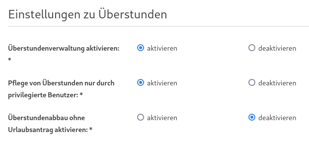
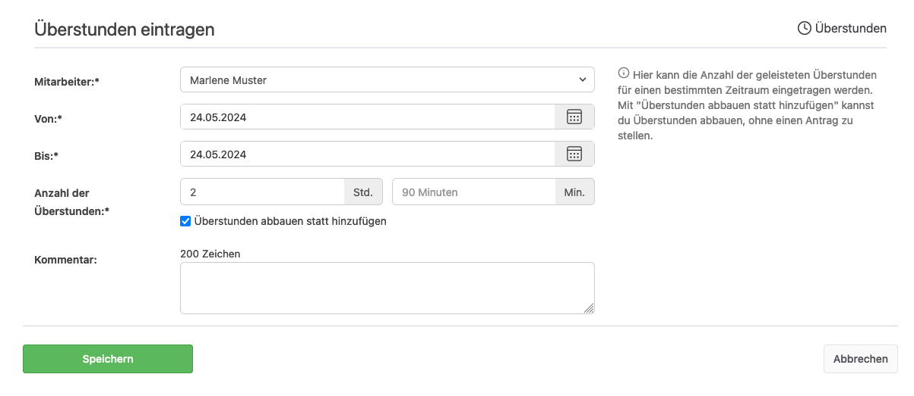

# Überstundenverwaltung in der urlaubsverwaltung.cloud

## Gibt es die Möglichkeit Überstunden zu erfassen?

Ja, die Urlaubsverwaltung bietet die Möglichkeit schnell und einfach Überstunden zu erfassen. Diese können ebenfalls abgebaut werden oder auch über einen Antrag auf Überstundenabbau durch eine privilegierte Person freigegeben werden. Es sind verschiedene Arbeitsweisen der Überstundenverwaltung möglich. Diese sind [hier](#welche-arbeitsweisen-sind-moeglich-ueberstunden-im-unternehmen-abzubilden) zusammengefasst.

Um die Überstundenverwaltung nutzen zu können muss unter dem Menüpunkt "Einstellungen" im Tab "Arbeitszeiten" Überstundenverwaltung aktiviert werden.

## Wer wird informiert, wenn ein Überstundeneintrag angelegt wurde?

Wenn ein Überstundeneintrag erstellt wurde oder ein bereits bestehender editiert
wurde, erhalten die Benutzer, die die Office Berechtigung haben und bei denen
die entsprechende E-Mail-Benachrichtigung aktiv ist, eine E-Mail.

## Welche Arbeitsweisen sind möglich Überstunden im Unternehmen abzubilden?

### Eigenverantwortliche Erfassung

Die Überstunden als auch der Abbau von Überstunden kann durch den Mitarbeiter eigenverantwortlich in der Urlaubsverwaltung dokumentiert werden.

Um diesen Workflow verwenden zu können, müssen folgende Einstellungen konfiguriert sein:

  <picture>
    <source srcset="eigenverantwortliche-ueberstunden-erfassung.avif" type="image/avif" />
    <source srcset="eigenverantwortliche-ueberstunden-erfassung.webp" type="image/webp" />
    
  </picture>

### Eigenverantwortliche Erfassung und Antrag auf Abbau

Diese Form der Überstundenverwaltung ermöglicht die Erfassung der Überstunden durch den Mitarbeiter. Zum Abbau von Überstunden muss ein Antrag auf Überstundenabbau gestellt werden.

Um diesen Workflow verwenden zu können, müssen folgende Einstellungen konfiguriert sein:

  <picture>
    <source srcset="ueberstunden-antrag.avif" type="image/avif" />
    <source srcset="ueberstunden-antrag.webp" type="image/webp" />
    
  </picture>

### Erfassung durch privilegierte Person und Antrag Überstundenabbau

Diese Form der Überstundenverwaltung ermöglicht die Erfassung der Überstunden durch eine privilegierte Person (z. B. Person mit der Berechtigung Office, Chef oder Abteilungsleiter)

Um diesen Workflow verwenden zu können, müssen folgende Einstellungen konfiguriert sein:

  <picture>
    <source srcset="privilegierte-ueberstunden-erfassung.avif" type="image/avif" />
    <source srcset="privilegierte-ueberstunden-erfassung.webp" type="image/webp" />
    
  </picture>

## Kann ich die Überstundenfunktion deaktivieren?

Ja. Unter dem Menüpunkt "Einstellungen" beim Tab "Arbeitszeiten" kann die
Überstundenfunktion deaktiviert werden. Dies hat zur Folge, dass keine
Überstundeneinträge angelegt werden können. Außerdem wird die
Überstundenübersicht auf der persönlichen Übersichtsseite ausgeblendet.

Sollte die Überstundenfunktion in der Vergangenheit genutzt worden sein und wird
nachträglich deaktiviert, so hat dies keine Auswirkung auf die bestehenden
Überstundeneinträge; diese bleiben erhalten. Es können allerdings keine neuen
Überstundeneinträge angelegt werden.

## Kann ich die Überstundenpflege nur für privilegierte Benutzer erlauben?

Ja, durch eine globale Konfiguration in den Einstellungen ist die Eintragung, Anpassung, Löschung von Überstunden auf privilegierte Benutzer auf die Berechtigung Office, Chef, Abteilungsleiter, Freigabe-Verantwortlicher eingeschränkt. Anwender in der normalen Benutzer Rolle dürfen ihre Überstunden dann lediglich einsehen. Die Konfiguration kann unter "Einstellungen" im Tab "Arbeitszeiten" unter "Einstellungen zu Überstunden" mit der Konfiguration "Pflege von Überstunden nur durch privilegierte Benutzer" aktiviert werden.

## Ist es möglich für einen Urlaubsantrag auf Überstundenabbau eine minimale Stundenanzahl zu konfigurieren?

Ja, ein Urlaubsantrag auf Überstundenabbau ist mit einer Minimalstundenanzahl konfigurierbar. Damit müssen pro Antrag mindestens die konfigurierten Minimalstunden abgebaut werden. Diese Minimalstundenanzahl kann über die Einstellungen der Urlaubsverwaltung global konfiguriert werden. Die Konfiguration kann unter "Einstellungen" im Tab "Arbeitszeiten" unter "Einstellungen zu Überstunden" mit der Konfiguration "Minimale Anzahl an abgebauten Stunden pro Antrag" aktiviert werden.

## Können Überstunden abgebaut werden?

Ja, dabei einfach Überstunden eintragen und dabei den Haken mit "Überstunden abbauen statt hinzufügen" setzen. Damit wird die eingetragene Zeit vom Überstundenkonto abgezogen.

  <picture>
    <source srcset="abbau-ohne-antrag.avif" type="image/avif" />
    <source srcset="abbau-ohne-antrag.webp" type="image/webp" />
    
  </picture>

## Ist der Überstundenabbau deaktivierbar?

Ja, die Funktionalität den Abbau von Überstunden direkt eintragen zu können, ist über eine globale Konfiguration in den Einstellungen deaktivierbar. Die Konfiguration kann in den "Einstellungen" im Tab "Arbeitszeiten" unter "Einstellungen zu Überstunden" mit der Konfiguration "Überstundenabbau ohne Urlaubsantrag aktivieren" aktiviert bzw. deaktiviert werden.
