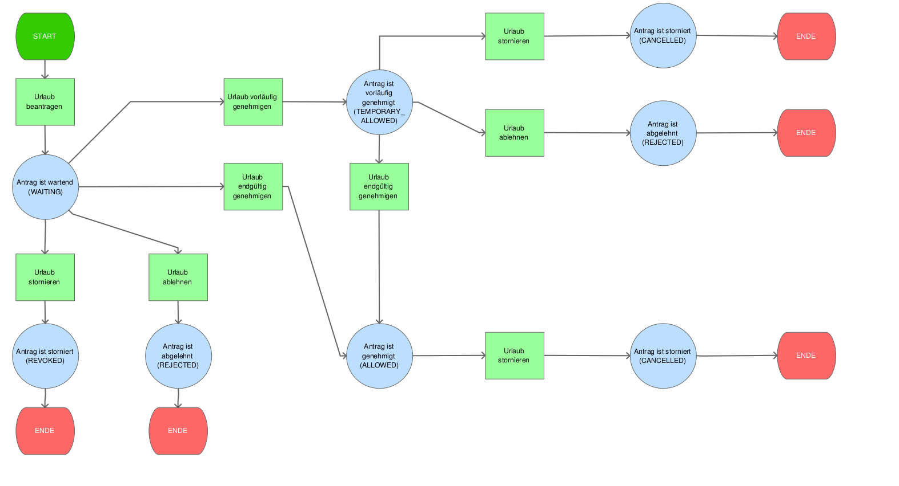
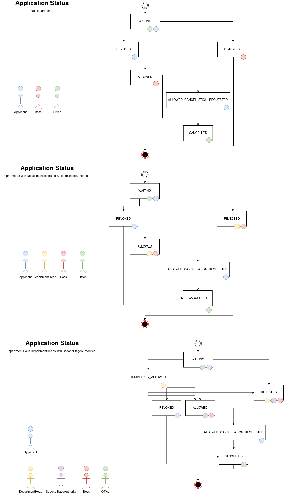

## Wer genehmigt Urlaub?

Der einfache Genehmigungsprozess für Urlaubsanträge sieht vor, dass
Urlaubsanträge von einem Abteilungsleiter oder Chef genehmigt werden.

Außerdem gibt in der Urlaubsverwaltung auch einen [zweistufige Genehmigungsprozess](#wie-funktioniert-der-zweistufige-genehmigungsprozess-von-urlaubsantraegen).

## Wer wird informiert, wenn ein Urlaubsantrag gestellt wurde?

Wenn ein Urlaubsantrag gestellt wurde, erhalten sowohl Abteilungsleiter des
Mitarbeiters als auch globale Chefs eine E-Mail-Benachrichtigung.

Vorausgesetzt bei diesen Personen ist die entsprechende E-Mail-Benachrichtigung
aktiviert.

## Wer wird informiert, wenn ein Urlaubsantrag genehmigt wurde?

Wenn ein Urlaubsantrag genehmigt wurde, erhalten sowohl der betroffene
Mitarbeiter als auch die Office-Benutzer eine E-Mail-Benachrichtigung.
Vorausgesetzt beim Office-Benutzer ist die entsprechende E-Mail-Benachrichtigung aktiviert.

## Wer wird informiert, wenn ein Urlaubsantrag abgelehnt wurde?

Wenn ein Urlaubsantrag abgelehnt wurde, erhält nur der betroffene Mitarbeiter
eine E-Mail.

## Kann eine Urlaubsvertretung angegeben werden?

Ja, bei der Antragsstellung können optional eine oder mehrere Urlaubsvertretungen angegeben werden. Für jede Vertretung kann eine eigene Notiz hinterlegt werden. Die ausgewählten Personen werden über die Vertretung per E-Mail benachrichtigt. Außerdem ist für die Vertretung unter dem Menü-Punkt "Urlaub" im Abschnitt "Aktuelle und zukünftige Vertretungen" eine Übersicht aller Vertretungen einsehbar.

## Wird die Urlaubsvertretung informiert?

Die Vertretung erhält eine Mitteilung per E-Mail. Die E-Mail enthält zusätzlich einen Kalendereintrag als Anhang für den Import in den eigenen Kalender. 

## Wie funktioniert der zweistufige Genehmigungsprozess von Urlaubsanträgen?

Der einfache Genehmigungsprozess für Urlaubsanträge sieht vor, dass
Urlaubsanträge von einem Abteilungsleiter oder Chef genehmigt werden.

Beim zweistufigen Genehmigungsprozess wäre der Urlaubsantrag nach der
Genehmigung durch den zuständigen Abteilungsleiter nur vorläufig genehmigt.
Die endgültige Freigabe erfolgt durch einen Benutzer mit der Berechtigung zur
Freigabe.

Voraussetzungen: Wie beim Abteilungsleiter muss der Freigabe Verantwortliche der
Abteilung zugeordnet sein, für deren Mitarbeiter er zuständig ist. Des Weiteren
muss der zweistufige Genehmigungsprozess für die einzelnen Abteilungen aktiviert
werden. So lassen sich beide Workflows für jeweils verschiedene Abteilungen
nutzen.

## Wie kann ich die Art des Urlaubs bei einem Urlaubsantrag bearbeiten?

Die Art des Urlaubs kann noch angepasst werden solange der Antrag noch nicht genehmigt wurde. Das Bearbeiten kann durch den Mitarbeiter selbst durchgeführt werden.

Um einen bereits genehmigten Antrag zu editieren, muss der bisherige Antrag stornieren können privilegierter Benutzer den Urlaubsantrag stornieren und einen neuen
Urlaubsantrag mit der korrekten Art des Urlaubs für den gleichen Zeitraum erstellen.

## Wie funktioniert der Übergang zwischen zwei Jahren?

Der Urlaub der im bisherigen Jahr noch nicht genommen wurde wird in das folgende Jahr übernommen. Diese Übernahme passiert in den Standard-Einstellungen am 1.1. des Folgejahres um 05:00 Uhr.
Der übernommene Resturlaub beinhaltet alle bis zum 31.12. nicht genommenen Urlaubstage. Dieser Resturlaub kann dann bis zum Ende des Monats März genommen werden.

## Workflow bei Urlaubsanträgen

## Technische Dokumentation für Application Status

