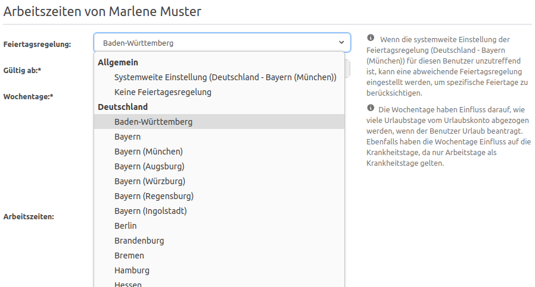

# Feiertage in der urlaubsverwaltung.cloud

## Wie kann ich die Feiertage für die Urlaubsverwaltung konfigurieren?

In der Menüleiste befindet sich der Punkt "Einstellungen". Hier kann das Land und die Region
(z.B. das Bundesland in Deutschland) ausgewählt werden, dessen Feiertage nicht als Arbeitstage
beim Beantragen von Urlaub gezählt werden sollen. Außerdem kann festgelegt werden, wie
Heiligabend und Silvester behandelt werden sollen: gelten diese als Arbeitstag,
halber Arbeitstag oder kein Arbeitstag?

  <picture>
    
  </picture>

## Kann ich für einen bestimmten Mitarbeitenden die geltenden Feiertage konfigurieren?

Ja, im Konto des Mitarbeitenden kann unter dem Punkt "Feiertagsregelung" die systemweite eingestellte Feiertagsregelung
durch eine persönliche Feiertagsregelung überschrieben werden. Die Feiertage für den Mitarbeitenden werden dann anhand
des persönlichen Landes bzw. der Region berechnet.

  <picture>
    
  </picture>

## Welche Feiertage sind vorhanden?

Die Urlaubsverwaltung bietet alle geltenden Feiertage der Länder

- Deutschland
- des Vereinigten Königreiches
- Griechenland
- Italien
- Kroatien
- Malta
- Niederlande
- Österreich
- Schweiz
- Spanien

und weiteren europäischen Länder an. Auch Besonderheiten wie z. B. das Augsburger Friedensfest ist mit dabei.

Sollte uns ein Feiertag fehlen, dann schreibe uns gerne eine [E-Mail](mailto:info@urlaubsverwaltung.cloud?subject=Feiertage)!
