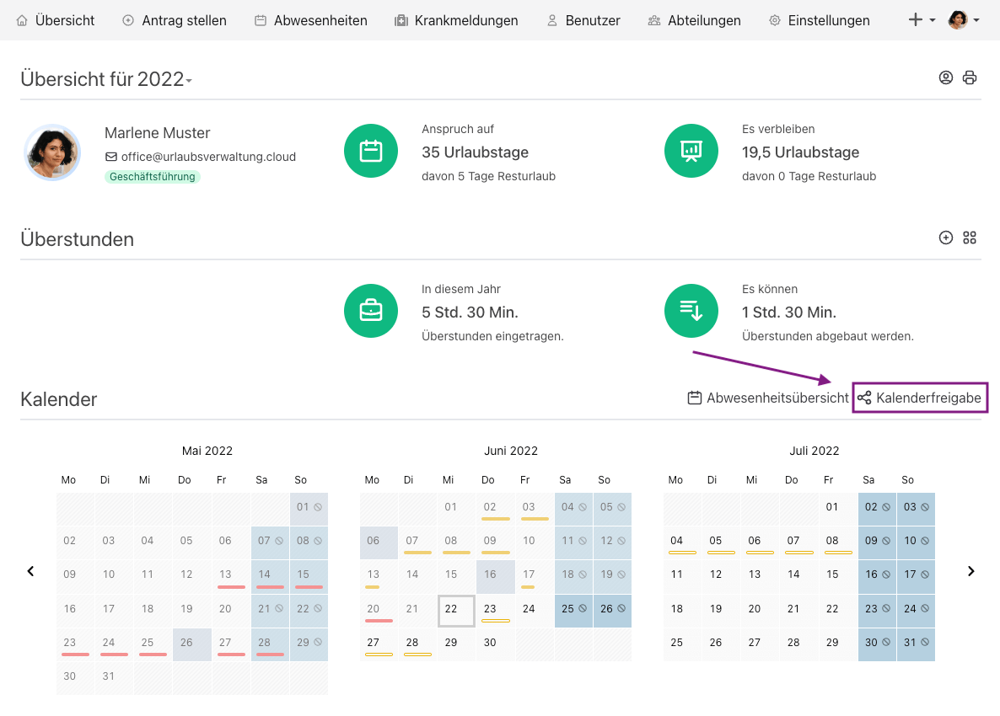
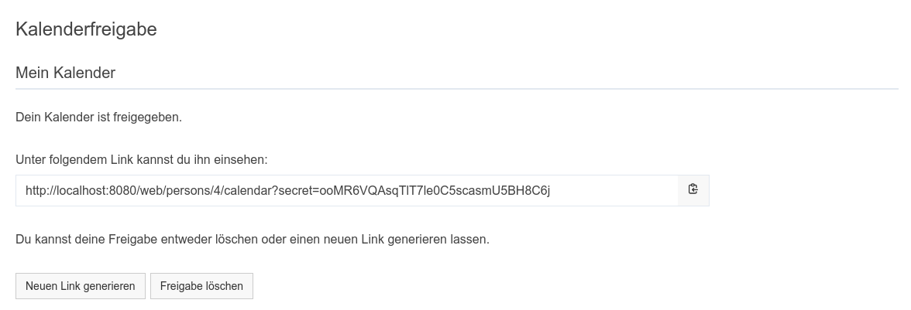
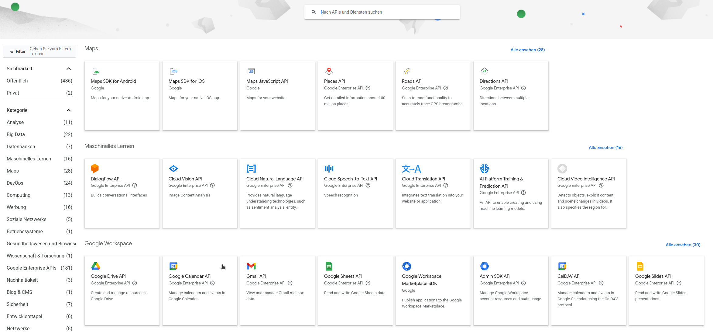
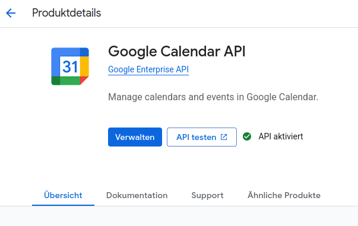
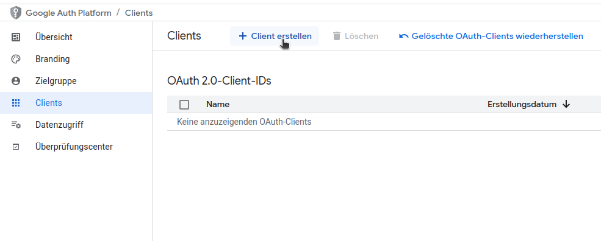
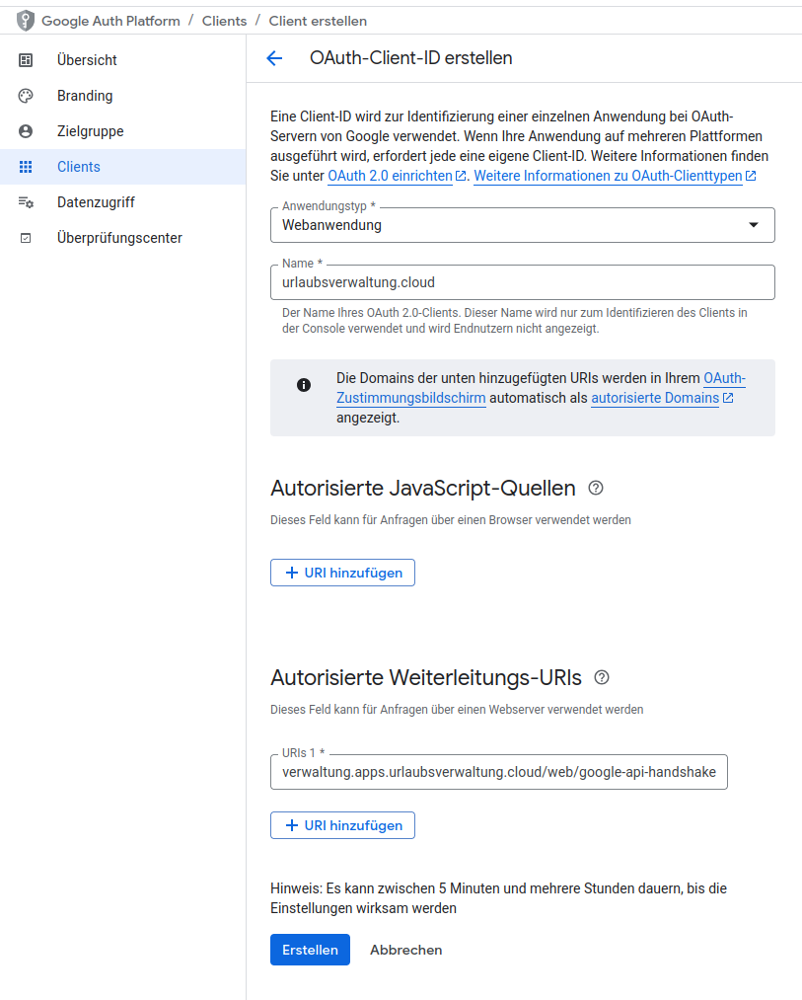
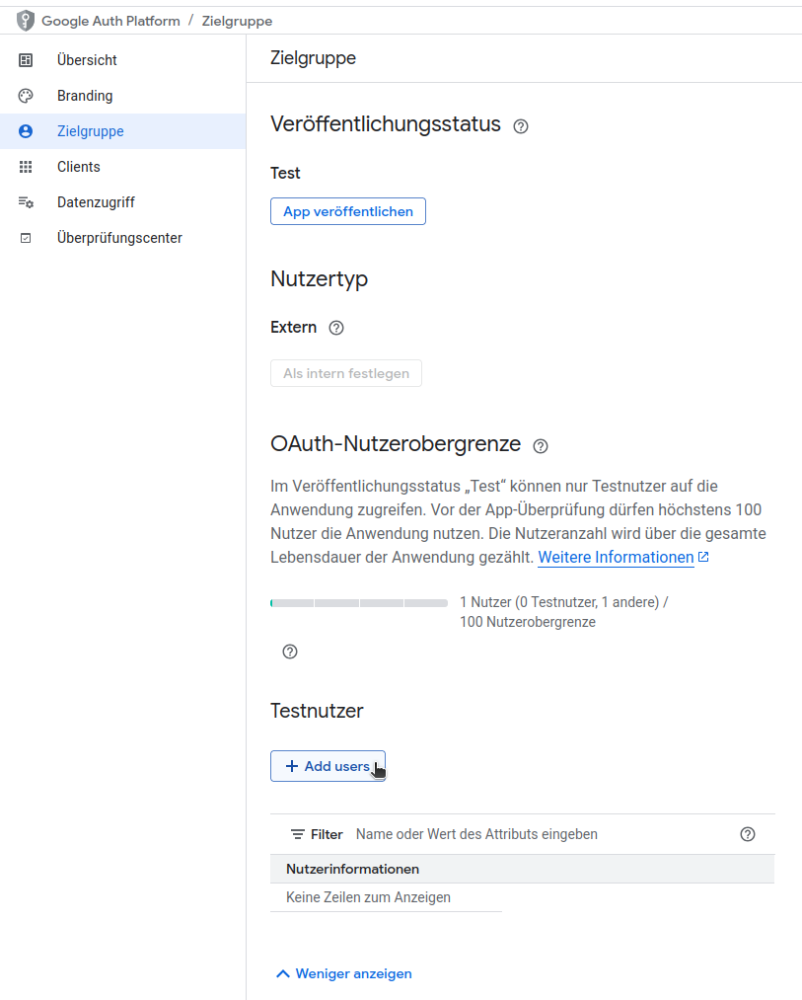

# Kalenderintegration in der urlaubsverwaltung.cloud

## Kalenderfreigabe

### In welchem Format werden die Kalender der Urlaubsverwaltung freigegeben?

Die Urlaubsverwaltung ermöglicht die Freigabe von Abwesenheiten im iCal-Format.

### Was ist das iCal-Format?

iCal oder auch iCalendar ist ein standardisiertes Datenformat zum Austausch von Kalenderinhalten. Das iCalendar-Format wird von der Mehrzahl von Kalender-Programmen akzeptiert und bietet die Möglichkeit Kalenderdaten einzubinden (abonnieren).

### Welche Formen der Kalenderfreigabe gibt es?

Die Urlaubsverwaltung bietet die folgenden Möglichkeiten für eine Kalenderfreigabe:

- **Mein Kalender**: Der Freigabe-Link enthält nur deine Abwesenheiten
- **Abteilung**: Der Freigabe-Link enthält die Abwesenheiten deiner Abteilung
- **Firma**: Der Freigabe-Link enthält die Abwesenheiten deiner Firma. Diese Freigabe ist nur möglich, wenn ein Office-Benutzer die Konfigurationsmöglichkeit erlaubt hat.

<aside class="wissensbasis-info">
  

    Diesen Freigabe-Link kennst nur du. Gehe verantwortungsvoll damit um. Jeder, der diese URL kennt, hat Zugriff auf deinen Kalender.
  

</aside>

### Wie kann ich einen Kalender freigeben?

Die Kalenderfreigabe kann pro Benutzer konfiguriert werden. Um die Konfiguration in der Urlaubsverwaltung durchzuführen sind folgende Schritte zu tun:

1. Klicke auf "Kalenderfreigabe" in der Übersichtsseite oberhalb des Kalenders

  <picture>
    
  </picture>

2. Wähle z. B. "Meinen Kalender freigeben"

  <picture>
    
  </picture>

3. Es wird ein geheimer Link generiert, welchen du jetzt zum Abonnieren verwenden kannst. Weitere Informationen über das Abonnieren findest du [hier](#welche-moeglichkeiten-habe-ich-eine-ical-kalenderfreigabe-in-meinem-client-zu-verwenden).

  <picture>
    
  </picture>

### Wie kann ich eine Freigabe löschen?

Eine Freigabe kann über folgende Schritte gelöscht werden:

1. Klicke auf "Kalenderfreigabe" in der Übersichtsseite oberhalb des Kalenders

  <picture>
    
  </picture>

2. Wähle beim betreffenden Kalender "Freigabe löschen". Durch das Löschen ist der Zugriff über den geheimen Link nicht mehr möglich.

  <picture>
    
  </picture>

### Welche Möglichkeiten habe ich eine iCal Kalenderfreigabe in meinem Client zu verwenden?

Hier eine Liste von Anleitungen beliebter Kalenderlösungen, welche die iCal Kalenderfreigabe unterstützen:

<ul>
<li><a href="https://support.apple.com/de-de/guide/calendar/icl1022/mac" target="_blank" rel="noopener">Apple Calendar</a></li>
<li><a href="https://support.google.com/calendar/answer/37100" target="_blank" rel="noopener">Google Calendar</a></li>
<li><a href="https://support.microsoft.com/de-de/office/importieren-oder-abonnieren-eines-kalenders-in-outlook-com-cff1429c-5af6-41ec-a5b4-74f2c278e98c" target="_blank" rel="noopener">Microsoft Calendar</a></li>
<li><a href="https://support.mozilla.org/de/kb/neue-kalender-erstellen#w_icalendar-ics" target="_blank" rel="noopener">Mozilla Thunderbird</a></li>
<li><a href="https://docs.nextcloud.com/server/latest/user_manual/de/groupware/calendar.html#subscribe-to-a-calendar" target="_blank" rel="noopener">Nextcloud Kalender-App</a></li>
</ul>

### Wird die iCal Kalenderfreigabe die bisherigen Kalenderintegrationen wie Exchange und Google Calendar ersetzen?

Ja, wir haben die Kalenderintegration für Google Calendar und Exchange in Version 4 der Urlaubsverwaltung als `deprecated` markiert und werden diese in Version 5 entfernen. Die Integration kann aber ohne weitere Einschränkungen durch die iCal Kalenderfreigabe ersetzt werden.

#### Welche Vorteile bringt mir das?

Durch die iCal Kalenderfreigabe können die Berechtigungen und Sichtbarkeiten feingranular konfiguriert werden, wodurch ein Datenschutz-konformer Einsatz möglich wird.

## Google Calendar

Die Urlaubsverwaltung bietet die Möglichkeit, Kalendereinträge in einen Google Calendar zu synchronisieren. Um die Synchronisation zu konfigurieren, müssen folgende Voraussetzungen erfüllt sein:

1. **Google Calendar API** ist aktiviert unter [API-Bibliothek](https://console.cloud.google.com/apis/library) ([Dokumentation](https://cloud.google.com/apis/docs/enable-disable-apis))

   <figure>
     <picture>
       
     </picture>
     <figcaption class="text-sm text-center">Google Calendar API auswählen</figcaption>
   </figure>

   <figure class="mb-4">
     <picture>
       
     </picture>
     <figcaption class="text-sm text-center">Google Calendar API aktivieren</figcaption>
   </figure>

2. Ein **OAuth2 Client** als Webanwendung ist erstellt

   Gehe dazu auf https://console.developers.google.com und führe folgende Schritte aus:

   - OAuth2-Client-ID erstellen
    <figure class="mb-4">
     <picture>
       
     </picture>
     <figcaption class="text-sm text-center">Google OAuth2 Client erstellen</figcaption>
   </figure>

   - OAuth2-Client-ID als Webanwendung (Anwendungstyp) konfigurieren
    <figure class="mb-4">
     <picture>
       
     </picture>
     <figcaption class="text-sm text-center">Google OAuth2 Client erstellen</figcaption>
   </figure>

   - Autorisierte Weiterleitungs-URIs angeben (siehe dazu die Information in den Einstellungen der Urlaubsverwaltung)
   - Client-ID und Clientschlüssel sind für Punkt 5 notwendig

3. Unter "Zielgruppe" ist ein Testnutzer angelegt

   Der **Testnutzer** entspricht dem Benutzerkonto der Person, die den Google-Kalender zur Synchronisation verwendet.

   <figure class="mb-4">
      <picture>
        
      </picture>
      <figcaption class="text-sm text-center">Google OAuth2 Client Testnutzer</figcaption>
    </figure>

4. Die **Kalender ID** ist notiert

   Die **Kalender-ID** entspricht der **E-Mail-Adresse deines Google-Kontos** (bei Verwendung des primären Kalenders), das für die Synchronisation genutzt wird. Diese ID ist erforderlich, um den Kalender in der Urlaubsverwaltung einzubinden. Du findest sie in den **Einstellungen deines [Google Kalenders](https://calendar.google.com/)**.

5. Handshake ist in der Urlaubsverwaltung durchgeführt

   Alle Informationen aus den vorherigen Punkten müssen nun in deiner Urlaubsverwaltung unter **„Einstellungen > Kalender Synchronisation“** eingetragen werden. Anschließend klickst du auf **„Zugriff erlauben“**. Es öffnet sich eine Seite, auf der du dich mit deinem Google-Konto anmelden kannst. Nach erfolgreicher Anmeldung wird die Synchronisation automatisch durchgeführt, und es erscheint die Bestätigung: **„Verbindung zum Google-Kalender ist hergestellt.“**
