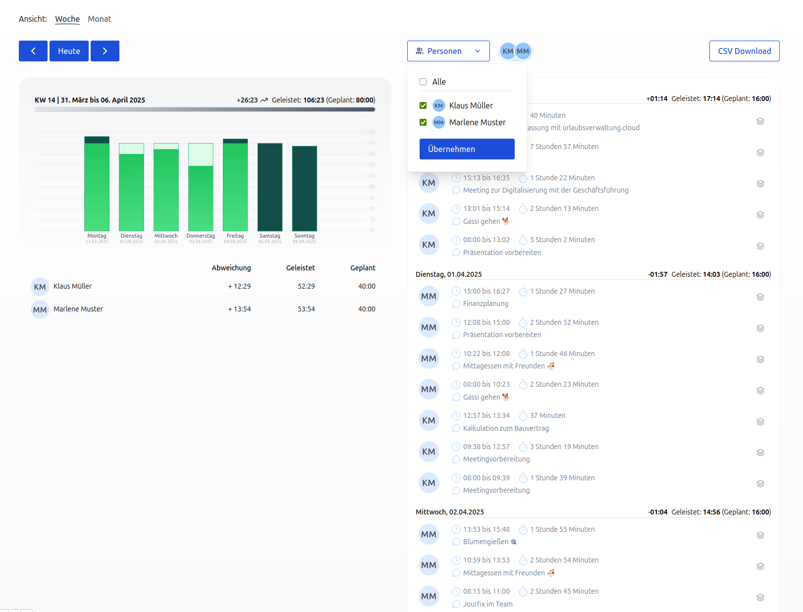
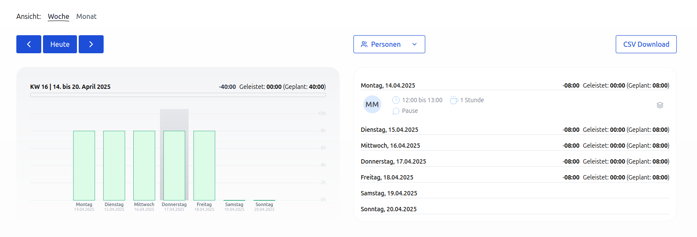
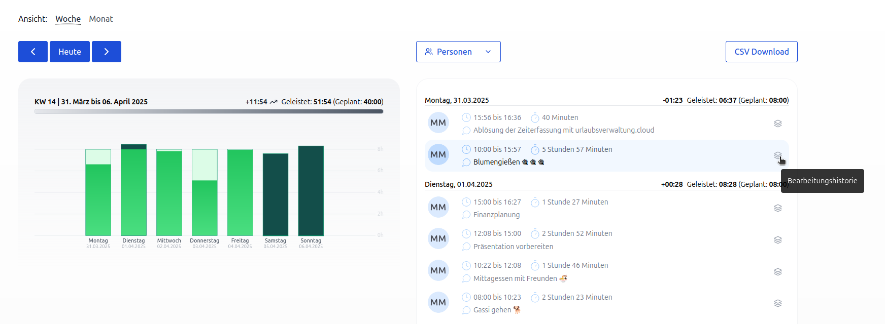
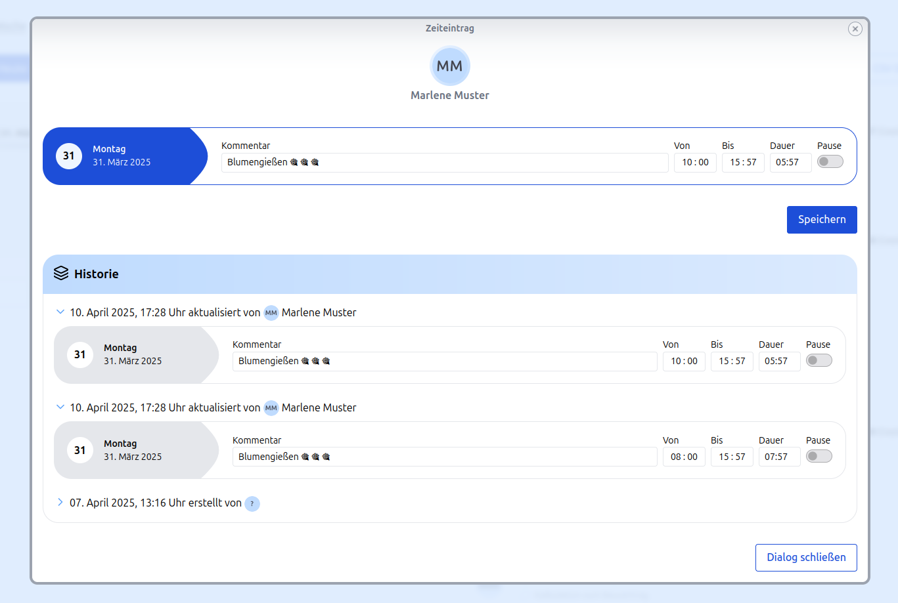

# Berichte in der Zeiterfassung

## Geleistete und geplante Stunden von Mitarbeitenden

In der Ansicht "Berichte" können die **geleisteten Arbeitsstunden** pro Mitarbeitenden grafisch als auch
als CSV-Download eingesehen werden. Zusätzlich werden die **einzelnen Zeiteinträge** angezeigt,
die nach Mitarbeitenden selektiert werden können. Es können auch mehrere Mitarbeitende ausgewählt werden.

  <picture>
    
  </picture>

Die Ansicht eines Tags gibt einen schnellen Überblick darüber, wann und wie tatsächlich gearbeitet wurde.

## Abweichung zu den geleisteten Arbeitsstunden

Die Berichte zeigen den Vergleich zwischen den geplanten und den tatsächlich geleisteten Arbeitsstunden sowohl auf Wochen- als auch auf Monatsbasis an.
Angezeigt werden die geplanten Arbeitsstunden pro Tag sowie die tatsächlich geleisteten Arbeitsstunden. Eine weitere Kennzahl,
die **Abweichung der geplanten Arbeitsstunden**, zeigt, ob an einem Tag Überstunden geleistet oder weniger Stunden
gearbeitet wurden als vorgesehen. Darüber hinaus werden diese Werte auch auf Wochen- und Monatsbasis aggregiert, was den Nutzern eine detailliertere Analyse ihrer Arbeitszeit über längere Zeiträume hinweg ermöglicht und einen genaueren Überblick sowie eine bessere Planung der Arbeitszeit unterstützt.

## Darstellung von Pausen

<svg xmlns="http://www.w3.org/2000/svg" width="24" height="24" viewBox="0 0 24 24" fill="none" stroke="currentColor"
stroke-width="2" stroke-linecap="round" stroke-linejoin="round" role="img" aria-hidden="true" focusable="false">
<path d="M10 2v2" />
<path d="M14 2v2" />
<path d="M16 8a1 1 0 0 1 1 1v8a4 4 0 0 1-4 4H7a4 4 0 0 1-4-4V9a1 1 0 0 1 1-1h14a4 4 0 1 1 0 8h-1" />
<path d="M6 2v2" />
</svg>

Ein Pausensymbol zeigt, ob es sich bei einer erfassten Zeit um eine Pause handelt.

  <picture>
    
  </picture>

Pausen werden nicht in die geleistete Arbeitszeit eingerechnet.

## Änderungshistorie für Zeiteinträge

Alle Änderungen an den Zeiteinträgen können nachvollzogen werden. Jede Änderung wird in einer übersichtlichen Historie gespeichert, die den Verlauf der Zeiteinträge dokumentiert.
Die Historie kann durch Anklicken des Historie-Symbols geöffnet werden. Zu jeder Änderung ist der Stand zum Zeitpunkt der Änderung ersichtlich sowie wer die Änderung vorgenommen hat.
So können Fehler korrigiert werden und es ist nachvollziehbar, wer wann eine Änderung vorgenommen hat.

  <picture>
    
  </picture>

Die Nachvollziehbarkeit von Änderungen ist insbesondere für Unternehmen und Teams von großer Bedeutung, da sie zu mehr Transparenz und Datenintegrität führt. Durch die Änderungshistorie können Fehlerquellen schneller identifiziert und behoben werden. Diese Funktion ist auch für Audits oder Compliance-Anforderungen von großer Bedeutung.

  <picture>
    
  </picture>

## Zeiteinträge über Berichte bearbeiten

Mitarbeitende mit der Berechtigung "darf die Berechtigungen aller Personen bearbeiten" können Zeiteinträge direkt über die Berichte bearbeiten.
So können fehlerhafte oder ungenaue Einträge einfach korrigiert werden - ohne dass die betroffenen Mitarbeitenden selbst aktiv werden müssen.
Die Zeiteinträge können über die [Änderungshistorie für Zeiteinträge](#aenderungshistorie-fuer-zeiteintraege)
angepasst werden und sind somit für alle Beteiligten nachvollziehbar und transparent.

Gerade für Personalabteilungen und Führungskräfte ist es entscheidend, die Richtigkeit der Berichte zu überprüfen und gegebenenfalls zentral anzupassen. Diese Funktion stellt sicher, dass alle Zeiteinträge korrekt und vollständig sind - für eine verlässliche Datenbasis.
