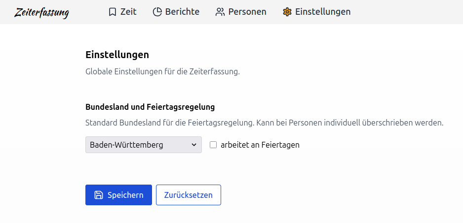
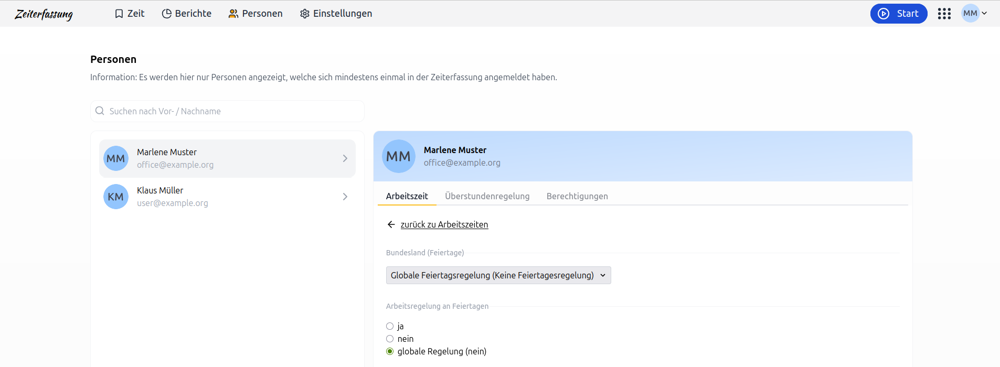

# Feiertage in der Zeiterfassung

## Wie kann ich die globale Feiertagsregelung für die Zeiterfassung konfigurieren?

In den Einstellungen der Zeiterfassung ist es möglich eine globale Feiertagsregelung zu konfigurieren.
Diese Regelung gilt für alle Mitarbeitenden, die in der Zeiterfassung erfasst sind.

  <picture>
    
  </picture>

Falls du für einen bestimmten Mitarbeitenden eine individuelle Feiertagsregelung benötigst,
kannst du diese in den Einstellungen eines Mitarbeitenden überschreiben.

## Kann ich für einen bestimmten Mitarbeitenden eine individuelle Feiertagsregelung konfigurieren?

Bei verteilten Teams ist es nicht selten, dass unterschiedliche Anforderungen an Feiertagsregelungen existieren.
Für Mitarbeitende, die in Baden-Württemberg angestellt sind, gelten andere Feiertagsregelungen als z. B. in Hessen.
Daher kannst du die Feiertagsregelung für jeden Mitarbeitenden individuell anpassen.

  <picture>
    
  </picture>

## Welche Feiertagsregelungen sind vorhanden?

Die Zeiterfassung bietet alle geltenden Feiertagsregelungen der Länder

- 🇩🇪 Deutschland
- 🇦🇹 Österreich
- 🇨🇭 Schweiz
- 🇲🇹 Malta
- 🇭🇷 Kroatien
- 🇮🇹 Italien
- 🇬🇧 Vereinigtes Königreich
- 🇬🇷 Griechenland
- 🇳🇱 Niederlande
- 🇪🇸 Spanien
- 🇺🇸 USA – Washington, D.C., Virginia und Maryland

und weiteren europäischen Länder an. Auch Besonderheiten wie z. B. das Augsburger Friedensfest ist mit dabei.

Dir fehlen Feiertage für ein bestimmtes Land? Dann melde dich bei uns am einfachsten per E-Mail, wir freuen uns über dein Feedback!
Sollte uns ein Feiertag fehlen, dann schreibe uns gerne eine [E-Mail](mailto:info@urlaubsverwaltung.cloud?subject=Feiertage)!
