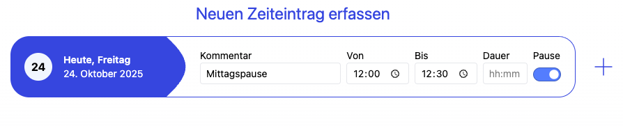
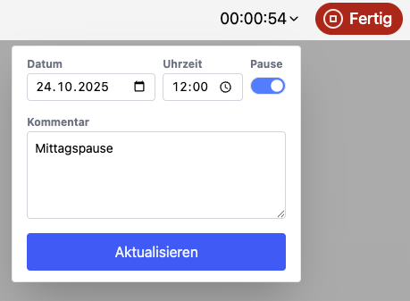
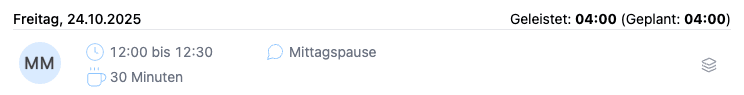
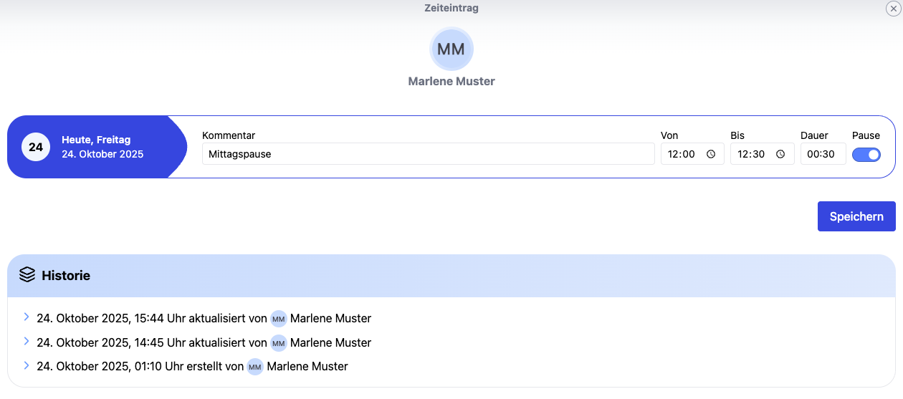

# Pausen in der Zeiterfassung

## Wie kann ich Pausen erfassen?

### Neue Pausen erfassen

Auf der Startseite unter "Zeit" kannst du für dich selbst Pausen erfassen. Wichtig ist, den Pause-Regler zu aktivieren.
Du kannst den Tag auswählen, einen Kommentar sowie eine Start- und Endzeit eingeben, die Dauer wird automatisch berechnet.

  <picture>
    
  </picture>

Wenn nur Startzeit und Dauer angegeben werden, wird die Endzeit automatisch gesetzt.

### Zeiteintrag mit der Stoppuhr erfassen

Pausen können auch durch Anklicken des Start-Buttons der Stoppuhr erfasst werden. 
Wichtig ist, den Pause-Regler zu aktivieren.
Die Stoppuhr läuft im Hintergrund weiter, auch wenn du die Seite wechselst. 
Du kannst die Stoppuhr jederzeit anhalten und so die Pause speichern.

  <picture>
    
  </picture>

Wenn du die Stoppuhr startest, kannst du auch einen Kommentar hinzufügen oder die Startzeit nachträglich ändern.
Der Kommentar wird dann automatisch zum Zeiteintrag hinzugefügt.

### Pausen im Bericht

In Berichten werden neben den Zeiteinträgen auch die Pausen angezeigt.

  <picture>
    
  </picture>

Auch im CSV-Download werden sie aufgelistet.

### Historie einer Pause

Wie jeder Zeiteintrag hat auch jeder Pauseneintrag eine Änderungshistorie.
So können alle Änderungen nachvollzogen werden.

  <picture>
    
  </picture>

