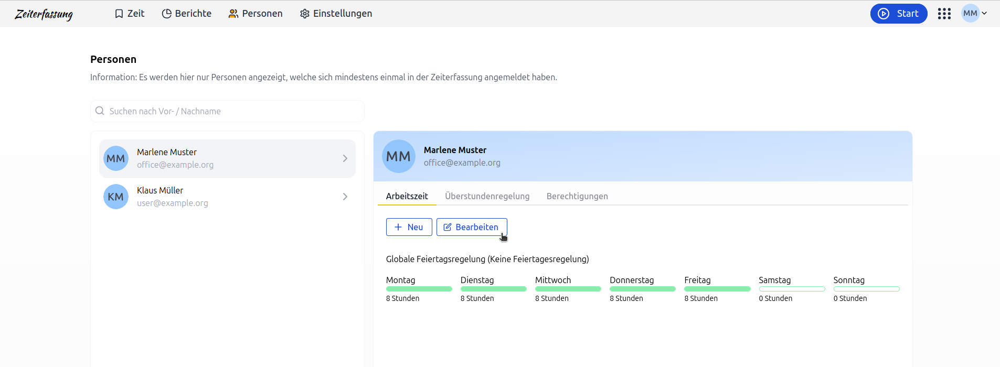
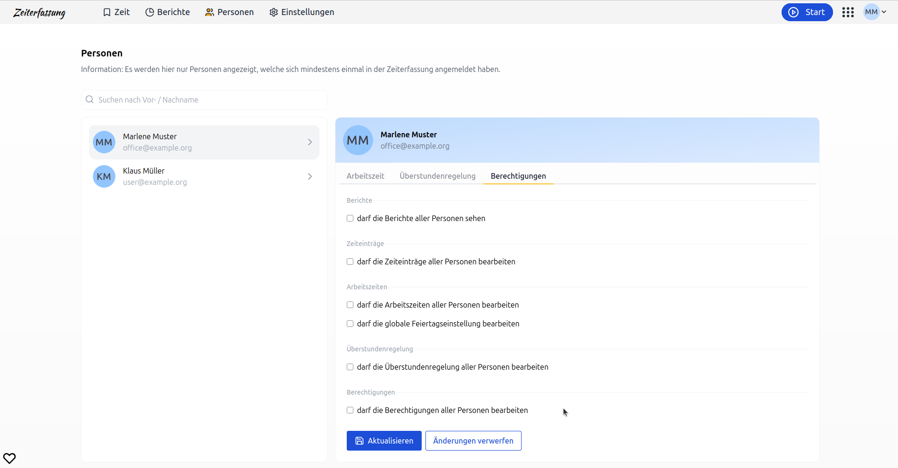

# Personen und ihre Berechtigungen, Arbeitszeiten und deren Überstundenregelung in der Zeiterfassung

Ohne Mitarbeitende, kein Unternehmen. Die Verwaltung der Mitarbeitenden und ihre Berechtigungen
sind zentraler Teil der Zeiterfassung.

## Arbeitszeiten pro Mitarbeitenden festlegen

Arbeitszeiten können individuell pro Mitarbeitende festgelegt werden – sowohl für die gesamte Woche als auch
detailliert pro Wochentag. Diese Einstellungen können von Mitarbeitenden mit der Berechtigung
"darf die Arbeitszeiten aller Personen bearbeiten" vorgenommen werden.

  <picture>
    
  </picture>

## Berechtigungen

### Wie stelle ich die Berechtigungen eines Mitarbeitenden ein?

Berechtigungen von Mitarbeitenden können unter Personen angepasst werden. Du hast die Möglichkeit, die Berechtigungen
ganz bequem und sicher anzupassen, ohne die Anwendung verlassen zu müssen.

  <picture>
    
  </picture>

### Wann greifen neue Berechtigungen für einen Benutzer?

Die Berechtigungen eines Mitarbeitenden werden sofort aktiv, wenn ihr diese ändert.
Du musst also nicht warten, bis der Mitarbeitende sich erneut anmeldet oder die Seite aktualisiert.
