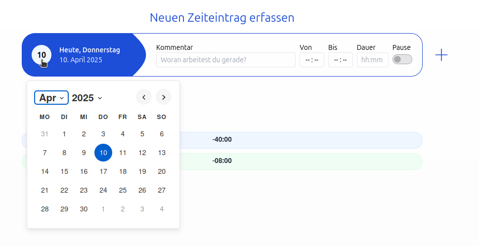
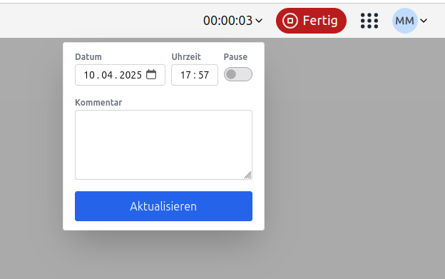
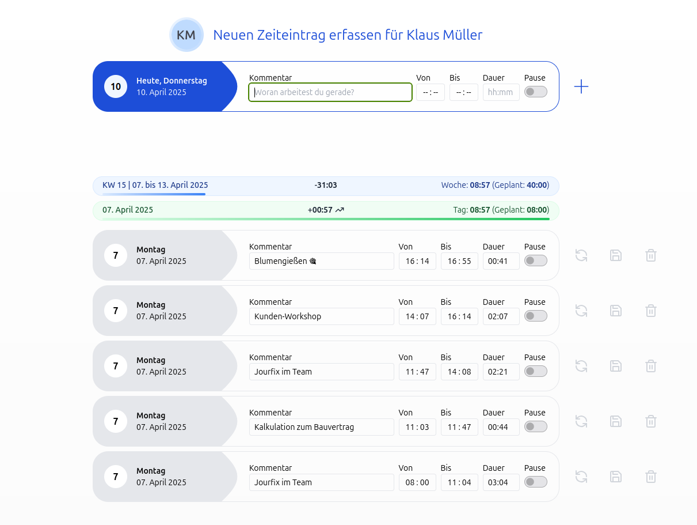

# Zeiteinträge in der Zeiterfassung

## Wie kann ich Zeiteinträge erfassen?

### Neuen Zeiteintrag erfassen

Auf der Startseite unter "Zeit" kannst du für dich selbst Zeiteinträge erfassen.
Du kannst den Tag auswählen, einen Kommentar sowie eine Startzeit und Endzeit angeben, die Dauer wird automatisch berechnet.

  <picture>
    
  </picture>

Wenn du nur die Startzeit und die Dauer angibst, wird die Endzeit automatisch gesetzt.

    <video width="640" height="480" autoplay>
      <source src="neuen_zeiteintrag.mp4" type="video/mp4" />
    </video>

### Zeiteintrag mit der Stoppuhr erfassen

Zeiteinträge können auch durch ein klick auf den Stoppuhr-Start-Button erfasst werden. Die Stoppuhr läuft im
Hintergrund weiter, auch wenn du die Seite wechselst. Du kannst die Stoppuhr jederzeit anhalten und dadurch den Zeiteintrag speichern.

Wenn du die Stoppuhr startest, kannst du auch einen Kommentar hinzufügen oder die Startzeit nachträglich anpassen.
Der Kommentar wird dann automatisch dem Zeiteintrag hinzugefügt.

  <picture>
    
  </picture>

## Kann ich für einen bestimmten Mitarbeitenden Zeiteinträge erfassen?

### Zeiterfassung für andere Mitarbeitende

Mitarbeitende, welche die Berechtigung "darf die Berechtigungen aller Personen bearbeiten" haben, haben die Möglichkeit
die Startseitenansicht einer anderen Mitarbeitenden zu sehen und Zeiteinträge für diese Person zu erfassen.

Mit einem Klick auf den Avatar eines Mitarbeitenden kannst du die Startseitenansicht für diese Person aufrufen.

  <picture>
    
  </picture>
