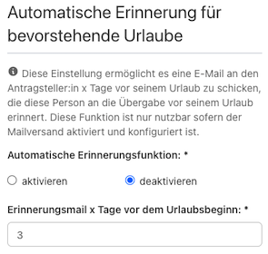
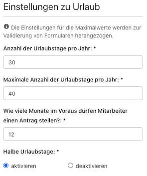

Neue Features und Verbesserungen.

<!-- more -->

### Erinnerung an Urlaubsbeginn

  

    

      Mit der neuen Version bringen wir dir die <em class="font-bold">Automatische Erinnerungsfunktion</em>.
    

    

      In den Einstellungen kannst du ab sofort konfigurieren, ob deine Mitarbeiter:innen drei Tage vor Urlaubsbeginn automatisch per E-Mail informiert werden sollen oder nicht. So wird hoffentlich nicht mehr all zu oft vergessen die E-Mail Abwesenheitsnachricht einzurichten, oder noch rechtzeitig eine Übergabe zu planen.
    

    

      Natürlich kannst du auch einstellen wie viele Tage im voraus die Benachrichtigung versendet werden soll. Dir reicht ein Tag? Du willst eine Woche vorher die Information bekommen? Trage einfach die Tagesanzahl ein, die dir am besten passt.
    

    

      Aktuell gilt diese Einstellung für alle Anwender:innen der Urlaubsverwaltung. Noch ist es nicht möglich diese Einstellung für sich persönlich vorzunehmen.
      Melde dich gerne bei uns falls dir die Funktion wichtig ist. Wir schauen dann wie wir das schneller umsetzen werden.
    

  

  

    
  

### Halbe Urlaubstage erlauben oder unterbinden

  

    
  

  

    

      Nach § 7 BUrlG hat die Arbeitgeberin die Urlaubswünsche des Arbeitnehmers zu berücksichtigen. Das gilt aber nur, wenn dem Urlaubswunsch
    

    <ul>
      <li>weder dringende betriebliche Belange</li>
      <li>noch Urlaubswünsche anderer Arbeitnehmer, die unter sozialen Gesichtspunkten Vorrang haben,</li>
    </ul>
    

      nicht entgegenstehen.
    

    

      Das unterstützen wir ab sofort auch in der Urlaubsverwaltung. Bisher konnten <em>immer</em> halbe <em>oder</em> ganze Urlaubstage beantragt werden. Jetzt kannst du einstellen, ob halbe Urlaubstage in deinem Unternehmen erlaubt sind oder nicht.
    

  

### Verschicke abgelehnten Kalendereintrag, wenn eine Abwesenheit zurückgenommen wird

  
  

    Lorem ipsum
  

