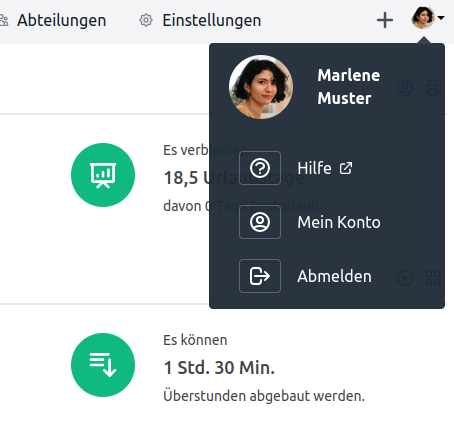
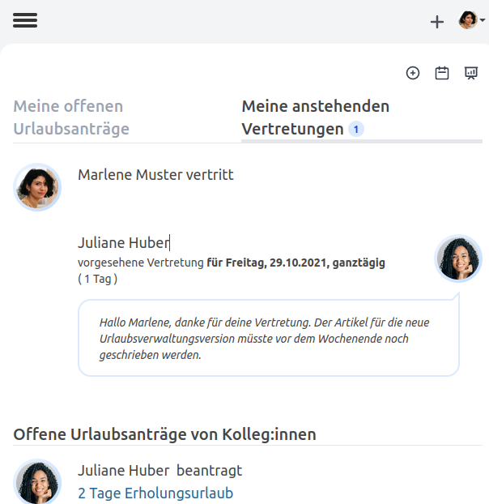
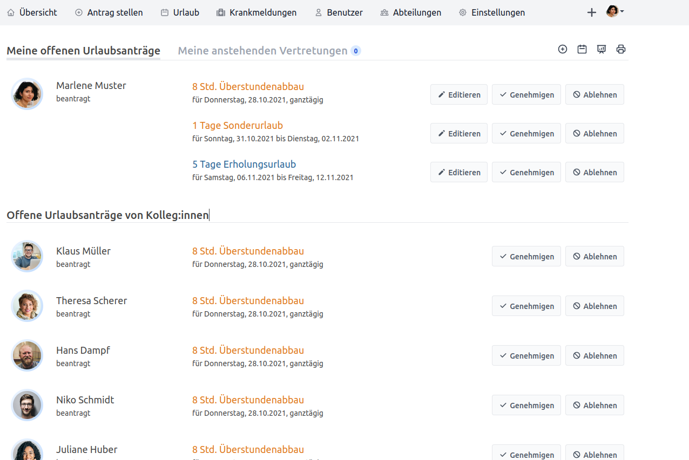

Verbesserte Urlaubsübersichtsseite und Hilfe direkt aus der Urlaubsverwaltung

<!-- more -->

## Hilfe direkt aus der Urlaubsverwaltung

  

    
  

  

    

      Unsere Philosophie mit der Urlaubsverwaltung ist es, eine mächtige Applikation zu entwickeln, die sich
      sehr leichtgewichtig anfühlt, sodass sich jeder Benutzer direkt wohlfühlt und das Anliegen einfach und
      bequem erledigen kann. Es kommt jedoch ab und an vor, dass man spezifische Fragen zu einem bestimmten Feature
      hat und dieses auf eigene Faust lösen möchte. Deshalb haben wir für euch die <a href="/hilfe">Hilfe</a> Sektion auf 
      <a href="/hilfe">urlaubsverwaltung.cloud</a> erstellt und in der Urlaubsverwaltung im Avatar-Menü verlinkt.
    

    

      Helfe dir selbst und sei dein eigener Held!
    

  

## Verbesserte Urlaubsübersichtsseite

  

    
  

  

    

      In dieser Version wurde die <strong>Urlaubsübersichtsseite</strong> unter "Urlaub" verbessert, sodass diese noch schneller und 
      intuitiver auf kleinen Endgeräten zu bedienen ist. Mehr Informationen über deine Urlaubsanträge, sowie direkter Zugriff zum
      Genehmigen, Ablehnen und Editieren ersparen umständliche Klicks über das öffnen des Antrags.
    

    

      Zudem wurden die eigenen <em>noch offenen Urlaubsanträge</em> sowie <em>anstehende Vertretungen</em> gruppiert, sodass man auf
      einen Blick den Status erkennen kann und immer auf dem Laufenden ist.
    

  

    Mit der neuen Ansicht <em>anstehender Vertretungen</em>, wird nun auf übersichtliche Weise direkt aufgezeigt, wann eine
    Vertretung und für wie lange geplant ist und ob eine Notiz an die Vertretung hinterlassen wurde. Zum Glück hatte
    Juliane eine Notiz an Marlene hinterlassen, sonst wäre dieser Artikel wohl erst deutlich später veröffentlicht worden.

## Weitere Anpassungen

    

      Damit ihr immer wisst, welche <strong>Version</strong> ihr von der Urlaubsverwaltung verwendet.
      Wird diese nun am Seitenende in den Einstellungen angezeigt.
    

