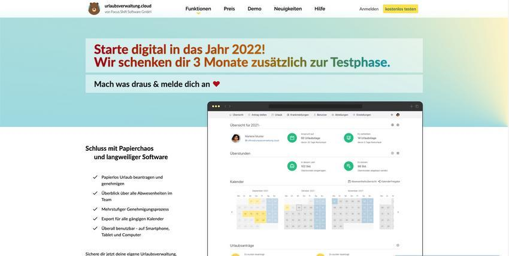

_Abwesenheitsverwaltung als Software as a Service (Saas) erleichtert kleinen und mittelständischen Unternehmen die
Digitalisierung im Personalmanagement und reduziert Prozesskosten._

<!-- more -->

Der Jahreswechsel bietet eine optimale Gelegenheit für einen Schritt in Richtung unternehmensweiter Digitalisierung.
Die Verwaltung von Abwesenheiten und Vertretungen ist mit einem hohen Administrationsaufwand verbunden, auch wenn die
Prozesse standardisiert sind. Mit dem Produkt urlaubsverwaltung.cloud bietet die Focus Shift Software GmbH eine 
intuitive Lösung für die Herausforderung, Abwesenheiten digital zu verwalten. Um insbesondere kleinen und 
mittelständischen Unternehmen den wichtigen Schritt in das digitale Personalmanagement zu erleichtern, erhalten 
Neukunden, die sich bis zum 31.12.2021 registrieren, die ersten 3 Monate kostenlos - zusätzlich zu der 30-tägigen
Testphase.

Der Prozess der Abwesenheitsverwaltung ist in sich abgeschlossen und damit optimal dafür geeignet, firmeninterne
Prozesse digital abzubilden. “Die relevante Datengrundlage im Bereich der betrieblichen Abwesenheiten unterliegt einem
jährlichen Turnus, so dass sich vor allem Jahreswechsel dazu eignen, eine Urlaubsverwaltung zu konfigurieren,
insbesondere bei vielen Angestellten. Somit profitiert ein Kunde direkt von reduzierten Prozesskosten der
Abwesenheitsverwaltung im neuen Jahr.”, so Andreas Weigel Geschäftsführer der Focus Shift Software GmbH.

## urlaubsverwaltung.cloud

Neben Urlaub und Krankmeldungen lassen sich in der SaaS-Lösung auch Überstunden DSGVO-konform verwalten.
Um die bestehenden Prozesse des Kunden bestmöglich abzubilden, existieren ein- oder zweistufige Freigabeverfahren.
Eine Aufbauorganisation kann durch Abteilungen und deren verantwortliche Personen abgebildet werden. Schnittstellen zu
Kalender- oder Single Sign-On Systemen bieten eine nahtlose Integration in bestehende Infrastruktur.

<picture>
    <source srcset="urlaubsverwaltung.avif" type="image/avif" />
    <source srcset="urlaubsverwaltung.webp" type="image/webp" />
    
</picture>
 

## Focus Shift Software GmbH

Die Focus Shift Software GmbH stellt kleinen und mittelständischen Unternehmen aller Branchen Software-as-a-Service-Produkte
zur Verfügung, die das administrative Rückgrat der Unternehmen digital abbilden. Die Verlagerung der Kompetenzen aus der
Verwaltung in Richtung der Fachkompetenz stärken das Kerngeschäft. 
