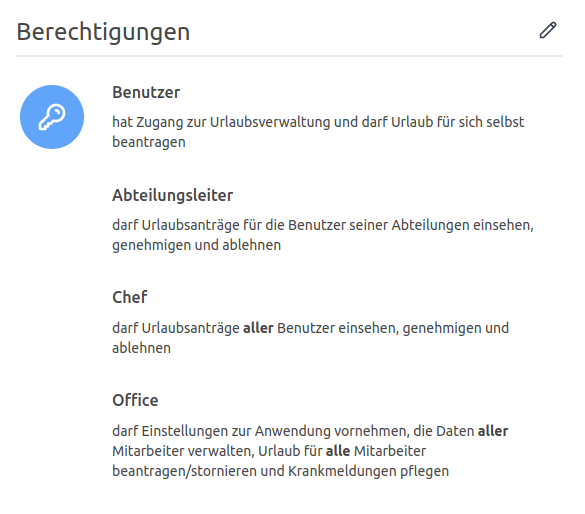

_Version 4.26.0 veröffentlicht_

<!-- more -->

## Verbesserte Berechtigungen

Seit dieser Version können die Berechtigungen _Chef_ und _Office_ mit den Berechtigungen _Abteilungsleiter_ bzw.
_Freigabe-Verantwortlicher_ kombiniert werden. Wir bieten dir damit die Möglichkeit deine Organisationsstruktur noch besser abbilden zu können.

<picture>
    <source srcset="berechtigungen.avif" type="image/avif" />
    <source srcset="berechtigungen.webp" type="image/webp" />
    
</picture>

## E-Mail-Benachrichtigung bei Neuanlage einer Person

Personen mit der Berechtigung _Office_ erhalten eine E-Mail-Benachrichtigung, sobald eine neue Person in der
Urlaubsverwaltung angelegt wurde. Diese Benachrichtigung soll dazu dienen, einen Überblick über Neuanlagen zu behalten
und die Person direkt mit einem individuellen Urlaubsanspruch oder Arbeitszeiten zu konfiguriert.

## Weitere Anpassungen und Fehlerbehebungen

- Wir haben für euch aus dem technischen Begriff **Editieren** den verständlicheren und wundervollen Begriff _Bearbeiten_ gezaubert.
  In der Urlaubsverwaltung wird nun nicht mehr langweilig editiert, sondern mit Spaß bearbeitet.

- Das verschickten der **Erinnerungen für bevorstehende Urlaube** konnte in bestimmten Konstellation nicht durchgeführt werden.
  Dieser Fehler wurde behoben und es wird sichergestellt, dass die Erinnerungen korrekt versendet werden.

- Bei aktivierten **halben Urlaubstagen** in den Einstellungen ist es möglich den jährlichen Urlaubsanspruch
  einer Person auf einen halben Tag zu setzen.

- **Vorläufig genehmigte Urlaube** wurden sowohl im Kalender auf der Übersichtsseite als auch in der Datumsauswahl
  eines Antrages nicht angezeigt. Dies wurde behoben und die Anträge werden nun korrekt eingeblendet.

- **Fehlerhafte Links** in den E-Mails zu _meine anstehenden Vertretungen_ wurden angepasst.
