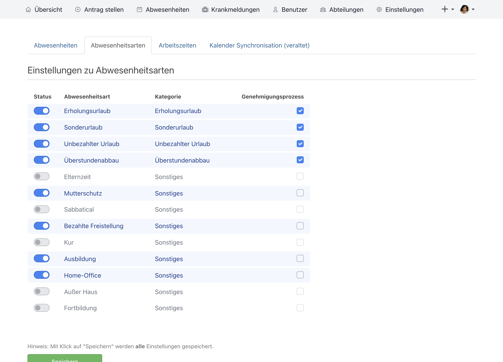
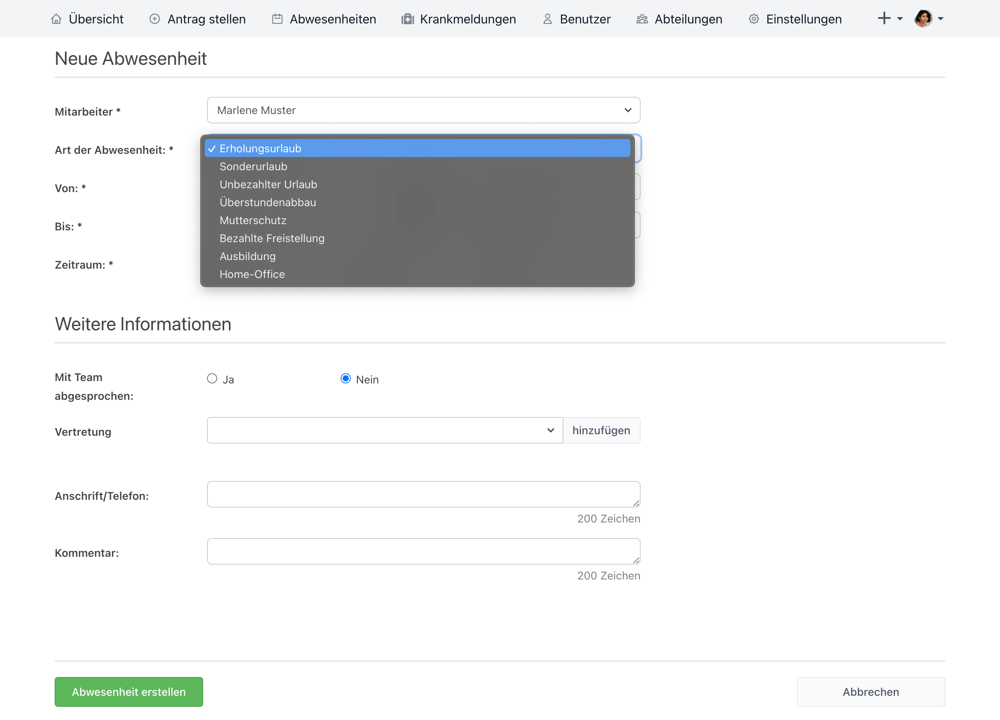
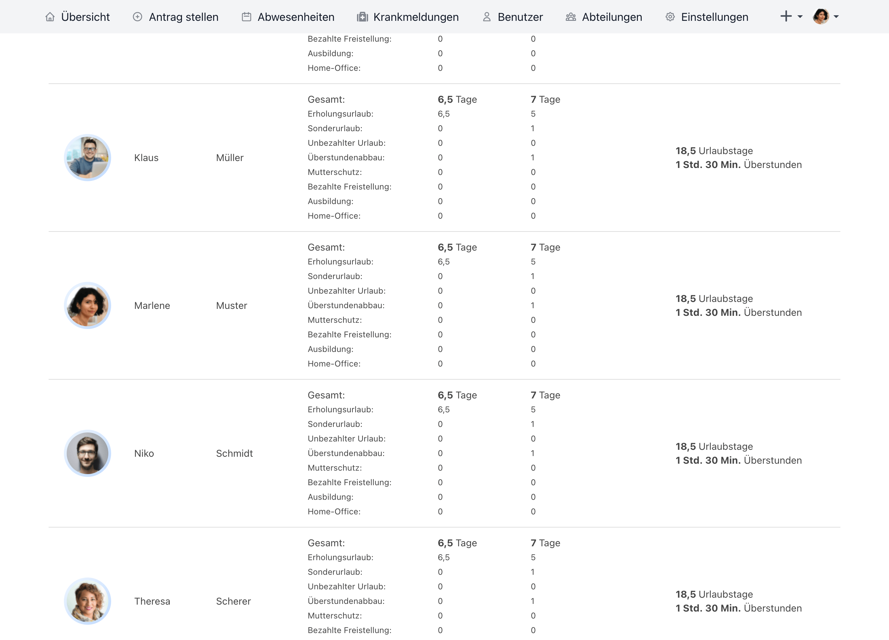

_Version 4.27.0 veröffentlicht_

<!-- more -->

## Neue Abwesenheitsarten

Deine Urlaubsverwaltung kann nun weitere Abwesenheiten und du hast die Möglichkeit diese freizuschalten!

_Bisher_ gab es in der Urlaubsverwaltung vier Abwesenheitsarten:

* Erholungsurlaub
* Sonderurlaub
* Unbezahlter Urlaub und
* Überstundenabbau

  

    
  

  

    

        Diese sind in vielen Fällen ausreichend um deine täglichen Abwesenheiten abzubilden, aber für uns ist ausreichend nicht gut genug.
        Darum spendieren wir der Urlaubsverwaltung weitere Abwesenheitsarten und den Begriff "Urlaub" wird in einigen
        Fällen durch "Abwesenheiten" ersetzt, sodass auch der Weg der Urlaubsverwaltung zur Abwesenheitsverwaltung deutlicher wird.
        Natürlich bleiben wir unserem Namen zunächst treu und die Urlaubsverwaltung wird weiterhin die Urlaubsverwaltung sein. 
        Aber man weiß ja nie was uns die Zukunft bringt.
    

    

        Die neuen Abwesenheitsarten lassen sich in den Einstellungen mit der Berechtigung 'Office' aktivieren bzw deaktivieren.
        Zusätzlich kann konfiguriert werden, ob für diese Abwesenheitsart der Antrag durch einen Genehmigungsprozess (Einstufig bzw. Zweistufig) abgebildet wird.
        Neu ist, dass jede Abwesenheit auch ohne Genehmigungsprozess konfiguriert werden kann.
    
  
  

Die Kategorie zeigt auf, von welchem Abwesenheitskonto die Abwesenheit abgezogen wird. Wenn es ein _Erholungsurlaub_
ist, wird die Abwesenheit von diesem Abwesenheitskonto abgezogen. Wenn es die Kategorie _Überstunden_ ist, wird die
Abwesenheit von dem Überstundenkonto abgezogen.
_Sonderurlaub_, _Unbezahlter Urlaub_ und _Sonstiges_ werden von keinem Abwesenheitskonto abgezogen und dienen lediglich
der Statistik.

Wir möchten zudem in einer kommenden Version der Urlaubsverwaltung die Möglichkeit bieten, dass eine Person mit der
Berechtigung 'Office' die Kategorie bzw. das Abwesenheitskonto pro Abwesenheitsart anpassen kann und damit individuell
das Abwesenheitskonto für eine Abwesenheitsart anzupassen.

Die aktivierten Abwesenheitsarten fließen nicht nur beim Erstellen einer Abwesenheit in die Urlaubsverwaltung ein,
sondern werden auch in den Abwesenheitsstatistik (frühere Urlaubsstatistik) separat ausgewertet, sowie über den
CSV-Export herausgegeben.

  

    <picture>
        <source srcset="antrag.avif" type="image/avif" />
        <source srcset="antrag.webp" type="image/webp" />
        
    </picture>
  

  

    <picture>
        <source srcset="abwesenheitsstatistik.webp" type="image/webp" />
        
    </picture>
  

Wir hoffen, dass ihr eure Organisation noch besser abbilden könnt, und wünschen viel Spaß mit den neuen
Abwesenheitsarten.

<a href="mailto:info@urlaubsverwaltung.cloud?subject=Weitere%20Abwesenheitsart">Fehlt dir eine Abwesenheitsart dann
schreib uns einfach!</a>
