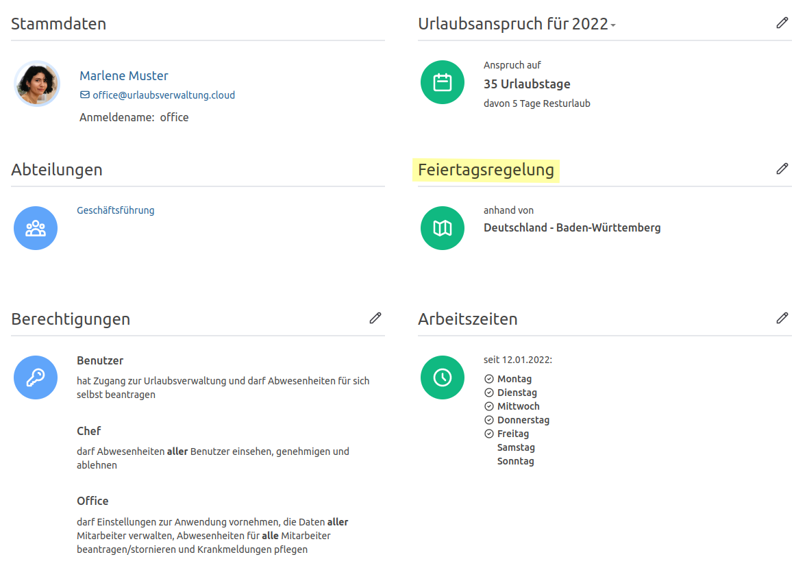
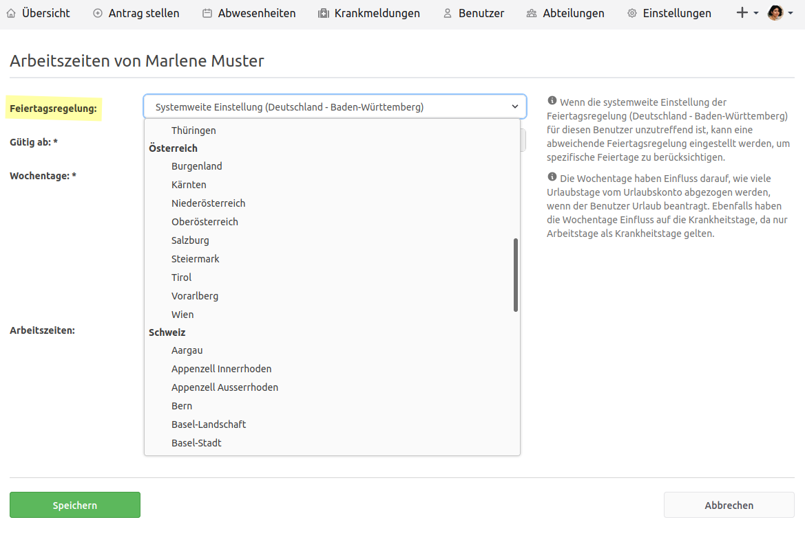
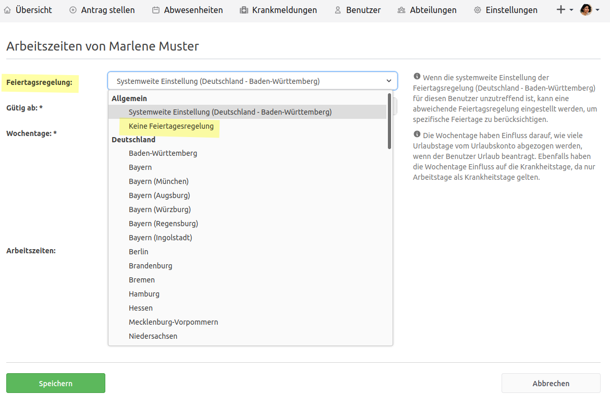
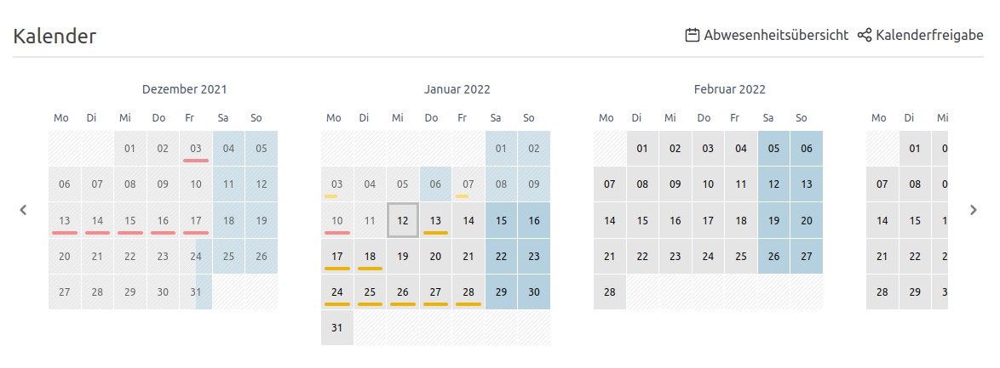

_Feiertagsregelung für Österreich, die Schweiz und das Vereinigtes Königreich, Abwesenheiten an Feiertagen und ein neues Kalenderdesign_

<!-- more -->

## Feiertagsregelungen für Österreich 🇦🇹, Schweiz 🇨🇭 und das Vereinigte Königreich 🇬🇧

Ab sofort kann die Feiertagsregelung, neben den Bundesländern für Deutschland, auch mit den österreichischen Bundesländern,
den Schweizer Kantonen sowie mit den Landesteilen des Vereinigtes Königreiches konfiguriert werden. Diese Einstellung ist, wie gewohnt,
global in den Einstellungen der Urlaubsverwaltung konfigurierbar und steht zusätzlich im Konto einer Person zur Auswahl bereit.
Der Name der Einstellung hat sich von 'Bundesland' zu 'Feiertagsregelung' geändert.

    <picture>
        <source srcset="public_holiday_person.avif" type="image/avif" />
        <source srcset="public_holiday_person.webp" type="image/webp" />
        
    </picture>
    <picture>
        <source srcset="public_holiday_person_change.avif" type="image/avif" />
        <source srcset="public_holiday_person_change.webp" type="image/webp" />
        
    </picture>

## Abwesenheiten an Feiertagen

Die [Feiertagsregelung](#feiertagsregelung) wurde zudem um den Eintrag _Keine Feiertagsregelung_ erweitert. Mit dieser Einstellung
ist es für die gesamte Urlaubsverwaltung sowie für bestimmte Personen möglich die Feiertagsregelung außer Kraft zu setzen und
Abwesenheiten auch an Feiertagen einzutragen.

<picture>
    <source srcset="public_holiday_person_no.avif" type="image/avif" />
    <source srcset="public_holiday_person_no.webp" type="image/webp" />
    
</picture>

## Neues Kalenderdesign

Das Kalenderdesign wurde überarbeitet und bietet nun mehr Platz um zukünftig noch weitere Informationen für einen Tag anzuzeigen.
Die Urlaubsverwaltung unterliegt einem ständigen Verbesserungsprozess, welcher Wert auf eine intuitive Bedienung legt.
Mit dem neuen Kalenderdesign stellen wir die Weichen für mehr Flexibilität und einen höheren Informationsgehalt. Wir freuen uns auf dein Feedback!

<picture>
    <source srcset="new_calendar_design_overview.avif" type="image/avif" />
    <source srcset="new_calendar_design_overview.webp" type="image/webp" />
    
</picture>
