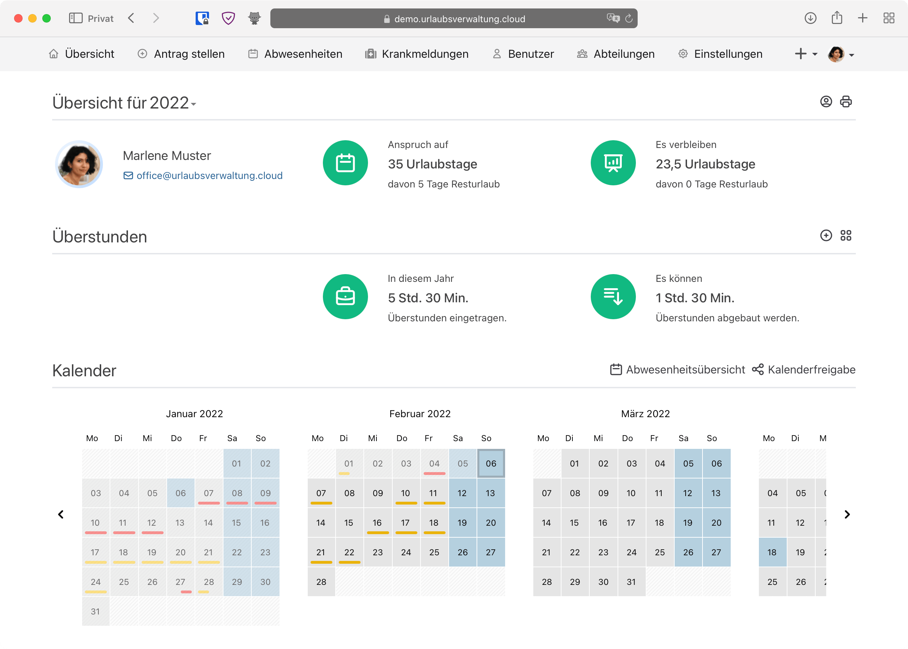
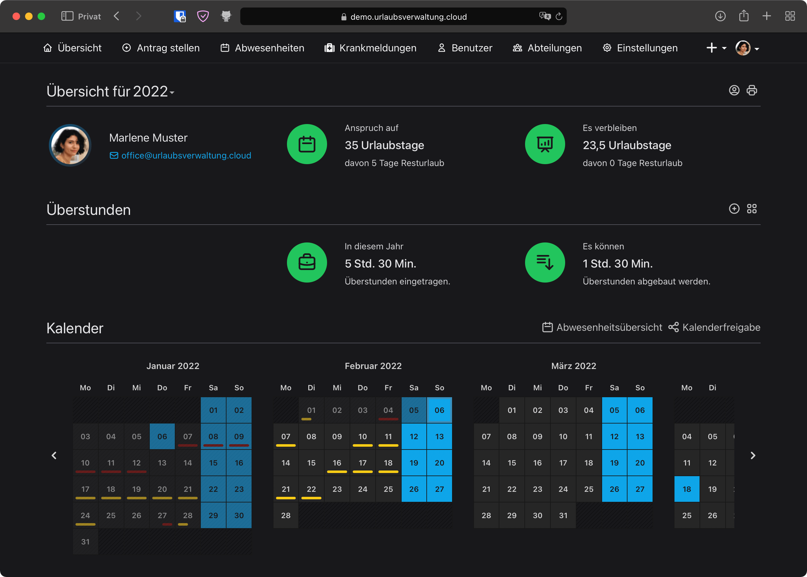

Mit Version 4.30.0 macht die Urlaubsverwaltung den Schritt zur dunklen Seite. Machst du ihn mit?

<!-- more -->

### Dunkelmodus

Der Dunkelmodus (Dark Mode oder auch Dark Theme) ist eine Einstellung für das Erscheinungsbild der Benutzeroberfläche auf Smartphones und Desktop Computer bzw Laptops.
Im Gegensatz zum Light Mode (Light Theme), der dunklen Text auf hellem Hintergrund darstellt, wird im Dark Mode ein heller Text auf dunklem Hintergrund verwendet.
Standardmäßig ist bei Windows, Android und MacOS das Light Theme aktiviert. Mittlerweile wird allerdings direkt beim Einrichten
des Gerätes die Präferenz nachgefragt und eingestellt.

Neu in der Urlaubsverwaltung ab Version 4.30.0 ist, dass sie sich an der Systemeinstellung orientiert und
sich mit hellem oder dunklem Hintergrund präsentiert. Sollte die Urlaubsverwaltung bereits im Einsatz sein,
wird sie weiterhin im Light Mode dargestellt und muss vom Nutzer selbst auf Dark Mode umgestellt werden.

Die Idee hinter dem Dunkelmodus ist, dass er das vom Bildschirm emittierte Licht reduziert und damit die Augen entlasten soll.
Des Weiteren hat eine Studie herausgefunden, dass heller Text auf dunklem Hintergrund sogar das Entstehen von Kurzsichtigkeit verhindern kann
(https://www.geo.de/wissen/gesundheit/19282-rtkl-kurzsichtigkeit-warum-wir-zukuenftig-mehr-weiss-auf-schwarz-lesen).

Warum wir uns freuen dir endlich einen Dunkelmodus anzubieten:

* Es ist cool und trendy. Mal im Ernst, wer findet die dunkle Seite nicht verlockend? 😎
* Es verbessert die Accessibility für Personen die sensibel auf helles Licht reagieren
* Die Akkulaufzeit auf Geräten mit OLED Display wird verbessert
* Die Urlaubsverwaltung sticht endlich nicht mehr heraus dem mittlerweile sehr populär und weit verbreiteten Erscheinungsbild

    

      <picture>
          <source srcset="uv-theme-light.avif" type="image/avif" />
          <source srcset="uv-theme-light.webp" type="image/webp" />
          
      </picture>
      
Übersichtseite im Light Theme.

    

    

      <picture>
          <source srcset="uv-theme-dark.avif" type="image/avif" />
          <source srcset="uv-theme-dark.webp" type="image/webp" />
          
      </picture>
      
Übersichtseite im Dark Theme.

    

### Dunkelmodus einstellen

Möchtest du in der Urlaubsverwaltung den Schritt auf die dunkle Seite mit gehen ist das ganz einfach getan.

Wähle hierfür deinen Avatar rechts oben aus und gehe zur Personalisierungs Webseite. Dort kannst du aus drei Möglichkeiten wählen:

- **System**  
  die Urlaubsverwaltung passt sich deinen Systemeinstellungen an (dunkel oder hell)
- **Hell**  
  die Urlaubsverwaltung wird immer mit dunklem Text auf hellem Hintergrund dargestellt
- **Dunkel**  
  die Urlaubsverwaltung wird immer mit hellem Txt auf dunklem Hintergrund dargestellt

<video controls width="720" height="515" class="my-8">
  <source src="uv-theme-configuration.mp4" type="video/mp4">
</video>

Du hast Verbesserungsvorschläge?  
Du wünschst die weitere Themes wie z. B. stärker Kontrast?  
Oder dir gefällt das neue Theme einfach nur sehr gut?

Wir freuen uns über dein Feedback an <a href="mailto:info@urlaubsverwaltung.cloud?subject=Feedback">info@urlaubsverwaltung.cloud</a>.

