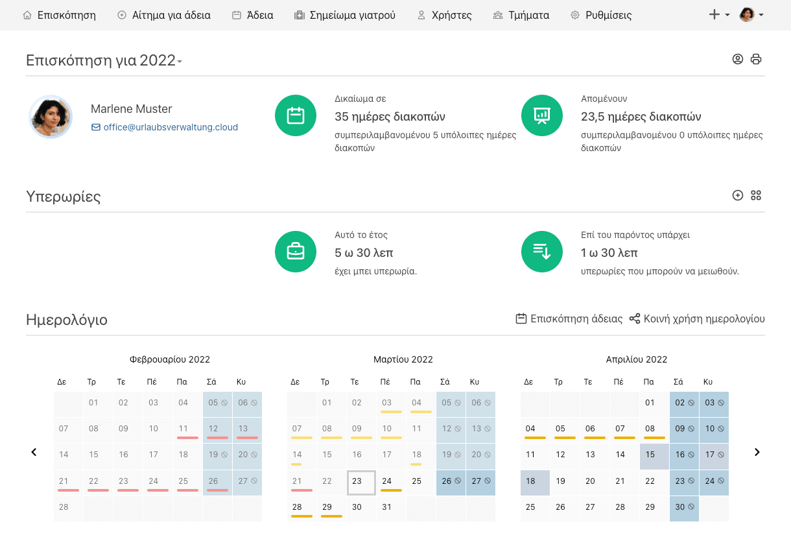

Die Urlaubsverwaltung nun auch in Griechenland!

<!-- more -->

### Griechische Feiertage & Übersetzung

Wir freuen uns sehr darüber, dass Nikos Zagkanas auf uns zukam und die Urlaubsverwaltung für Griechenland einsetzbar gemacht hat!

Die Urlaubsverwaltung verfügt nun über eine vollständige griechische Übersetzung, welche durch die Browsersprache gesteuert wird. Des Weiteren wurden auch griechische Feiertage integriert.

Wir empfanden die Kooperation als sehr angenehm und wir freuen uns darüber, auch in Griechenland einen Mehrwert bei der Abwesenheitsplanung beisteuern zu können.

<picture>
    <source srcset="greek.avif" type="image/avif" />
    <source srcset="greek.webp" type="image/webp" />
    
</picture>

 

Wir freuen uns über dein Feedback an <a href="mailto:info@urlaubsverwaltung.cloud?subject=Feedback">info@urlaubsverwaltung.cloud</a>.
