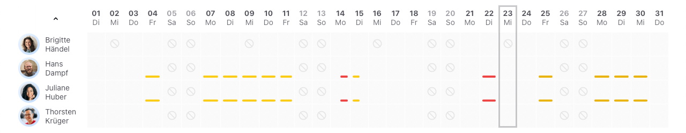

Bessere Übersicht deiner freien Tage in der Abwesenheitsübersicht und in den Kalendern

<!-- more -->

### Freie Tage

Bestimmt ist es jedem von euch schonmal so ergangen. Man möchte einen Urlaubsantrag genehmigen und schaut davor noch kurz in die
Abwesenheitsübersicht und wundert sich, warum der Kollege nur am Montag und Dienstag und dann wieder am Donnerstag und Freitag eine Abwesenheit eingetragen hat,
obwohl der Abwesenheitsantrag über die ganze Woche gestellt wurde.

Genau so erging es uns immer mal wieder. Zunächst wunderte man sich, dann schaute man in das Konto der Person und merkte,
das diese eine vier Tage Woche hat und das der freie Tag am Mittwoch ist. Ok. Verstanden. Man konnte den Antrag genehmigen.
Drei Monate später wunderte man sich wieder und das Spiel ging von vorne los.

Um dieser Herausforderung zu begegnen, haben wir, in der Abwesenheitsübersicht und in den Kalendern, die freien Tage einer Person dargestellt.

<picture>
  <source srcset="vier-tage-woche.avif" type="image/avif" />
  <source srcset="vier-tage-woche.webp" type="image/webp" />
  
</picture>

 

Wie man in der Abwesenheitsübersicht nun gut erkennen kann, hat Brigitte Händel eine vier Tage Woche und an jedem
Mittwoch sowie an den Wochenenden ihre freien Tage. Mit dieser Information der freien Tage wird nun direkt kenntlich gemacht,
warum für Brigitte Händel am 9. März keine Abwesenheit, über den Antrag, eingetragen ist. 

 

<picture>
  <source srcset="vier-tage-woche-kalender.avif" type="image/avif" />
  <source srcset="vier-tage-woche-kalender.webp" type="image/webp" />
  
</picture>

 

Diese Informationen sind auch im persönlichen Kalender sowie in der Datumsauswahl verfügbar.

Wir freuen uns über dein Feedback an <a href="mailto:info@urlaubsverwaltung.cloud?subject=Feedback">info@urlaubsverwaltung.cloud</a>.

