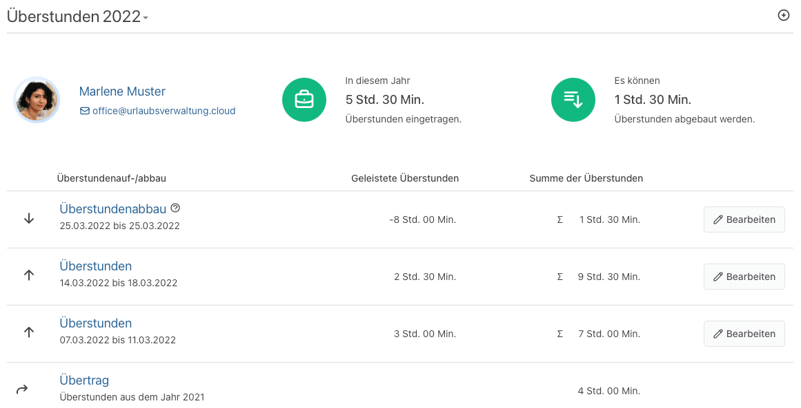

Bessere Nachvollziehbarkeit und Übersicht deiner Überstunden

<!-- more -->

### Überstundenübersicht mit flair

Wir haben für euch die Überstundenübersicht erweitert, sodass ihr nicht nur die eingetragenen Überstunden, sondern auch
die **beantragten und genehmigten Abwesenheiten** mit der Art 'Überstundenabbau' angezeigt bekommt. Mit dieser zusätzlichen
Information erhaltet ihr ein **komplettes Bild eurer Überstunden** und wie diese aufgebaut bzw. abgebaut wurden.
Zudem wird euch auf der untersten Zeile der **Übertrag** eurer Überstunden aus dem vorherigen Jahr angezeigt,
ein **Schnelleinstieg zum Bearbeiten** bereitgestellt sowie die **Summe** der Überstunden pro Eintrag angezeigt.

<picture>
    <source srcset="overtime-overview.avif" type="image/avif" />
    
</picture>

Wir freuen uns über dein Feedback an <a href="mailto:info@urlaubsverwaltung.cloud?subject=Feedback">info@urlaubsverwaltung.cloud</a>.
