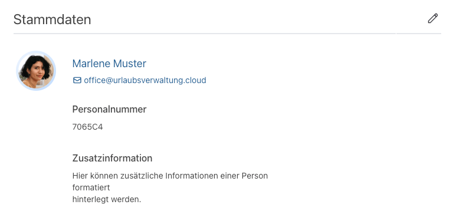
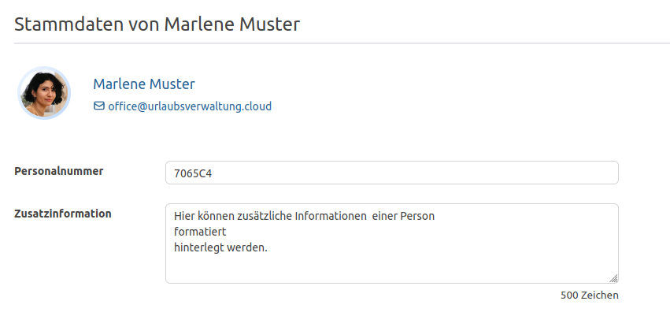
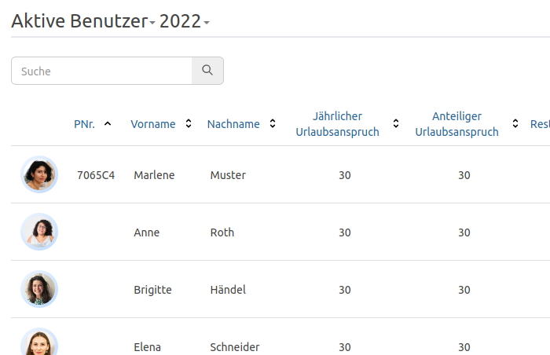
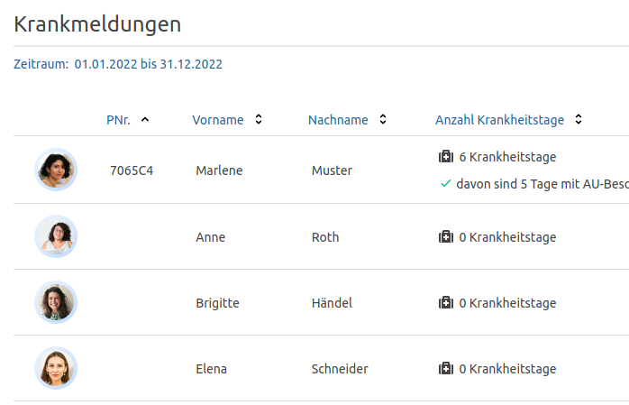
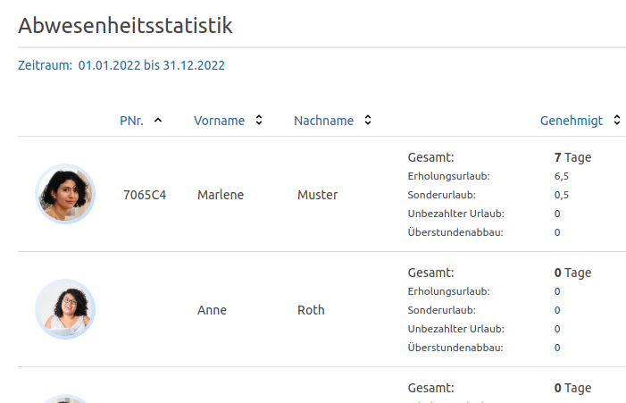

Hinterlege eine Personalnummer und weitere Informationen für deine Mitarbeitenden

<!-- more -->

### Benutzerspezifische Stammdaten

Die Urlaubsverwaltung kann nun Stammdaten! Was bedeutet das genau? Es ist im Konto einer Person möglich zusätzliche Informationen
wie die **Personalnummer** und **Zusatzinformation** zu hinterlegen. Zum Hinzufügen oder Bearbeiten einer dieser Information,
könnt ihr über das Konto einer Person bei den __Stammdaten__ auf den Stift klicken und schon kann es losgehen.  

    

        <picture>
            <source srcset="basedata-account-overview.avif" type="image/avif" />
            
        </picture>
        
Stammdatenformular

    

    

        <picture>
            <source srcset="basedata-input.avif" type="image/avif" />
            
        </picture>
        
Übersicht der Stammdaten

    

Nachdem ihr die Informationen gespeichert habt, werden diese im Konto, in der Benutzerübersicht, bei den Krankmeldungen,
in der Abwesenheitsstatistik und dessen CSV-Export sowie in anderen Sichten angezeigt.

    

        <picture>
            <source srcset="benutzeruebersicht.avif" type="image/avif" />
            
        </picture>
      
Benutzerübersicht mit Personalnummer.

    

    

        <picture>
            <source srcset="krankmeldungen.avif" type="image/avif" />
            
        </picture>
      
Krankmeldungen mit Personalnummer.

    

    

        <picture>
            <source srcset="abwesenheitsstatistik.avif" type="image/avif" />
            
        </picture>
        
Abwesenheitsstatistik mit Personalnummer.

    

Wir freuen uns über dein Feedback an <a href="mailto:info@urlaubsverwaltung.cloud?subject=Feedback">info@urlaubsverwaltung.cloud</a>.
