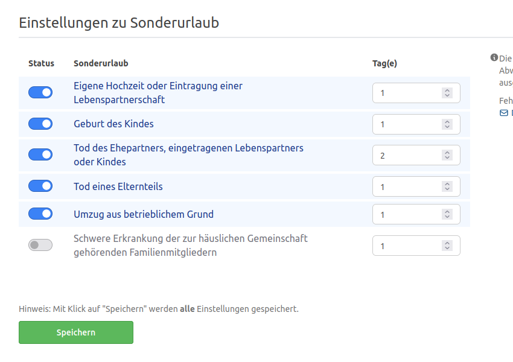
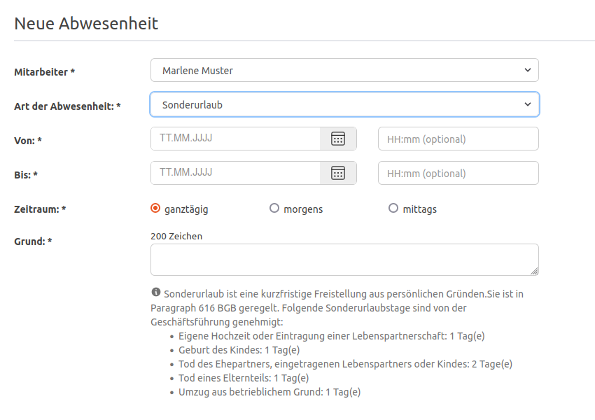

Sonderurlaube können individualisiert werden und Bildungsurlaub steht als neue Abwesenheitsart zur Verfügung

<!-- more -->

### Konfiguration der Sonderurlaubstage

Mit der Version 4.34.0 zieht die neue Konfiguration **Einstellungen zu Sonderurlaub** in die Urlaubsverwaltung ein.
Ihr findet diese als Person mit der Berechtigung _Office_ unter _Einstellungen > Abwesenheitsarten_. An dieser Stelle
könnt ihr nun die Anzeige der bei euch in der Organisation möglichen Sonderurlaube sowie die Anzahl der Tage konfigurieren.

Diese Einstellung wird beim Beantragen eines Sonderurlaubes direkt angezeigt und unterstützt den Antragsteller.

    <figure>
        <picture>
            <source srcset="configuration-special-holiday.avif" type="image/avif" />
            
        </picture>
        <figcaption class="text-sm text-center">Einstellungen zu Sonderurlaub</figcaption>
    </figure>
    <figure>
        <picture>
            <source srcset="absence-request.png" type="image/avif" />
            
        </picture>
        <figcaption class="text-sm text-center">Antrag eines Sonderurlaubes</figcaption>
    </figure>

### Bildungsurlaub

Eine neue Abwesenheitsart hat es in die Urlaubsverwaltung geschafft. Der **Bildungsurlaub**. Ihr könnt ihn, wie gewohnt,
in den Einstellungen unter Abwesenheitsarten aktivieren.

 
Wir freuen uns über dein Feedback an <a href="mailto:info@urlaubsverwaltung.cloud?subject=Feedback">info@urlaubsverwaltung.cloud</a>.
