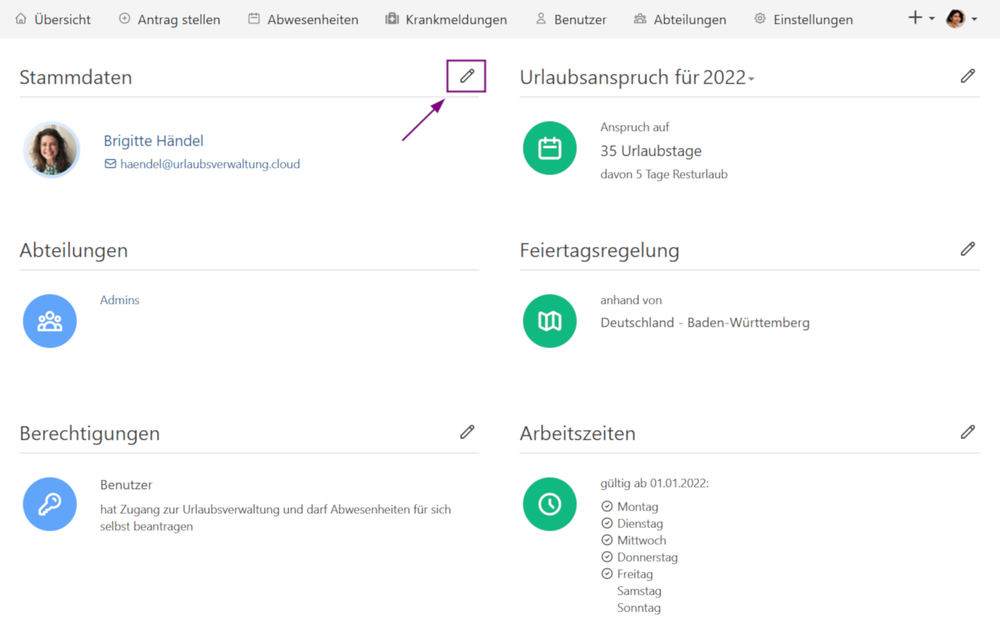

Erweiterung der Personalstammdaten um Personalnummer und Zusatzinformationen. Außerdem: Kalendereinladung für _Office_-Benutzende bei genehmigten Anträgen.

<!-- more -->

## Pflege von Personalstammdaten

Mit der Version 4.35.0 der Urlaubsverwaltung ist es nun möglich Stammdaten einer Person zu pflegen.
Benutzende mit der Berechtigung _Office_ können nun ganz bequem für Mitarbeitende die Personalnummer sowie weitere Zusatzinformation in der Urlaubsverwaltung speichern. Die Personalstammdaten können im Konto der betreffenden Person gepflegt werden.
Die Personalnummern und Zusatzinformationen sind in den bereits vorhandenen CSV-Exporten für Abwesenheiten und Krankmeldungen enthalten und können somit zur weiteren Verarbeitung in nachgelagerten Prozessen berücksichtigt werden.

    <figure>
        <picture>
            <source srcset="basedata-view.avif" type="image/avif" />
            
        </picture>
        <figcaption class="text-sm text-center">Hinzufügen von Personalstammdaten</figcaption>
    </figure>
    <figure>
        <picture>
            <source srcset="basedata-edit.avif" type="image/avif" />
            
        </picture>
        <figcaption class="text-sm text-center">Editieren von Personalstammdaten</figcaption>
    </figure>

Sofern mindestens eine Personalnummer gepflegt ist, werden diese in allen Übersichten von Mitarbeitenden angezeigt und kann zur Sortierung sowie auch zur Suche verwendet werden. Folgende Ansichten sind um die Personalnummer erweitert:

- Übersicht der Benutzenden
- Abwesenheitsstatistik
- Übersicht der Krankmeldungen

    <figure>
        <picture>
            <source srcset="user-overview-with-personnel-number.avif" type="image/avif" />
            
        </picture>
        <figcaption class="text-sm text-center">Personalnummer in der Übersicht von Benutzenden</figcaption>
    </figure>

## Kalendereinladung für Office-Benutzende

Die E-Mail-Benachrichtigung einer genehmigten Abwesenheit wurde für die Benutzenden mit der Berechtigung _Office_ um die Kalendereinladung der Abwesenheit erweitert. Diese kann z.B. für einen externen Kalender zur einfacheren Koordination verwendet werden.

 
Wir freuen uns über dein Feedback an <a href="mailto:info@urlaubsverwaltung.cloud?subject=Feedback">info@urlaubsverwaltung.cloud</a>.
