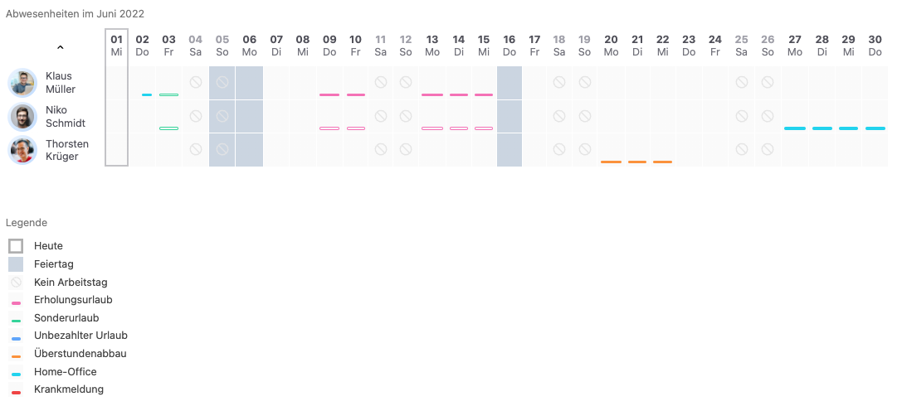
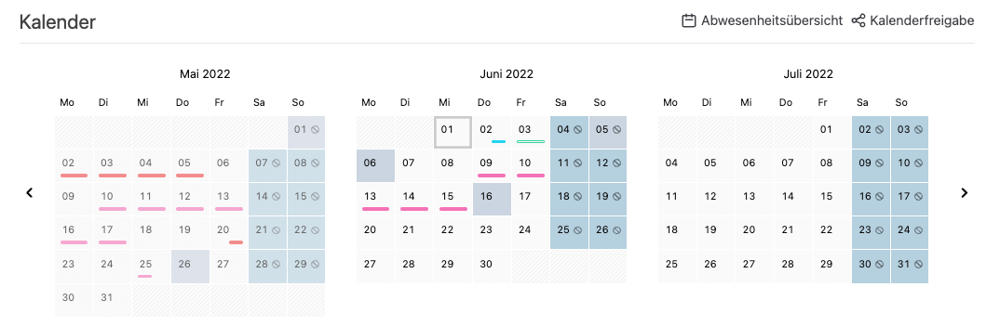
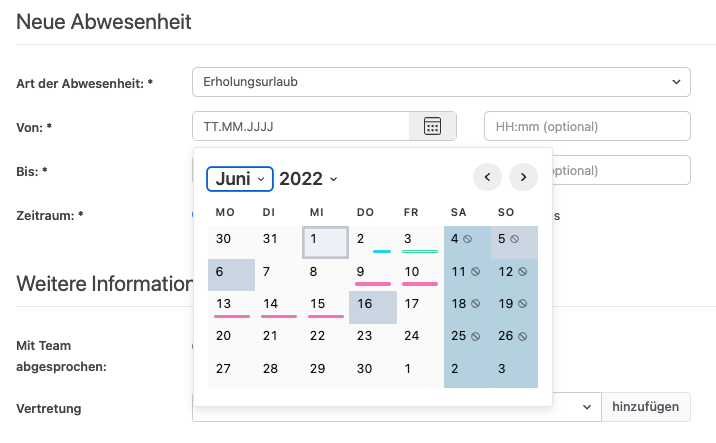
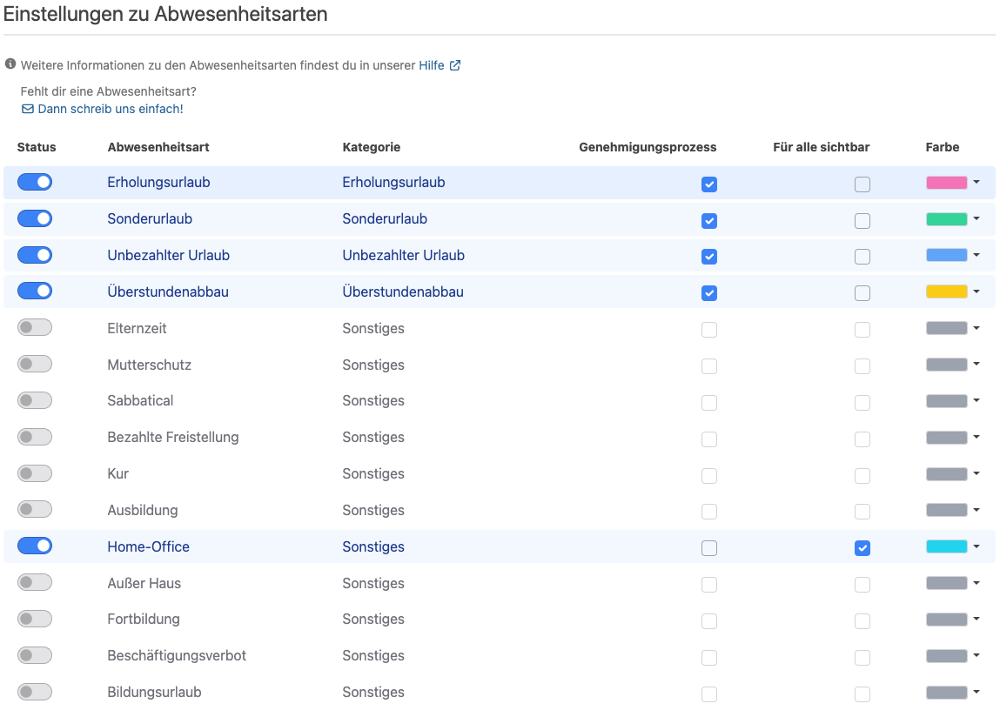
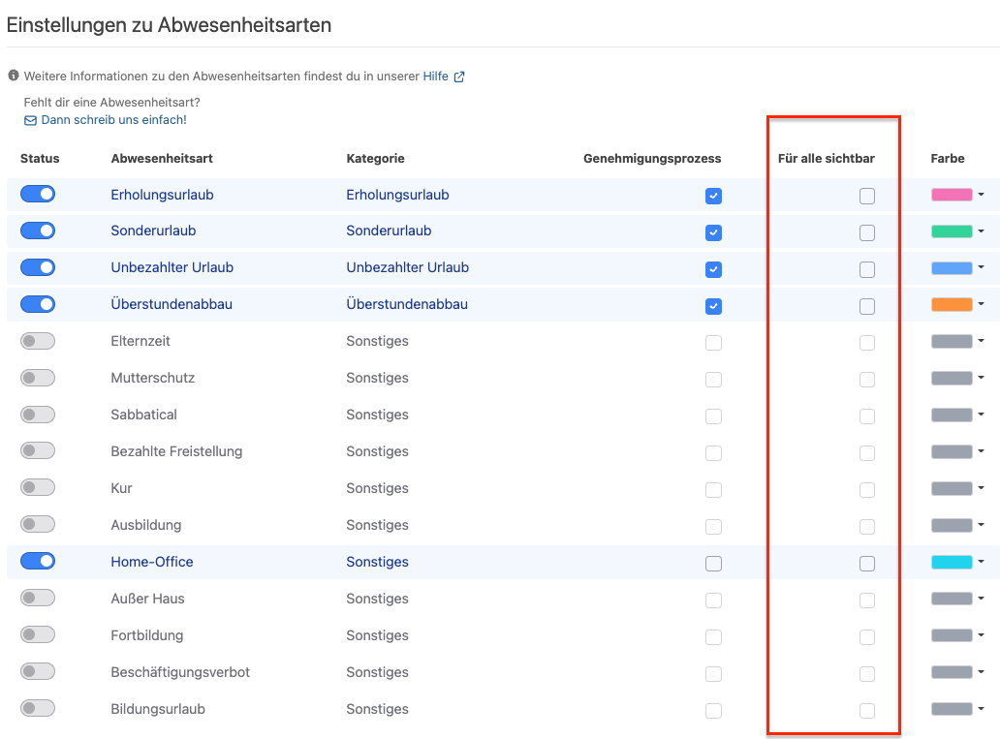

Die Farbe und Sichtbarkeit einer Abwesenheitsart können ab sofort individuell konfiguriert werden.

<!-- more -->

Mit der Einführung weiterer Abwesenheitsarten wie _Home-Office_, _Außer Haus_ oder _Ausbildung_ können auch Abwesenheiten erfasst werden, bei denen
Mitarbeitende zwar nicht vor Ort, aber dennoch beschäftigt und erreichbar sind. Um einen umfassenden Überblick der Abwesenheiten zu erhalten kannst du, seit der neuen Version der Urlaubsverwaltung, die Abwesenheitsarten in den vorhandenen Übersichten und Kalendern farblich anpassen und gruppieren! 🎉

## Abwesenheitsübersicht

    <figure>
        <picture>
            <source srcset="allAbsencesVisibleForOffice.avif" type="image/avif" />
            
        </picture>
        <figcaption class="text-sm text-center">Farbliche Darstellung der Abwesenheitsarten mit entsprechender Legende in der Abwesenheitsübersicht</figcaption>
    </figure>

Zusätzlich wurde im Rahmen der Änderung eine eindeutigere Unterscheidbarkeit zwischen genehmigten und noch offenen Anträgen geschaffen.
Noch nicht genehmigte Abwesenheiten werden als leerer Rahmen in der betreffenden Farbe angezeigt. Für genehmigte Anträge wird dieser Rahmen ausgefüllt dargestellt.

## Kalender auf der persönlichen Startseite

    <figure>
        <picture>
            <source srcset="overviewCalendar.avif" type="image/avif" />
            
        </picture>
        <figcaption class="text-sm text-center">Kalender auf der persönlichen Startseite mit farblicher Unterscheidung der Abwesenheitsarten</figcaption>
    </figure>

## Datumsauswahl

    <figure>
        <picture>
            <source srcset="calendarPicker.avif" type="image/avif" />
            
        </picture>
        <figcaption class="text-sm text-center">Datumsauswahl mit farblicher Unterscheidung der Abwesenheitsarten</figcaption>
    </figure>

## Einstellung der Farbe der Abwesenheitsarten

Die Farben der Abwesenheitsarten können durch Benutzende mit der Berechtigung Office unter _Einstellungen_ » _Abwesenheitsarten_ konfiguriert werden:

    <figure>
        <picture>
            <source srcset="colorConfiguration.avif" type="image/avif" />
            
        </picture>
        <figcaption class="text-sm text-center">Neue Farbkonfiguration für Abwesenheitsarten</figcaption>
    </figure>

Die Farben der Abwesenheitsarten werden in allen oben genannten Übersichten entsprechend verwendet.

## Einstellung der Sichtbarkeit

Neben der neuen Farbkonfiguration ist es nun auch möglich die Sichtbarkeit der Abwesenheitsarten in der Abwesenheitsübersicht einzustellen.

    <figure>
        <picture>
            <source srcset="visibilityConfiguration.avif" type="image/avif" />
            
        </picture>
        <figcaption class="text-sm text-center">Einstellung der Sichtbarkeit von Abwesenheitsarten</figcaption>
    </figure>

Bisher war die Sichtbarkeit anhand der Berechtigungen eingeschränkt. Normale Benutzende konnten bisher nur die generische Information _Abwesend_ für die Kolleg:innen der Abteilung einsehen. Dies macht vor allem im Hinblick auf Datenschutz-Aspekte Sinn, da den Kolleg:innen aus der Abteilung z.B. nicht mitgeteilt werden muss, warum eine Person nicht anwesend ist. Im nachfolgenden Beispiel sind für den normalen Benutzer Klaus Müller nur eigenen Abwesenheiten mit Abwesenheitsart sichtbar. Die Abwesenheiten der Kolleg:innen sind mit der generischen Information _Abwesen_ dargestellt.

    <figure>
        <picture>
            <source srcset="onlyOwnVisible.avif" type="image/avif" />
            
        </picture>
        <figcaption class="text-sm text-center">Unterscheidung nur der eigenen Abwesenheitsarten, Abwesenheiten von Kolleg:innen werden als <i>Abwesend</i> dargestellt.</figcaption>
    </figure>

Dagegen ist z.B. die Abwesenheitsart _Home-Office_ oder _Außer Haus_ ein Fall bei dem es sinnvoll sein kann die Information in der Abteilung zu teilen, da die Person in Arbeitsabläufe eingebunden sein kann oder zumindest telefonisch erreichbar ist. Für diesen Fall ist es nun möglich, dass die Abwesenheitsart für alle sichtbar gemacht wird. Die Einstellung hat zur Folge, dass die Abwesenheitsart nicht mehr durch die generische Information "Abwesend" für normale Benutzende dargestellt wird, sondern die konkrete Abwesenheitsart sichtbar ist. Als Beispiel ist im folgenden Bild ist die <i>Home-Office</i>-Abwesenheit von Niko Schmitt am 27.-30.06 für Klaus Müller als normaler Benutzer sichtbar. Abwesenheitsarten für die, die Sichtbarkeit nicht freigegeben wurde, werden weiterhin als _Abwesend_ angezeigt.

    <figure>
        <picture>
            <source srcset="differentVisibilities.avif" type="image/avif" />
            
        </picture>
        <figcaption class="text-sm text-center">Differenzierung von Abwesenheitsarten der Mitarbeitenden, im Beispiel wird <i>Home-Office</i> für alle Mitarbeitenden der Abteilung sichtbar</figcaption>
    </figure>

 
Wir freuen uns über dein Feedback an <a href="mailto:info@urlaubsverwaltung.cloud?subject=Feedback">info@urlaubsverwaltung.cloud</a>.
