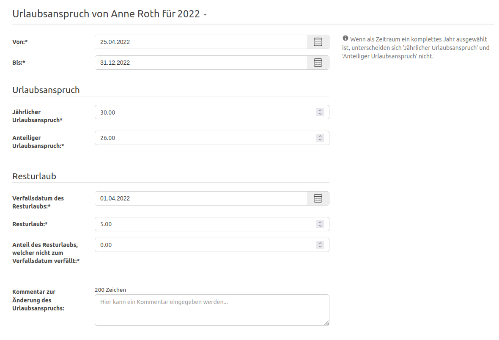

Der Verfall des Resturlaubs aus dem Vorjahr kann ab sofort pro Mitarbeitenden konfiguriert werden und ist auf der
Übersichtseite einsehbar.

<!-- more -->

#### Informationen über den verfallenen Resturlaub

Der Verfall von Resturlaub wird dir auf der deiner Übersichtseite aufgezeigt, sofern dein teilweise oder vollständig Resturlaub verfallen ist.
Dies schafft mehr Transparenz über die Berechnung deiner verbleibenden Urlaubstage und erklärt, warum sich dein anteiliger Urlaubsanspruch ggf. reduziert hat.

    <figure>
        <picture>
            <source srcset="residual-leave-top.avif" type="image/avif" />
            
        </picture>
        <figcaption class="text-sm text-center">Information über den verfallenen Resturlaub am Start der Übersichtsseite</figcaption>
    </figure>

Der verfallene Resturlaub wird dir nicht nur bei den verbleibenden Urlaubstagen, sondern auch bei der Auflistung deiner Abwesenheiten dargestellt.

    <figure>
        <picture>
            <source srcset="residual-leave-bottom.avif" type="image/avif" />
            
        </picture>
        <figcaption class="text-sm text-center">Information über den verfallenen Resturlaub bei den Abwesenheiten auf der Übersichtsseite</figcaption>
    </figure>

#### Verfall von Resturlaub pro Mitarbeitenden konfigurieren

Der Verfall von Resturlaub ist ab sofort pro Mitarbeitenden im Konto unter Urlaubsanspruch konfigurierbar. Bisher war
das Verfallsdatum des Resturlaubes fest auf den 1. April des Folgejahres definiert. Dieses Datum entspricht zwar einer breiten
Masse der Mitarbeitenden, war jedoch sehr starr und hat nicht jeden Anwendungsfall befriedigt. Seit der Version 4.43.0 der
Urlaubsverwaltung ist es nun möglich das Verfallsdatum im Konto unter Urlaubsanspruch pro Mitarbeitenden zu konfigurieren. 

    <figure>
        <picture>
            <source srcset="residual-leave-configuration.avif" type="image/avif" />
            
        </picture>
        <figcaption class="text-sm text-center">Konfiguration des Urlaubsanspruchs einer Person mit anpassbarem Datum zum Verfall des Resturlaubes</figcaption>
    </figure>

 
Wir freuen uns über dein Feedback an <a href="mailto:info@urlaubsverwaltung.cloud?subject=Feedback">info@urlaubsverwaltung.cloud</a>.
