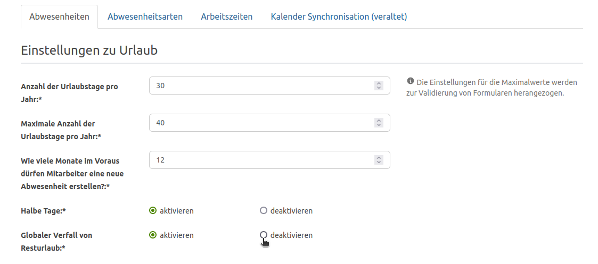
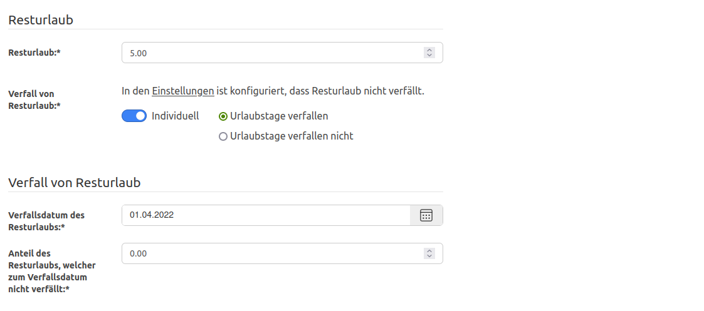

Der Verfall des Resturlaubs aus dem Vorjahr kann ab sofort für alle in den Einstellungen oder im jeweiligen Urlaubsanspruch
des Mitarbeitenden deaktiviert bzw. aktiviert werden.

<!-- more -->

### Verfall von Resturlaub für alle Mitarbeitenden deaktivieren

Der Verfall des Resturlaubes kann, seit der Version 4.50.0 der Urlaubsverwaltung, in den Einstellungen unter 
'Einstellungen zu Urlaub' global deaktiviert bzw. aktiviert werden. Durch das Deaktivieren des Verfalls werden die 
nicht genommenen Urlaubstage komplett in das kommende Jahr als Resturlaub übernommen.

    <figure>
        <picture>
            <source srcset="residual-leave-configuration.avif" type="image/avif" />
            
        </picture>
        <figcaption class="text-sm text-center">Konfiguration zum Deaktivieren/Aktivieren des Verfalls von Resturlaubs für alle Mitarbeitenden</figcaption>
    </figure>

### Verfall von Resturlaub pro Mitarbeitenden individuell deaktivieren

Der Verfall von Resturlaub kann nicht nur für alle Mitarbeitenden, sondern zusätzlich auch pro Mitarbeitenden im Konto 
unter Urlaubsanspruch deaktiviert bzw. aktiviert werden. Hiermit hat man die Möglichkeit z.B. den Verfall für alle Mitarbeitenden
zu deaktivieren und für bestimmte Mitarbeitenden individuell zu aktivieren.

    <figure>
        <picture>
            <source srcset="residual-leave-configuration-employee.avif" type="image/avif" />
            
        </picture>
        <figcaption class="text-sm text-center">Konfiguration des individuellen Verfalls von Resturlaub pro Mitarbeitenden</figcaption>
    </figure>

Wir freuen uns über dein Feedback an <a href="mailto:info@urlaubsverwaltung.cloud?subject=Feedback">info@urlaubsverwaltung.cloud</a>.
 
