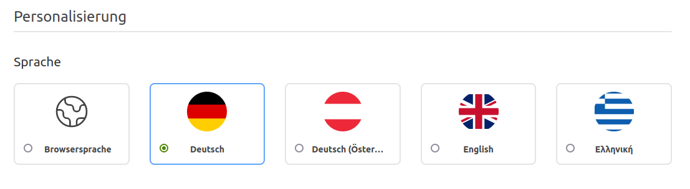

Wir erweitern für euch die Personalisierung, sodass ihr die Sprache unabhängig der Browsersprache konfigurieren könnt.

<!-- more -->

## Browsersprache in der Personalisierung überschreiben

Bisher war es in der Urlaubsverwaltung ausschließlich so, dass die Browsersprache bestimmt hat, in welcher Sprache die
Urlaubsverwaltung dargestellt wird. Dies ist weiterhin der Standardfall, jedoch gehen wir nun einen Schritt weiter und
ermöglichen es in der Personalisierung einzustellen, welche Sprache verwendet werden soll.

    <figure>
        <picture>
            <source srcset="language-personalisation.avif" type="image/avif" />
            
        </picture>
        <figcaption class="text-sm text-center">Konfiguration zum Überschreiben der Browsersprache in den Personalisierungen</figcaption>
    </figure>

Warum tun wir das? Weil wir euer Feedback ernst nehmen und mit euch die Urlaubsverwaltung weiterentwickeln! Es wurde mehrfach an uns
herangetragen, dass Personen ihren Browser z.B. auf die englische Sprache eingestellt haben, jedoch mit den fachlichen und
rechtlichen Bezeichnungen der Urlaubsverwaltung für Urlaub und Abwesenheiten auf Englisch ihre Probleme haben. Verständlich!
Wer kennt schon die englischen Bezeichnungen für Resturlaub oder anteilige Urlaubstage.
Nun könnt ihr euren Browser auf eurer Wunschsprache eingestellt haben und die Urlaubsverwaltung z.B. auf Deutsch genießen!

 
Wir freuen uns über dein Feedback an <a href="mailto:info@urlaubsverwaltung.cloud?subject=Feedback">info@urlaubsverwaltung.cloud</a>.
