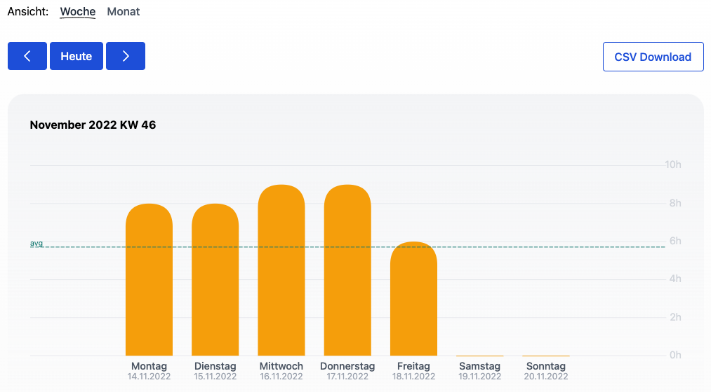
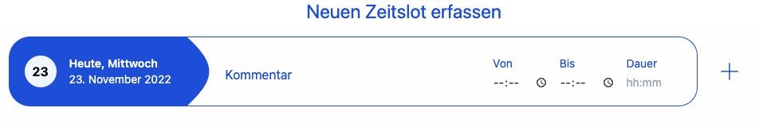

Unsere schlanke Lösung auf die Anforderung des Bundesarbeitsgerichts (BAG) einer 
objektiven, verlässlichen und zugänglichen Zeiterfassung ist jetzt da!

<!-- more -->

### Brauche ich eine Zeiterfassung?

Sind wir mal ehrlich, Vertrauensarbeitszeit hin oder her, die eigene Arbeitszeit in irgendeiner Art und Weise festzuhalten
hat viele Vorteile und sollte jeder Arbeitnehmer machen. Nicht zuletzt als Selbstschutz um nachvollziehen zu können,
ab wann zu viel gearbeitet wird. Vor allem im Homeoffice, wo z.B. der Arbeitsweg wegfällt,
<a target="_blank" href="https://www.forbes.com/sites/zakdoffman/2020/03/24/coronavirus-work-from-home-longer-hours-more-distractions-and-this-surprising-privacy-threat/">
arbeiten viele Arbeitnehmer deutlich mehr </a> als im Büro.

Seit dem EuGH Urteil aus dem Mai 2019 steht fest, dass in Europa die Pflicht für Arbeitgeber eine Zeiterfassung einzuführen
unumgänglich ist. Da jedoch ein zeitlicher Rahmen bisher fehlte, sahen sich die Unternehmen nicht im Zugzwang.
Dies änderte sich am 13.09.2022 mit dem Gerichtsurteil des Bundesarbeitsgerichts.

> "Der Arbeitgeber ist nach §3 Abs. 2 Nr. 1 ArbSchG verpflichtet, ein System einzuführen, mit dem die von den Arbeitnehmern geleistete Arbeitszeit erfasst werden kann."
>
> -- <a href="https://www.bundesarbeitsgericht.de/presse/einfuehrung-elektronischer-zeiterfassung-initiativrecht-des-betriebsrats/">Bundesarbeitsgericht</a> 

49% der KMUs erfassen bereits die Arbeitszeit. 50% davon erfassen ihre Arbeitszeit jedoch mit Stift und Papier und 24% verwenden eine
elektronische Tabelle, also Excel.
https://dup-magazin.de/management/strategie/so-kommen-sie-der-pflicht-zur-arbeitszeiterfassung-nach/
So ganz wird das dem EuGH Urteil nach einer objektiven, verlässlichen und zugänglichen Zeiterfassung nicht gerecht. 

### Aber was genau heißt objektiv, verlässlich und zugänglich?

Jeder Mitarbeitende sollte auf der gleichen Art seine Arbeitszeit erfassen, damit die erhobenen Zahlen keine 
Unstimmigkeiten vorweisen und wenig Interpretationsfreiheit zulassen. Nicht auf unterschiedliche Systeme oder Exceltabellen
schauen zu müssen, ermöglicht eine **objektive** Sicht und ein einfaches Verständnis.

>„Ich glaube keiner Statistik, die ich nicht selbst gefälscht habe“.
>
> -- Sir Winston Churchill
 
Sowohl Arbeitnehmer als auch Arbeitgeber müssen sich darauf verlassen können, dass Kalkulationen einheitlich und idempotent
sind. Für jeden Mitarbeitenden muss also gelten, dass für die gleichen eingegebenen Zahlen auch die gleiche und korrekte
Statistik **verlässlich** berechnet wird.

    <figure>
        <picture>
            <source srcset="stats.avif" type="image/avif" />
            
        </picture>
        <figcaption class="text-sm text-center">Statistik der Zeiterfassung</figcaption>
    </figure>

Eine Lösung die als **zugänglich** bezeichnet wird sollte nicht nur gleichermaßen aus dem HomeOffice sowie aus dem Büro 
verwendet werden können, sondern auch inklusiv bedienbar sein und nie.

    <figure>
        <picture>
            <source srcset="enterslot.avif" type="image/avif" />
            
        </picture>
        <figcaption class="text-sm text-center">Formular zur Erfassung eines Zeitabschnittes</figcaption>
    </figure>

### Unsere Open Source Software as a Service

Um den Anforderungen gerecht zu werden stellen wir eine Open Source Software as a Service zur Verfügung.
Für eine Open Source Zeiterfassung gilt, dass alle Interessierten bei Bedarf nachvollziehen können wie Daten verarbeitet werden, 
da der Sourcecode öffentlich zugänglich ist. Viel mehr gewinnt die Software an Stabilität und profitiert von der
Mitarbeit einer aktiven Community.

Mit dem Fokus auf User Experience und Accessibility verfolgen wir stetig das Ziel die Software allen Menschen gleichermaßen
zur Verfügung zu stellen.

Als Reaktion auf das oben genannte Urteil stellen wir unsere Lösung den urlaubsverwaltung.cloud Kunden zunächst kostenlos zur Verfügung.
