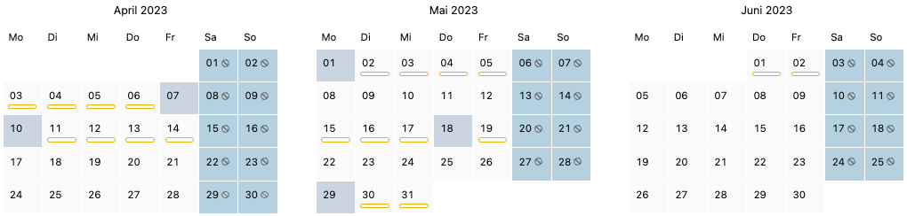
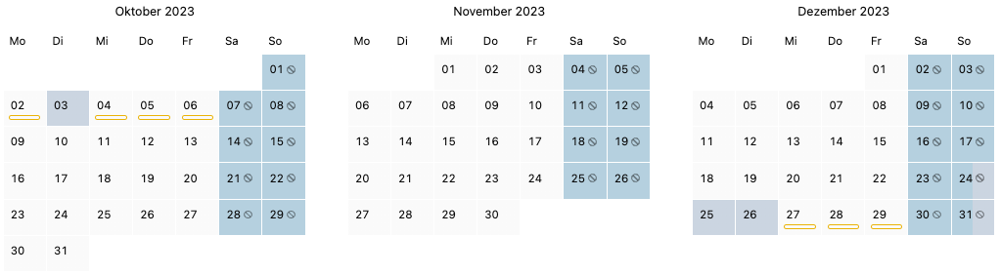
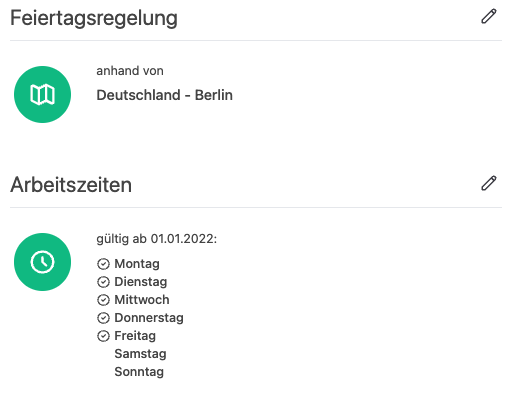

Die Brückentage liegen 2023 günstig um sich viel zu erholen.
Aus 8 Feiertagen werden 61 Tage Erholung!

<!-- more -->

## Die üblichen verdächtigen Ballungszeiträume Weihnachten und Ostern

Wenig überraschend verlängern Karfreitag und Ostersonntag das Osterwochenende und ermöglichen auch dieses Jahr nur mit 8
Urlaubstagen 16 freie Erholungstage. Um es an dieser Stelle korrekt einzuordnen sei vorweggenommen, dass auch nächstes Jahr die
Weihnachtsfeiertage
sowie der Neujahrstag an einem Werktag liegen und sogar mit nur 7 Urlaubstagen die 16 freien Erholungstage erreicht werden
können.

    <figure>
        <picture>
            <source srcset="apr-jun.avif" type="image/avif" />
            
        </picture>
        <figcaption class="text-sm text-center">Mögliche Urlaubsplanung für die Brückentage im April bis Juni</figcaption>
    </figure>

## Aus 8 Feiertagen werden 61 Tage Erholung

Wir wollen an dieser Stelle natürlich nicht unterschlagen, dass Familien vor allem von den Schulferien abhängig sind,
sodass auch im Jahr 2023 die klassischen wirtschaftlichen Flauten zu den Schulferienzeiten zu erwarten sind. 
Vor allem in den Sommerferien, die vom Bundesland abhängig zwischen dem 06. Juli und dem 11. September liegen.

> „Urlaub ist wie Medizin: man muss ihn regelmäßig nehmen, um gesund zu bleiben.“
>
> -- Unbekannt

Im Jahr 2023 fallen nur noch 3 der 20 deutschen Feiertage auf ein Wochenende. Im Vergleich waren es 2022 noch 8.
Ein spektakulärer Monat ist der Mai. Anfang (1. Mai, Tag der Arbeit), Mitte (18. Mai, Christi Himmelfahrt) und Ende
(29. Mai, Pfingstmontag) Mai befinden sich für ganz Deutschland 3 Feiertage auf einem Werktag.
Unterschiedlichen Kombinationen machen es möglich, dass

* aus 4 Urlaubstagen 9 freie Tage werden (2 Mal möglich)
* aus 6 Urlaubstagen 12 freie Tage werden
* aus 9 Urlaubstagen 17 freie Tage werden
  
oder die lange ersehnte Reise durch 13 Urlaubstagen und ganzen 23 Tagen Urlaub möglich wird.
  Das ist wahlweise sowohl für die erste Monatshälfte im Mai, als auch für die zweite Hälfte realisierbar.

Zusätzlich kann sich ganz Deutschland auf den Tag der deutschen Einheit freuen, der am 03.10. auf einen Dienstag fällt,
sodass auch hier mit nur 4 Urlaubstagen 9 freie Tage möglich sind.

    <figure>
        <picture>
            <source srcset="okt-dez.avif" type="image/avif" />
            
        </picture>
        <figcaption class="text-sm text-center">Mögliche Urlaubsplanung für den Tag der deutschen Einheit sowie für Weihnachten</figcaption>
    </figure>

**In ganz Deutschland kann man diese 8 Feiertage ausnutzen und sich mit 27 Urlaubstagen 61 Tage lang erholen.**

## Weitere Feiertage der Bundesländer

Da jedes Bundesland individuell Feiertage festgelegt hat, sind auch weitere Kombinationen denkbar.

| <!-- -->                             | <!-- -->   | <!-- -->   |
|--------------------------------------|------------|------------|
| **Feiertage Baden-Württemberg**      |            |            |
| Heilige Drei Könige                  | 06.01.2023 | Freitag    |
| Fronleichnam                         | 08.06.2023 | Donnerstag |
| Allerheiligen                        | 01.11.2023 | Mittwoch   |
| **Feiertage Bayern**                 |            |            |
| Heilige Drei Könige                  | 06.01.2023 | Freitag    |
| Fronleichnam                         | 08.06.2023 | Donnerstag |
| Mariä Himmelfahrt                    | 15.08.2023 | Dienstag   |
| Allerheiligen                        | 01.11.2023 | Mittwoch   |
| **Feiertage Berlin**                 |            |            |
| Internationaler Frauentag            | 08.03.2023 | Mittwoch   |
| **Feiertage Brandenburg**            |            |            |
| Reformationstag                      | 31.10.2023 | Dienstag   |
| **Feiertage Bremen**                 |            |            |
| Reformationstag                      | 31.10.2023 | Dienstag   |
| **Feiertage Hamburg**                |            |            |
| Reformationstag                      | 31.10.2023 | Dienstag   |
| **Feiertage Hessen**                 |            |            |
| Fronleichnam                         | 08.06.2023 | Donnerstag |
| **Feiertage Mecklenburg-Vorpommern** |            |            |
| Reformationstag                      | 31.10.2023 | Dienstag   |
| **Feiertage Niedersachsen**          |            |            |
| Reformationstag                      | 31.10.2023 | Dienstag   |
| **Feiertage Nordrhein-Westfalen**    |            |            |
| Fronleichnam                         | 08.06.2023 | Donnerstag |
| Allerheiligen                        | 01.11.2023 | Mittwoch   |
| **Feiertage Rheinland-Pfalz**        |            |            |
| Fronleichnam                         | 08.06.2023 | Donnerstag |
| Allerheiligen                        | 01.11.2023 | Mittwoch   |
| **Feiertage Saarland**               |            |            |
| Fronleichnam                         | 08.06.2023 | Donnerstag |
| Mariä Himmelfahrt                    | 15.08.2023 | Dienstag   |
| Allerheiligen                        | 01.11.2023 | Mittwoch   |
| **Feiertage Sachsen**                |            |            |
| Reformationstag                      | 31.10.2023 | Dienstag   |
| Buß- und Bettag                      | 22.11.2023 | Mittwoch   |
| **Feiertage Sachsen-Anhalt**         |            |            |
| Heilige Drei Könige                  | 06.01.2023 | Freitag    |
| Reformationstag                      | 31.10.2023 | Dienstag   |
| **Feiertage Schleswig-Holstein**     |            |            |
| Reformationstag                      | 31.10.2023 | Dienstag   |
| **Feiertage Thüringen**               |            |            |
| Weltkindertag                        | 20.09.2023 | Mittwoch   |
| Reformationstag                      | 31.10.2023 | Dienstag   |

## Aus 8 Feiertagen werden 61 Tage Erholung

  

    <figure>
        <picture>
            <source srcset="einstellungen.avif" type="image/avif" />
            
        </picture>
        <figcaption class="text-sm text-center">Einstellungen von Bundesland und Arbeitstagen</figcaption>
    </figure>
  

  

    

      An dieser Stelle müssen wir relativieren, dass die oben beschriebenen Fakten
      nur für diejenigen gelten, die Montag bis Freitag ihrem Beruf nachgehen.
      Arbeitet jemand am Wochenende sieht die Statistik entsprechend anders aus.
    

    

      Unter Berücksichtigung des Bundeslandes, der Arbeitstage und der Abwesenheiten anderer Mitarbeitenden,
      kann es relativ kompliziert werden den Überblick zu behalten und den korrekten Urlaubsanspruch zu berechnen.
      Hier kann die Urlaubsverwaltung perfekt unterstützen, welche genau diese Faktoren einbezieht.
    

  

	

		

			Mache dir selbst ein Bild und starte mit deiner eigene Urlaubsverwaltung noch heute.
		

		

			<a data-append-utm
				 href="https://registry.apps.urlaubsverwaltung.cloud/registration"
				 class="px-3 py-2 text-lg font-medium flex items-center justify-center no-underline rounded whitespace-nowrap bg-yellow-300 text-sky-900 text-opacity-90 hover:text-opacity-100 border border-sky-100 hover:border-blue-200 hover:shadow-md active:shadow"
				 data-goal="signup"
				 data-goal-trigger="eye-catcher"
			>
            
              30 Tage kostenlos testen
            
			</a>
		

	

