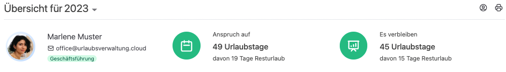
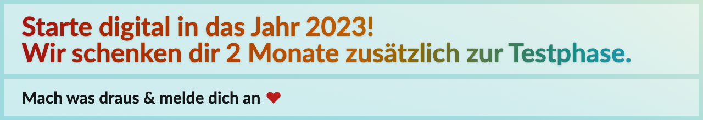

Es hat generell viele Vorteile die Urlaubsverwaltung zu digitalisieren.
Vor allem der Jahreswechsel ist ein sehr guter Zeitpunkt damit zu starten.

<!-- more -->

**Hier kommen 4 Gründe warum es sinnvoll ist jetzt damit zu starten!**

### 1. Neuberechnung des Urlaubsanspruchs 

Der Jahreswechsel ist ein guter Zeitpunkt, um die Urlaubsverwaltung zu digitalisieren, 
da zu diesem Zeitpunkt die Urlaubstage für das kommende Jahr festgelegt werden. Einflussfaktoren sind
Änderungen in der Arbeitszeit oder z.B. Resturlaub. Diese Kalkulation wird durch eine digitale Urlaubsverwaltung vereinfacht.
Rechnungsfehler werden vermieden.

 

    <figure>
        <picture>
            <source srcset="übersicht.avif" type="image/avif" />
            
        </picture>
        <figcaption class="text-sm text-center">Überblick des Urlaubsanspruchs sowie des Resturlaubs</figcaption>
    </figure>

### 2. Jahresurlaub planen

Eine digitale Urlaubsverwaltung unterstützt dich dabei, die Planung und Verwaltung der Urlaubstage zu vereinfachen, zu verbessern und schafft transparenz.
Mit dem kalkulierten Urlaubsanspruch können Mitarbeitende direkt den Jahresurlaub ins Auge fassen
und im Hinblick auf der Verteilung der Feiertage die optimale Urlaubsverteilung planen.
Außerdem können mit Hilfe der Abwesenheitsübersicht die Urlaubstage anderer Personen im Team berücksichtigt werden.

    <figure>
        <picture>
            <source srcset="Abwesenheitsübersicht.avif" type="image/avif" />
            
        </picture>
        <figcaption class="text-sm text-center">Abwesenheitsübersicht der Mitarbeitenden einer Abteilung</figcaption>
    </figure>

### 3. Zeit zur Reflektion

Das Jahresende wird meist durch eine stürmische und stressige Endjahresstimmung eingeleitet, 
bis sie in eine besinnliche und ruhige Phase übergeht. Gerade wenn die ersten
Mitarbeitenden im Urlaub sind, öffnet sich der Raum (vor allem mental), um das vergangene Jahr zu reflektieren. 
Dabei können alte Systeme und Verfahren neu gedacht und aufgeräumen werden, um Platz für verbesserte Lösungen zu schaffen.

### 4. Jahreswechselaktion

Um die Digitalisierung voranzubringen, haben wir aktuell die Aktion "Starte digital in das Jahr 2023". Damit habt ihr 
noch mehr Zeit die Urlaubsverwaltung anzuschauen und auszuprobieren, wie eure Prozesse und Organisationsstruktur abgebildet werden können.
Wir helfen euch beim Onboarding und stehen für Fragen gerne zur Verfügung.

 

    <figure>
        <picture>
            <source srcset="aktion.avif" type="image/avif" />
            
        </picture>
        <figcaption class="text-sm text-center">Aktion Starte digital in das Jahr 2023</figcaption>
    </figure>

Alles in allem kann der Jahreswechsel ein guter Anlass sein, 
um die Urlaubsverwaltung zu digitalisieren und damit die Effizienz und Produktivität im Unternehmen zu steigern.

	

		

			Mache dir selbst ein Bild und starte mit deiner eigene Urlaubsverwaltung noch heute.
		

		

			<a data-append-utm
				 href="https://registry.apps.urlaubsverwaltung.cloud/registration"
				 class="px-3 py-2 text-lg font-medium flex items-center justify-center no-underline rounded whitespace-nowrap bg-yellow-300 text-sky-900 text-opacity-90 hover:text-opacity-100 border border-sky-100 hover:border-blue-200 hover:shadow-md active:shadow"
				 data-goal="signup"
				 data-goal-trigger="eye-catcher"
			>
            
              30 Tage kostenlos testen
            
			</a>
		

	

