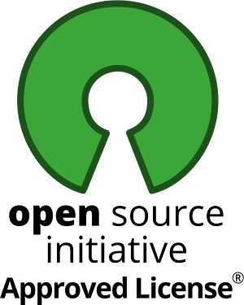

Es gibt viele gute Gründe, warum Unternehmen sich für Open-Source-Software entscheiden.
Aber wie wirkt sich diese Wahl auf den Datenschutz und die Transparenz aus?

<!-- more -->

Datenschutz und Open-Source sind zwei Konzepte, die oft miteinander in Konflikt stehen.
Auf der einen Seite steht der Schutz der Privatsphäre und die Sicherung sensibler persönlicher Daten,
auf der anderen Seite die Freiheit und Transparenz von Open-Source-Software.

  

    
  

  

    <h2>Datenschutz als beschützendes Konzept</h2>
    

      Der Schutz insbesondere von persönlichen Daten ist ein wichtiges Anliegen,
das in den letzten Jahren immer stärker in den Fokus der Öffentlichkeit gerückt ist.
Nicht zuletzt wegen der Anforderungen der Datenschutz-Grundverordnung.
Durch die zunehmende Digitalisierung und den stetig wachsenden Datenfluss ist es für Unternehmen und Organisationen
immer wichtiger geworden, Datenschutzmaßnahmen zu implementieren und zu dokumentieren, um die Privatsphäre der
Mitarbeitenden zu schützen.
Gleichzeitig stellt sie diese Anforderung vor große Herausforderungen, da nicht bei jedem digitalen Prozess ersichtlich
ist, wie personenbezogene Daten verarbeitet werden.
    

  

## Open-Source als offenes Konzept

Open-Source-Software hingegen basiert auf der Idee, dass der Quellcode der Software frei zugänglich ist. Versierte
Softwareentwickler haben somit einen Einblick, sowohl in die Codequalität als auch in die Verarbeitungsprozesse der
Daten.
Diese Offenheit und Kontrollierbarkeit bewirkt, dass Kritik expliziter Teil der Softwareevolution ist und aus diesem
Grund Software mit einem hohen Mindest-Qualitätsstandard bereitgestellt wird.

## Wie sich beide Konzepte ergänzen 

Auf den ersten Blick könnte man denken, dass Open-Source-Software und Datenschutz unvereinbare Konzepte sind.
Schließlich könnte jeder Nutzer den Quellcode einsehen und möglicherweise persönliche Daten ausspähen.
Doch tatsächlich kann Open-Source-Software dazu beitragen, den Datenschutz zu stärken.

Ein Missverständnis ist oft, dass der Quellcode Anwendungsdaten der Benutzenden offenbart. 
Daten werden aber in der Datenbank gespeichert und der Quellcode beschreibt nur, wie diese verarbeitet werden. 
Damit können die offensichtlichen datenverarbeitenden Prozesse auch in das Datenschutzkonzept des Unternehmens übernommen werden.  

Durch die Transparenz und Offenheit des Quellcodes können Sicherheitslücken und Schwachstellen leichter identifiziert
und behoben werden.
Die vorhandene Feedbackkultur der aktiven Community hat dabei eine treibende Kraft, da sie die Software selbst im
Einsatz hat.
Dieser Umstand führt dazu, dass potentielle Ungereimtheiten schneller entdeckt und kompetent diskutiert und behoben
werden.

  

    
  

  

    <h2> Datenschutz der Open-Source-Software urlaubsverwaltung.cloud</h2>
    

        In der Urlaubsverwaltung werden sensible personenbezogene Daten verarbeitet. Schon aus diesem Grund sind Datenschutz und 
        Sicherheit ein inhärenter Bestandteil bei der Konzeption und Umsetzung von Software und Architektur der Urlaubsverwaltung.
        Die verwendeten Open-Source-Lizenzen sind von der Open-Source-Software Initiative verifiziert.
        Es wird immer verschlüsselt kommuniziert und Prozesse werden anhand der Frage des "berechtigten Interesse" validiert.
    

        <h2> Open-Source-Software als Entscheidungskriterium </h2>
        

            Open-Source-Software ist eine wesentliche Entwicklung, wenn es um Datenschutz, Transparenz und Sicherheit geht. 
            Es ermöglicht jedem Benutzer, die Quellcodes anzusehen und zu überprüfen, was zu mehr Vertrauen in die Technologie führt. 
            Open-Source ist ein Schlüsselkonzept der Verbindung von Menschen in der digitalen Welt und verändert die Art und Weise, 
            wie wir unsere Daten schützen können. 
        

  

