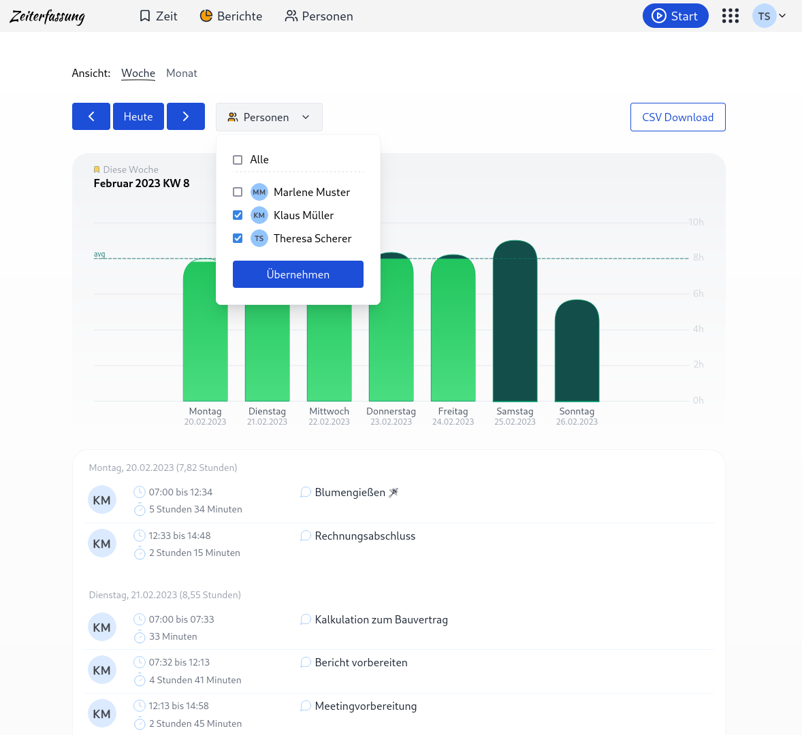
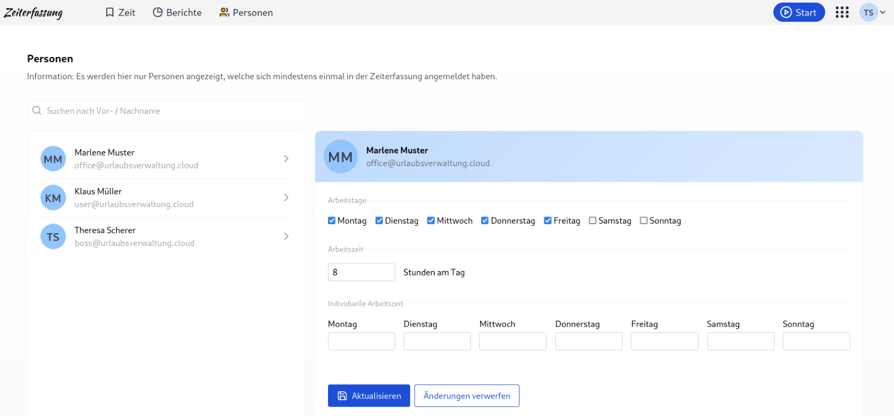
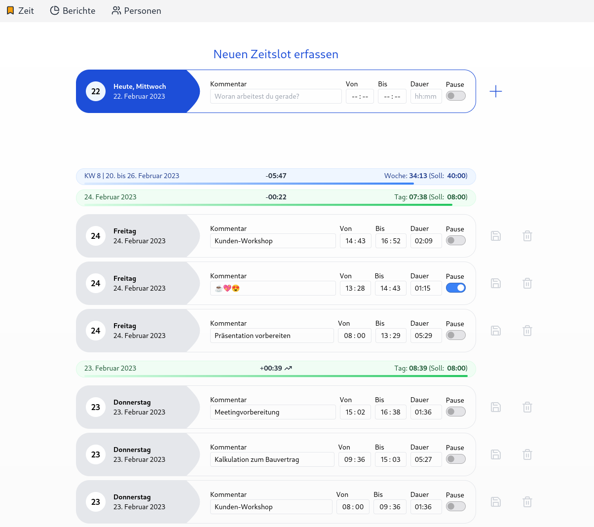
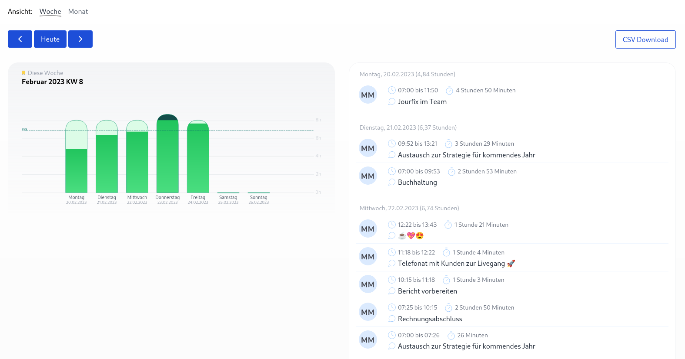
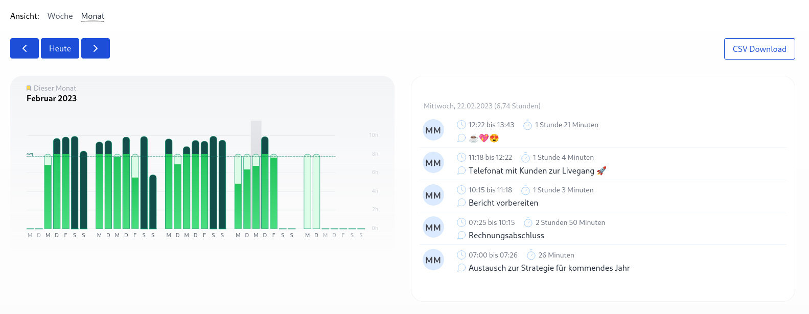

Wir haben in der neuen Version der Zeiterfassung viel vom eurem Feedback umsetzen können.
Mit dabei sind verbesserte Einsichten in die geleisteten Stunden deiner Mitarbeitenden und auch die Erfassung von
Sollstunden bzw. die dazugehörige Pflege von Arbeitszeiten.

<!-- more -->

## Geleisteten Stunden von Mitarbeitenden

Unter Berichte konnten bereits die geleisteten Stunden pro Mitarbeitende eingesehen werden in Form einer Grafik sowie 
als CSV-Download. Diese Ansicht wurde nun erweitert, um die einzelnen Zeitbuchungen der Mitarbeitenden. Diese können 
nach Mitarbeitenden selektiert anzeigt werden. Auch die Auswahl von mehreren Mitarbeitenden ist möglich. Zusätzlich 
erhält mal durch die Auswahl des jeweiligen Tags schnell einen Überblick wann und wie tatsächlich gearbeitet wurde.

    <figure>
        <picture>
            <source srcset="zeiterfassung-person-details.avif" type="image/avif" />
            
        </picture>
        <figcaption class="text-sm text-center">Auswahl einer Person zur Ansicht der gebuchten Zeiten</figcaption>
    </figure>

## Arbeitszeiten festlegen

Die Zeiterfassung wurde um die Konfiguration von Arbeitszeiten erweitert. Diese können nun pro Mitarbeitende eingestellt werden. 
Es ist möglich für die ganze Woche, als auch feingranular pro Tag die Arbeitszeiten festzulegen. 
Diese Einstellung kann durch eine Person mit der entsprechenden Berechtigung vorgenommen werden.

    <figure>
        <picture>
            <source srcset="zeiterfassung-workingtime.avif" type="image/avif" />
            
        </picture>
        <figcaption class="text-sm text-center">Einstellung der Arbeitszeiten pro Mitarbeitenden</figcaption>
    </figure>

Die gepflegten Arbeitszeiten fließen nach der Konfiguration in die Berechnung der Plan- und tatsächliche erfassten Arbeitszeiten mit ein.

## Wie viel habe ich diese Woche schon geschafft?

Die Arbeitszeiten fliesen nun auch in die Zeiterfassung mit ein. So ist jetzt auf Tages- als auch auf Wochenebene einsehbar wie viel Zeit 
bereits von der geplanten Arbeitszeit geleistet wurde. Auch Überstunden sind in der Darstellung direkt sichtbar.

    <figure>
        <picture>
            <source srcset="zeiterfassung-new-timeslot.avif" type="image/avif" />
            
        </picture>
        <figcaption class="text-sm text-center">Darstellung der geplanten Arbeitszeiten und der geleisteten Stunden</figcaption>
    </figure>

In den Berichten ist ebenfalls der Vergleich von Planarbeitszeiten und tatsächlich geleisteten Stunden grafisch aufbereitet 
und können sowohl auf Wochen- als auch Monatsbasis aggregiert angezeigt werden.

    <figure>
        <picture>
            <source srcset="zeiterfassung-report-week.avif" type="image/avif" />
            
        </picture>
        <figcaption class="text-sm text-center">Wöchentliche Berichte mit grafischer Darstellung der geplanten Arbeitszeiten</figcaption>
    </figure>

    <figure>
        <picture>
            <source srcset="zeiterfassung-report-month.avif" type="image/avif" />
            
        </picture>
        <figcaption class="text-sm text-center">Monatliche Berichte mit grafischer Darstellung der geplanten Arbeitszeiten</figcaption>
    </figure>

## Roadmap zur Zeiterfassung

Folgende Features sind außerdem geplant für die Zeiterfassung:

* Automatische Synchronisation von Abwesenheiten aus der Urlaubsverwaltung
* Automatische Synchronisation von Überstunden in die Urlaubsverwaltung
* Automatisierte Berechnung der Pausenzeiten
* Projektzeiterfassung
