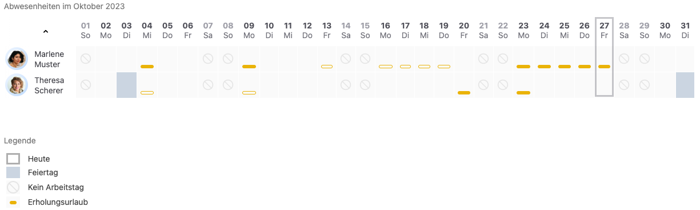
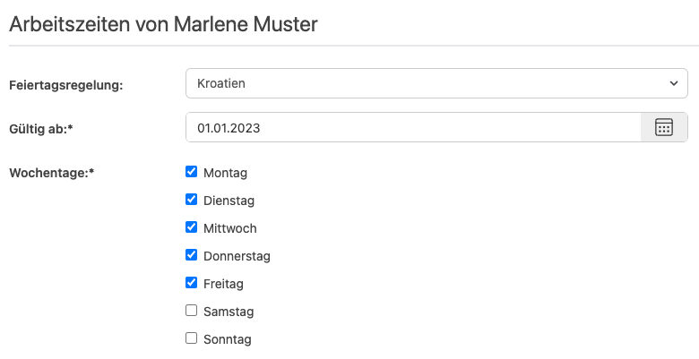

Homeoffice im Ausland? Workation? Oder einfach nur Urlaub? Die Urlaubsverwaltung bietet nun auch Feiertage für Kroatien an.

<!-- more -->

## Herausforderungen bei länderübergreifender Zusammenarbeit im Unternehmen

Nicht zuletzt aufgrund der Pandemie hat sich die Arbeitswelt stark verändert. Neue Modelle mit Fokus auf verteilte Arbeit 
wie Homeoffice im Ausland und Workation sind in den Fokus gerückt. 
Somit arbeiten Mitarbeitende nicht erst nach einer Expansion ins Ausland verteilt, sondern schon deutlich früher je nach Organisationsmodell.
Eine große Herausforderung dabei ist die Kommunikation und Koordination der Mitarbeitenden hinsichtlich ihrer Verfügbarkeit,
Arbeitszeiten und Urlaubszeiten, die sich je nach Land unterscheiden.

Urlaubsansprüche müssen individuell berechnet werden, da sie von den gesetzlichen Feiertagen abhängen. 
Eine Übersicht muss die individuellen Abwesenheiten im Kontext der Mitarbeitenden DSGVO-konform darstellen,
um nicht nur eine aktuelle Übersicht für die nächste Abwesenheit zu bieten, sondern auch die langfristige Planung von 
Projekten und Aufgaben zu ermöglichen.

Die Urlaubsverwaltung.cloud hat sich diesen Herausforderungen gestellt und bietet sowohl automatisierte Berechnungen
der Urlaubsansprüche als auch eine übersichtliche Darstellung der Abwesenheiten der Mitarbeitenden.

    <figure>
        <picture>
            <source srcset="kalenderuebersicht_Feiertage.avif" type="image/avif" />
            
        </picture>
        <figcaption class="text-sm text-center">Individuelle Feiertage pro Mitarbeitenden in der Kalenderübersicht</figcaption>
    </figure>

## Jetzt auch für Kroatien 🇭🇷

Neben allen Bundesländern aus Deutschland und Österreich, den Kantonen aus der Schweiz, den Regionen aus dem vereiningten Königreich,
Malta, Italien und Griechenland sind nun auch die Feiertage aus Kroatien verfügbar. Dobrodošla Hrvatska!

    <figure>
        <picture>
            <source srcset="arbeitszeiten_Kroatien.avif" type="image/avif" />
            
        </picture>
        <figcaption class="text-sm text-center">Feiertagsregelung in den Arbeitszeiten: jetzt mit Kroatien</figcaption>
    </figure>

Dir Fehlen Feiertage für ein bestimmtes Land? Dann <a href="mailto:info@urlaubsverwaltung.cloud?subject=Feiertage">melde</a> dich bei uns, wir freuen uns über dein Feedback!
