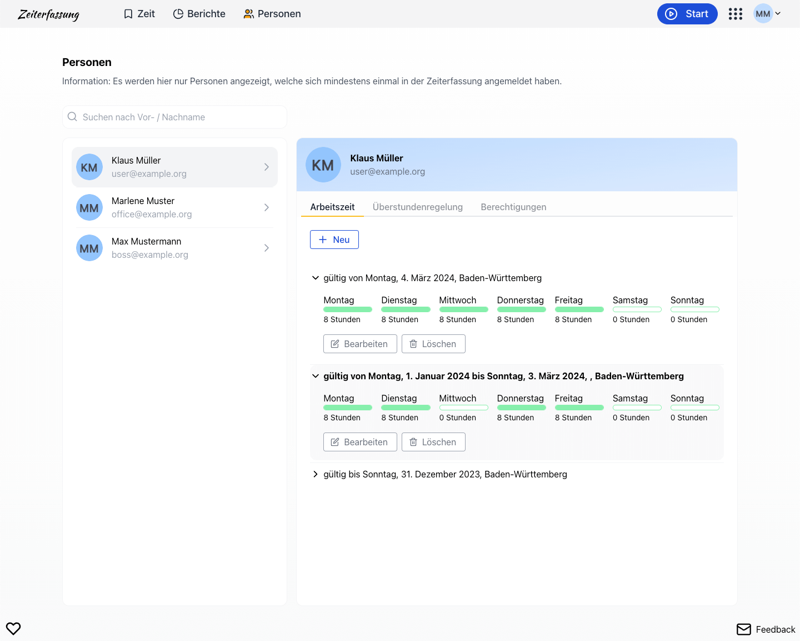
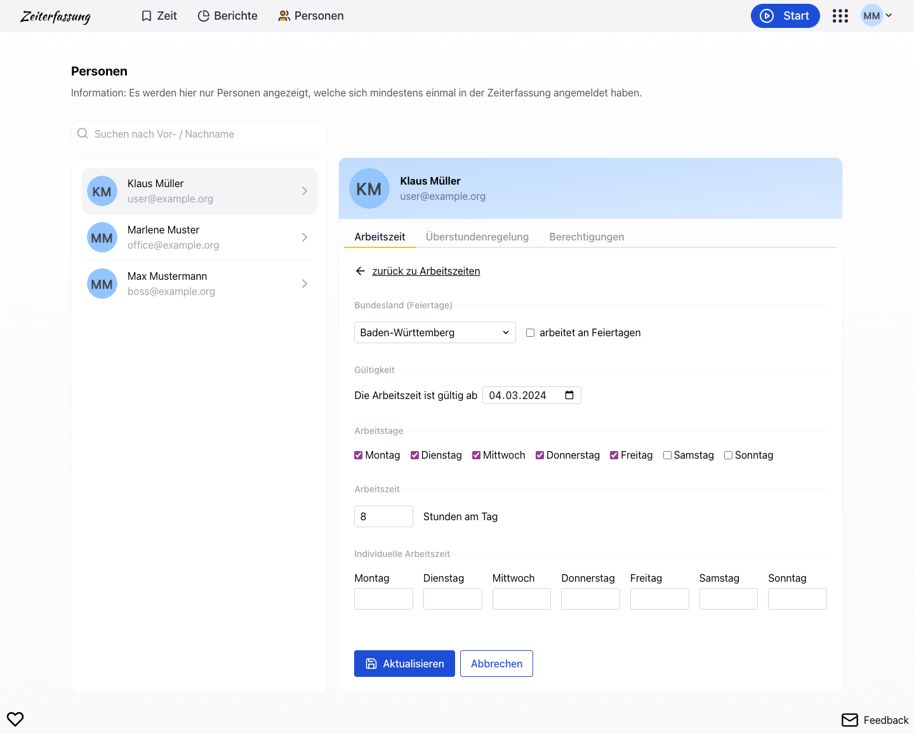
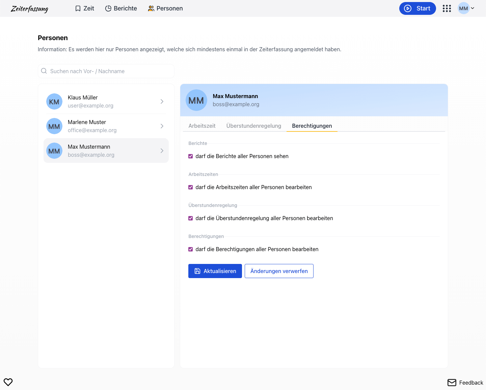

Zum Jahresstart gibt es spannende Aktualisierungen bei der Zeiterfassung:

- flexible Arbeitszeiten für Vertragsänderungen
- Bundesländer und Feiertagsregelungen individuell anpassen
- Berechtigungen direkt in der Anwendung vergeben

<!-- more -->

## Flexible Arbeitszeiten abbilden

Ab sofort könnt ihr mühelos mehrere Arbeitszeiten erstellen und verwalten. Sei es aufgrund von Teilzeitvereinbarungen,
Vollzeitbeschäftigungen oder anderen Vertragsänderungen. Die Anwendung gibt euch auf der Personenübersichtseite eine
kompakte Ansicht damit ihr stets den Überblick behaltet.

    <figure>
        <picture>
            <source srcset="arbeitszeiten.avif" type="image/avif" />
            
        </picture>
        <figcaption class="text-sm text-center">Weitere Arbeitszeiten erstellen und verwalten für Vertragsänderungen.</figcaption>
    </figure>
    <figure>
        <picture>
            <source srcset="arbeitszeiten_edit.avif" type="image/avif" />
            
        </picture>
        <figcaption class="text-sm text-center">Bundesland und Feiertagsregelung individuell pflegen.</figcaption>
    </figure>

## Individuelle Feiertagsregelung pro Bundesland

Bei verteilten Teams ist es nicht selten, dass unterschiedliche Anforderungen an Bundesländer und Feiertage existieren.
Für Personen, die in Baden-Württemberg angestellt sind, gelten andere Feiertage als z. B. in Hessen. Daher könnt ihr ab
sofort das Bundesland und die Feiertagsregelung für jede Person individuell anpassen.

Die Zeiterfassung unterstützt dabei nicht nur deutsche Bundesländer, sondern auch viele andere Länder aus Europa.

- 🇩🇪 Deutschland
- 🇦🇹 Österreich
- 🇨🇭 Schweiz
- 🇲🇹 Malta
- 🇭🇷 Kroatien
- 🇮🇹 Italien
- 🇬🇧 Vereinigtes Königreich
- 🇬🇷 Griechenland
- 🇳🇱 Niederlande
- 🇪🇸 Spanien

Dir fehlen Feiertage für ein bestimmtes Land? Dann melde dich bei uns am einfachsten
<a href="mailto:info@urlaubsverwaltung.cloud?subject=Feiertage">per E-Mail</a>, wir freuen uns über dein Feedback!

## Berechtigungen über die Anwendung vergeben

Wir freuen uns, euch ab sofort die Möglichkeit zu geben, direkt in der Anwendung die Berechtigungen von Personen
pflegen zu können. Egal ob Teamleiter, Mitarbeiter oder Administrator - ihr habt die Möglichkeit, die Zugriffsrechte
ganz bequem und sicher anzupassen, ohne die Anwendung verlassen zu müssen.

    <figure>
        <picture>
            <source srcset="berechtigungen.avif" type="image/avif" />
            
        </picture>
        <figcaption class="text-sm text-center">Berechtigungen einer Person direkt in der Anwendung pflegen.</figcaption>
    </figure>

Probiert die neuen Funktionalitäten gleich aus und gestaltet eure Arbeitszeit so, wir es für euch am besten passt!
Habt ihr weitere Anforderungen und Wünsche lasst es uns wissen. Urlaubsverwaltung.cloud ist euere Plattform! Schreibt
uns an <a href="mailto:info@urlaubsverwaltung.cloud">info@urlaubsverwaltung.cloud</a>
