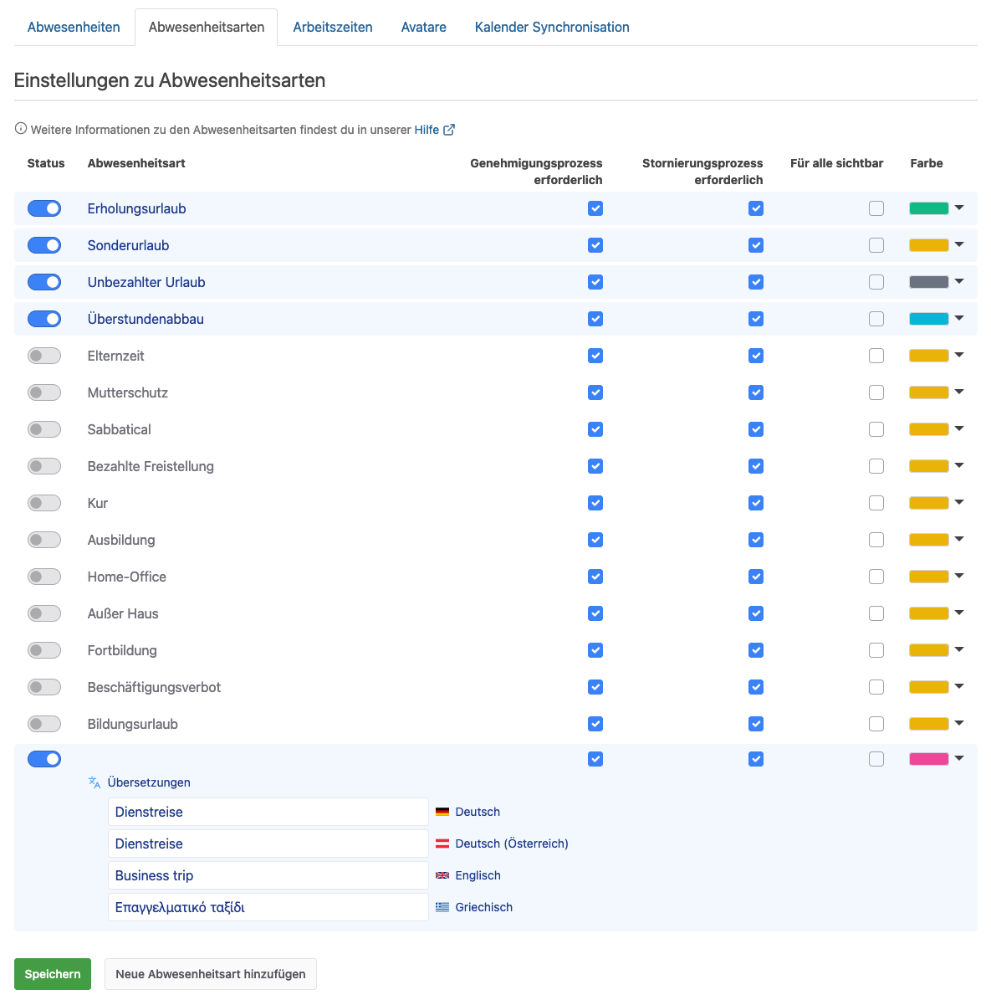
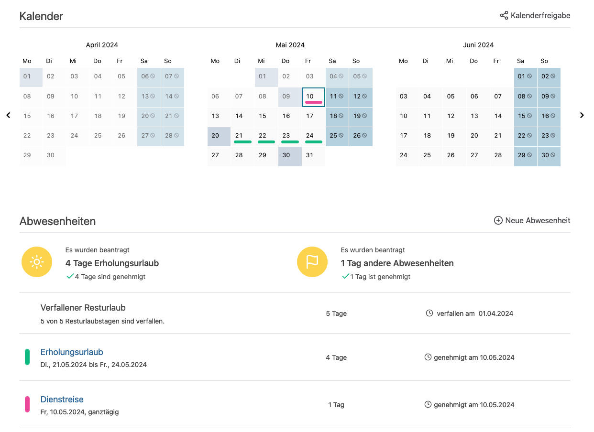
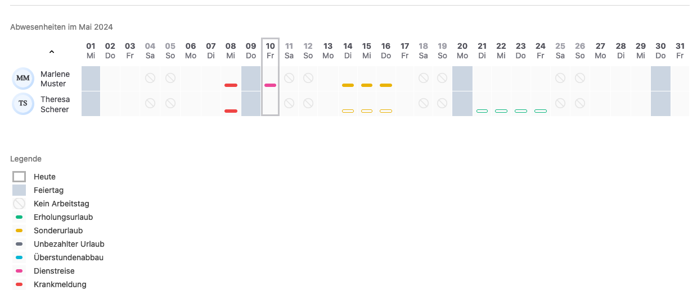

Mit einem riesigen Update der Urlaubsverwaltung stehen nun viele neue Funktionen und Verbesserungen bereit.
Einen Einblick in die neuen Funktionen geben wir euch in diesem Blog.

<!-- more -->

## Individuelle Abwesenheitsarten

    <figure>
        <picture>
            <source srcset="individuelle-abwesenheitsarten-einstellungen.avif" type="image/avif" />
            
        </picture>
        <figcaption class="text-sm text-center">Konfiguration von individuellen Abwesenheitsarten können nun in den Einstellungen hinterlegt werden</figcaption>
    </figure>

Gibt es im Unternehmen besondere Abwesenheitsarten? Je nach Branche und Ausrichtung sind nicht nur die Arbeitsbereiche stark unterschiedlich, sondern auch die Abwesenheitsarten können variieren. Daher bietet die Urlaubsverwaltung jetzt individuelle Abwesenheitsarten, um die betrieblichen Abläufe besser abbilden zu können. Die individuellen Abwesenheitsarten können als Mitarbeitende mit der Berechtigung Office in den Einstellungen unter Abwesenheitsarten gepflegt werden. Mit den entsprechenden Übersetzungen in Deutsch, Österreichisch, Englisch und Griechisch bist du bestens auch für deine internationalen Kollegen aufgestellt.

    <figure>
        <picture>
            <source srcset="individuelle-abwesenheitsarten-kalender.avif" type="image/avif" />
            
        </picture>
        <figcaption class="text-sm text-center">Der Kalender enthält die individuellen Abwesenheitsarten</figcaption>
    </figure>
        <figure>
        <picture>
            <source srcset="individuelle-abwesenheitsarten-abwesenheitsuebersicht.avif" type="image/avif" />
            
        </picture>
        <figcaption class="text-sm text-center">Beispiel für eine individuelle Abwesenheitsart in der Abwesenheitsübersicht</figcaption>
    </figure>

## Verbesserung der Menü-Struktur

Der Einstieg für das Erstellen von Anträgen, das Eintragen von Überstunden sowie die Krankmeldung erfolgt über den gleichen Einstieg oben rechts mit dem "+"-Zeichen. Im Zuge der neuen Version ist der Menü-Eintrag "Antrag stellen" entfernt worden, wodurch das Menü übersichtlicher wird.

## Verfallsdatum des Resturlaubs für ganzes Unternehmen

Es ist nun möglich das Verfallsdatum des Resturlaubs für das ganze Unternehmen festzulegen. Davon unabhängig können auch für einzelne Mitarbeitende individuelle Regelungen hinterlegt werden.

## Anlage von Abteilungen

Abteilungen können nun nicht mehr mit gleichen Namen doppelt angelegt werden, um Missverständnisse zu vermeiden.

## Exchange Kalenderintegration entfernt

Die Kalenderintegration für Exchange (EWS) wurde von Microsoft abgekündigt und im Zuge dessen aus der Urlaubsverwaltung entfernt. Zur Synchronisation von Abwesenheiten kann die Kalenderintegration via [abonnierten ICal-Kalender](https://urlaubsverwaltung.cloud/hilfe/kalender/) genutzt werden.

## Vereinfachter Ablauf bei Korrektur von Anträgen

Als Mitarbeitende mit der Berechtigung Office ist es nun möglich Anträge jeder Zeit zu editieren. Damit ist es nicht mehr nötig, z.B. bei einer Anpassung auf Grund von Krankheit, eine Stornierung des Antrags durchzuführen, um den korrigierten Zeitraum zu erfassen.

## Mehr Durchblick beim Start!

Gerade beim Loslegen mit der Urlaubsverwaltung kommt es vor, dass zur Datenübernahme die Pflege von vergangenen oder auch zukünftigen Abwesenheiten relevant wird. Wir haben hierfür die Standardwerte erhöht, sodass die Anzahl der Monate in die Vergangenheit als auch in die Zukunft höher ist. Diese Standardwerte können natürlich in den Einstellungen nach den Bedürfnissen der eigenen Organisation angepasst werden.
