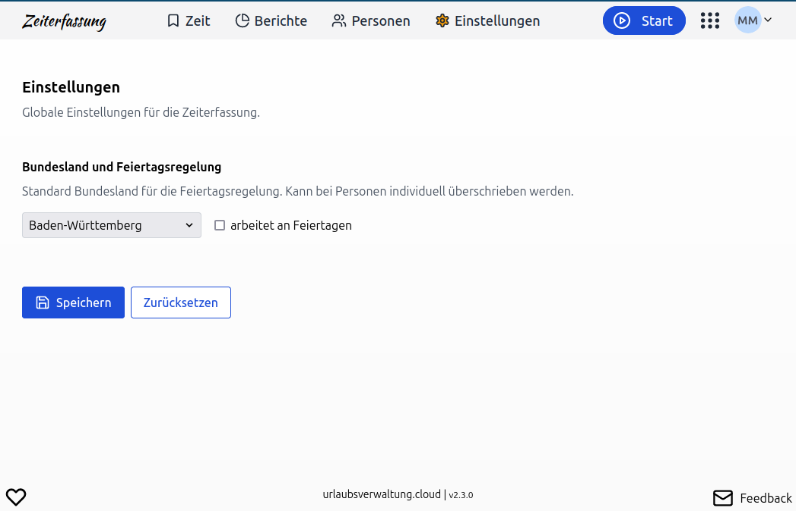

Globale Feiertagsregelungen und Arbeitszeiten zentral für dein Unternehmen festlegen. Diese Einstellungen gelten als Standard für alle Mitarbeitenden und können bei Bedarf individuell angepasst werden.

<!-- more -->

## Globale Feiertagsregelung

Bisher musste für jede Person einzeln das Bundesland und die dazugehörige Feiertagsregelung konfiguriert werden – eine mühsame Aufgabe bei einer größeren Anzahl von Mitarbeitern. Doch das ändert sich jetzt: Mit den neuen globalen Einstellungen kannst du ab sofort länderspezifische Feiertage und Arbeitsregelungen zentral für dein gesamtes Unternehmen festlegen.

    <figure>
        <picture>
            <source srcset="globale-feiertagsregelung-konfiguration.avif" type="image/avif" />
            
        </picture>
        <figcaption class="text-sm text-center">Konfiguration der globalen Feiertagsregelung in der Zeiterfassung</figcaption>
    </figure>

Konfiguriere einmalig, ob an Feiertagen gearbeitet wird oder nicht, und lege das Bundesland für die Feiertagsregelung fest. Diese globalen Einstellungen gelten dann als Standard für alle Mitarbeitenden und können bei Bedarf individuell überschrieben werden. Spare Zeit und vereinfache die Zeiterfassung – ganz ohne Kompromisse bei der Genauigkeit.
