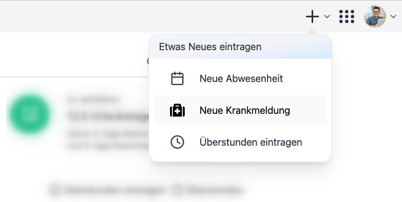
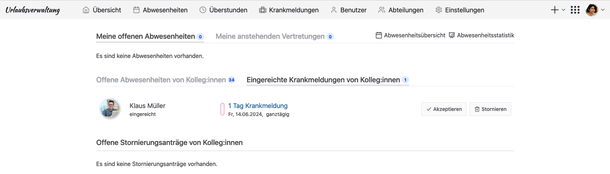
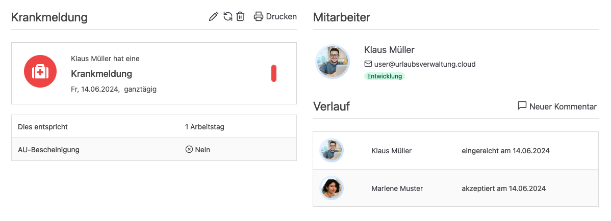

Krankmelden direkt über die Urlaubsverwaltung. Spar dir den Anruf bei deinem Chef und melde dich krank direkt über die urlaubsverwaltung.cloud.

<!-- more -->

## Krankmeldung selbst eintragen

Mit der neuen Version der Urlaubsverwaltung.cloud können jetzt auch die Mitarbeitenden selbst ihre Krankmeldung eintragen. Sobald eine Krankmeldung eingereicht wurde, werden alle Personen mit der Berechtigung „Office” oder „Pflege von Krankmeldungen” benachrichtigt. Sie können die Krankmeldung dann für die Organisation annehmen und z. B. in nachgelagerten Prozessen einfließen lassen.

### Der Ablauf der Einreichung

Jetzt mal Schritt für Schritt. Wie kann ich die Krankmeldung selbst eintragen? Nach dem dein Office die Konfiguration vorgenommen hat, kannst du als Mitarbeitende einfach über das „+“-Zeichen neben einer Abwesenheit auch eine Krankmeldung eintragen. Mehr zur Konfiguration der urlaubsverwaltung.cloud findest du in unserer [Hilfe zu Krankmeldungen](https://urlaubsverwaltung.cloud/hilfe/krankmeldungen/#kann-eine-mitarbeitende-die-krankmeldung-selbst-einreichen).

    <figure>
        <picture>
            <source srcset="user-neue-krankmeldung.avif" type="image/avif" />
            
        </picture>
        <figcaption class="text-sm text-center">Krankmeldung erstellen als Mitarbeitende</figcaption>
    </figure>

Mitarbeitende mit der Berechtigung „Office” oder „Pflege von Krankmeldungen” bekommen jetzt eine Benachrichtigung, dass eine neue Krankmeldung eingereicht wurde. Sie können diese im Bereich „Abwesenheiten” unter „Eingereichte Krankmeldungen von Kolleg:innen” einsehen. Hier gibt es jetzt die Möglichkeit, die Einreichung direkt anzunehmen oder auch zu stornieren. Wenn du die Krankmeldung annimmst, dann wissen auch die Kollegen der erkrankten Person, dass sie abwesend ist. Außerdem kannst du jetzt nachgelagerte Prozesse in der Organisation anstoßen, zum Beispiel in der Lohnbuchhaltung.

    <figure>
        <picture>
            <source srcset="office-eingereichte-krankmeldungen.avif" type="image/avif" />
            
        </picture>
        <figcaption class="text-sm text-center">Mitarbeitende mit der Berechtigung „Office” oder „Pflege von Krankmeldungen” bekommen eingereichte Krankmeldungen angezeigt</figcaption>
    </figure>

An einer Krankmeldung ist für alle Beteiligte sichtbar, wer die Krankmeldung eingereicht hat und wer sie danach angenommen hat.

    <figure>
        <picture>
            <source srcset="verlauf-krankmeldung.avif" type="image/avif" />
            
        </picture>
        <figcaption class="text-sm text-center">Der Verlauf an einer Krankmeldung zeigt die Einreichung sowie das Akzeptieren einer Krankmeldung</figcaption>
    </figure>

In den nächsten Versionen der urlaubsverwaltung.cloud werden wir uns noch mehr ins Zeug legen und das Ganze weiter verbessern und ausbauen. Dabei wollen wir vor allem darauf achten, dass die Funktion einfacher zu bedienen ist und wir sie noch besser an eure Bedürfnisse anpassen.

## Zusammenfassen und Verlängern

Doch einen Tag länger krank gewesen? Mehrere Krankmeldungen hintereinander aus dem gleichen Grund? Dafür werden wir für den Mitarbeitenden die Möglichkeit schaffen, um eine bestehende Krankmeldung ohne viel Aufwand zu verlängern. Auch als Person mit der Berechtigung „Office” oder „Pflege von Krankmeldungen” werden wir in dem Zuge es ermöglichen Krankmeldungen zusammenzufassen.

## Vereinfachte Krankmeldung

Wenn ich krank im Bett liege, möchte ich so einfach wie möglich die Krankmeldung loswerden, ohne 1000 Fragen beantworten zu müssen. Deshalb werden wir die Krankmeldung weiter vereinfachen, damit ich mich auf das Wesentliche konzentrieren kann: Gesund werden. 😊

Wir freuen uns über dein Feedback an <a href="mailto:info@urlaubsverwaltung.cloud?subject=Feedback%20Krankmeldung%20durch%20Mitarbeitende">info@urlaubsverwaltung.cloud</a>.
