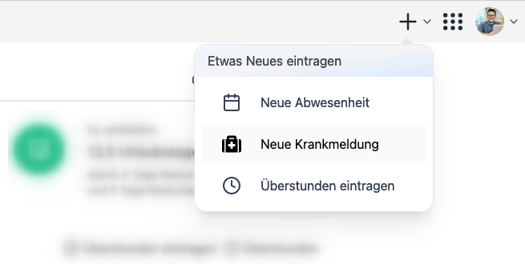
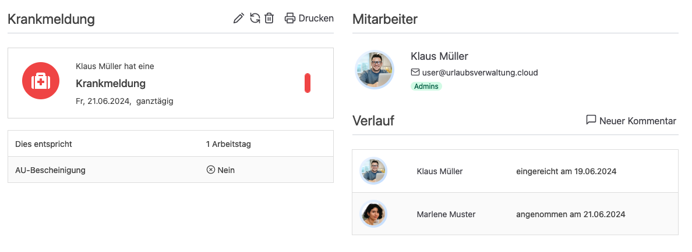
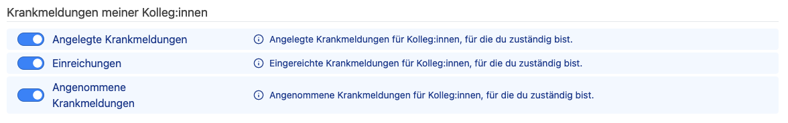

Krankmelden direkt über die Urlaubsverwaltung. Spar dir den Anruf bei deinem Chef und melde dich krank, direkt über die urlaubsverwaltung.cloud.

<!-- more -->

## Krankmeldung selbst eintragen

Mit der neuen Version der Urlaubsverwaltung.cloud können jetzt auch die Mitarbeitenden selbst ihre Krankmeldung eintragen. Sobald eine Krankmeldung eingereicht wurde, werden alle Personen mit der Berechtigung „Office” oder „Pflege von Krankmeldungen” benachrichtigt. Sie können die Krankmeldung dann für die Organisation annehmen und z. B. in nachgelagerten Prozessen einfließen lassen.

### Der Ablauf der Einreichung

Hier bekommst du eine Schritt-für-Schritt-Anleitung:

#### 1. Funktion aktivieren

Dein Office bzw. deine Personalabteilung kann die Funktion "Mitarbeiter-Krankmeldung" aktivieren/deaktivieren.
Mehr zur Konfiguration der urlaubsverwaltung.cloud findest du in unserer [Hilfe zu Krankmeldungen](https://urlaubsverwaltung.cloud/hilfe/krankmeldungen/#kann-eine-mitarbeitende-die-krankmeldung-selbst-einreichen).

#### 2. Krankmeldung eintragen

Jetzt kannst du als Mitarbeitende über das „+“-Zeichen neben einer Abwesenheit auch eine Krankmeldung eintragen.

    <figure>
        <picture>
            <source srcset="user-neue-krankmeldung.avif" type="image/avif" />
            
        </picture>
        <figcaption class="text-sm text-center">Krankmeldung erstellen als Mitarbeitende</figcaption>
    </figure>

#### 3. Benachrichtigung über neue Krankmeldung

Mitarbeitende mit der Berechtigung „Office” oder „Pflege von Krankmeldungen” bekommen jetzt eine Benachrichtigung, 
dass eine neue Krankmeldung eingereicht wurde. Sie können diese im Bereich „Abwesenheiten” unter 
„Eingereichte Krankmeldungen von Kolleg:innen” einsehen. Hier gibt es jetzt die Möglichkeit, 
die Einreichung direkt anzunehmen oder auch zu stornieren (für eine fälschlich eingetragene Krankmeldung). 
Wenn die Krankmeldung angenommen wird, bekommen auch alle Kollegen der erkrankten Person eine Benachrichtigung (konfigurierbar), 
dass sie abwesend ist (ohne Grundangabe oder Abwesenheitsart), analog zu allen anderen Abwesenheiten. 
Außerdem kann die Person aus dem Office jetzt nachgelagerte Prozesse in der Organisation anstoßen, 
zum Beispiel in der Lohnbuchhaltung.

    <figure>
        <picture>
            <source srcset="office-eingereichte-krankmeldungen.avif" type="image/avif" />
            
        </picture>
        <figcaption class="text-sm text-center">Mitarbeitende mit der Berechtigung „Office” oder „Pflege von Krankmeldungen” bekommen eingereichte Krankmeldungen angezeigt</figcaption>
    </figure>

An einer Krankmeldung ist für alle Berechtigten sichtbar, wann und wer die Krankmeldung eingereicht hat und wann und wer sie danach angenommen hat.

    <figure>
        <picture>
            <source srcset="verlauf-krankmeldung.avif" type="image/avif" />
            
        </picture>
        <figcaption class="text-sm text-center">Der Verlauf an einer Krankmeldung zeigt die Einreichung sowie das Annehmen einer Krankmeldung</figcaption>
    </figure>

## Benachrichtigungen

Neben der bereits bestehenden Benachrichtigung über neu erfasste Krankmeldungen durch pflegeberechtigte ist es nun auch möglich, 
sich als Mitarbeitende mit der Berechtigung „Office” oder „Pflege von Krankmeldungen" über eingereichte und angenommene 
Krankmeldungen benachrichtigen zu lassen.

    <figure>
        <picture>
            <source srcset="benachrichtigungen-krankmeldungen.avif" type="image/avif" />
            
        </picture>
        <figcaption class="text-sm text-center">Einstellung der Benachrichtigungen für eingereichte und angenommene Krankmeldungen</figcaption>
    </figure>

## Ausblick

In den nächsten Versionen der urlaubsverwaltung.cloud werden wir die Funktion verbessern und ausbauen.
Dabei wollen wir vor allem darauf achten, dass die Funktion einfacher zu bedienen ist und wir
sie noch besser an eure Bedürfnisse anpassen. Meldet euch gerne bei uns, wenn ihr Feedback habt oder mitgestalten wollt.

### Zusammenfassen und Verlängern

Doch einen Tag länger krank gewesen? Mehrere Krankmeldungen hintereinander aus dem gleichen Grund? Dafür werden wir für Mitarbeitende die Möglichkeit schaffen, eine bestehende Krankmeldung ohne viel Aufwand zu verlängern. Auch als Person mit der Berechtigung „Office” oder „Pflege von Krankmeldungen” werden wir in dem Zuge es ermöglichen, Krankmeldungen zusammenzufassen.

### Vereinfachte Krankmeldung

Wenn ich krank im Bett liege, möchte ich so einfach wie möglich die Krankmeldung loswerden, ohne 1000 Fragen beantworten zu müssen. Deshalb werden wir die Krankmeldung weiter vereinfachen, damit du dich auf das Wesentliche konzentrieren kann: Gesund werden. 😊

Wir freuen uns über dein Feedback an <a href="mailto:info@urlaubsverwaltung.cloud?subject=Feedback%20Krankmeldung%20durch%20Mitarbeitende">info@urlaubsverwaltung.cloud</a>.
