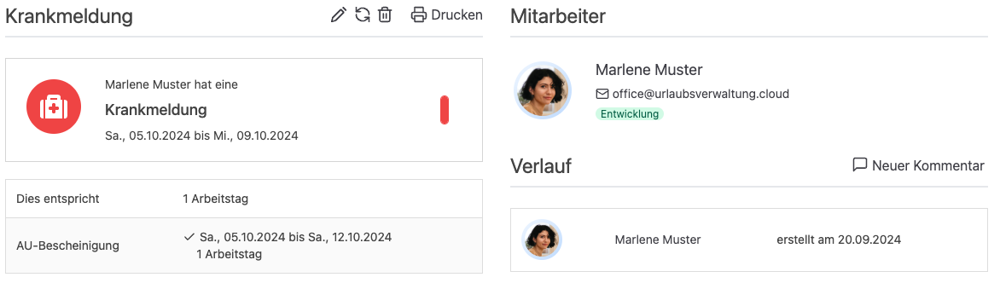

Der Zeitraum der AU Bescheinigung darf ab jetzt den Zeitraum der Krankmeldung überschreiten.
Außerdem können abgebaute Überstunden über die API abgerufen werden.

<!-- more -->

## AU-Bescheinigung Zeitraumvalidierung erweitert 

In der Urlaubsverwaltung ist es möglich einer Krankmeldung die Informationen einer AU-Bescheinigung wie zum Beispiel den Zeitraum hinzuzufügen. 
Wir haben dieser Funktion eine Validierung verpasst, um sicherzustellen, dass der Zeitraum der AU nicht den Zeitraum der Krankmeldung überschreitet,
da es üblich ist, dass die AU-Bescheinigung sowie die Krankmeldung zum gleichen Zeitpunkt endet. 

### Feedback und Anforderung von Kunden

Kürzlich haben wir Feedback von einem Kunden bekommen, dass diese Validierung bei ihnen zu einer Herausforderung führt, 
da es bei ihnen nicht unüblich ist, dass Mitarbeitende früher aus dem Krankenstand zurückkehren, wenn sie wieder arbeitsfähig sind.
In diesem Fall muss die Krankmeldung in der Urlaubsverwaltung gekürzt werden, die AU-Bescheinigung bleibt jedoch gleich. 

Warum ist das so?

Eine AU-Bescheinigung ist ein offizielles Dokument, welches von einem Arzt ausgestellt wird und die Arbeitsunfähigkeit 
eines Mitarbeitenden beurteilt und den Zeitraum bis zur Genesung einschätzt. Anhand dieser Informationen 
kann die Buchhaltung eine eAU abrufen. Der Zeitraum einer Krankmeldung kann an der AU-Bescheinigung ausgerichtet sein, ist aber nicht zwingend.

### Erweiterung der Funktion

Diese Anforderung entspricht einem validen Anwendungsfall, daher haben wir die Validierung angepasst.

    <figure>
        <picture>
            <source srcset="AU-Zeitraum.avif" type="image/avif" />
            <source srcset="AU-Zeitraum.webp" type="image/webp" />
            
        </picture>
        <figcaption class="text-sm text-center">Der Zeitraum der AU überschreitet den Zeitraum der Krankmeldung</figcaption>
    </figure>

Ab jetzt kann der Zeitraum der AU-Bescheinigung, den Zeitraum der Krankmeldung überschreiten. 

## Überstundenabbau via API

### Anforderung aus der OpenSource Community

Anwender unserer Software binden die Urlaubsverwaltung an, um die erhobenen Daten in anderen Systemen zu verwenden.
Eine Anfrage aus der OpenSource Community war es, abgebaute Überstunden über die API abrufbar zu machen, um in einem 
ügergreifenden Controlling Tool anzuzeigen.

### Implementierung durch OpenSource Community

Diesem Thema hat sich ein Entwickler aus der OpenSource Community angenommen und die Funktion implementiert, 
sodass wir sie direkt in der letzten Version der Urlaubsverwaltung veröffentlichen konnten.
Vielen Dank für Contribution!
