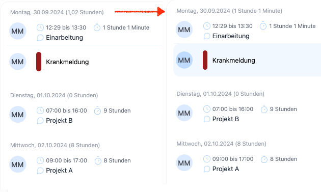
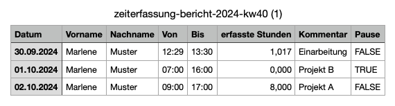

In der Berichtübersicht werden die Summen nicht mehr in Industriestunden, sondern lesbar dargestellt. 
Der CSV Export enthält jetzt auch die konkreten Arbeitszeiten.

<!-- more -->

## Verbesserte Darstellung in der Berichtübersicht  

In der Zeiterfassung werden unter dem Menüpunkt "Berichte" die erfassten Zeiten sowohl grafisch als auch tabellarisch dargestellt.
Die Summen der erfassten Zeiten wurden bisher in Industriestunden dargestellt, was für viele Anwender nicht intuitiv war.
Ab jetzt werden die Summen in Stunden und Minuten dargestellt, konsistent zu den Einträgen des ausgewählten Zeitraumes, 
was die Lesbarkeit deutlich verbessert.

    <figure>
        <picture>
            <source srcset="reformat-time.avif" type="image/avif" />
            <source srcset="reformat-time.webp" type="image/webp" />
            
        </picture>
        <figcaption class="text-sm text-center">Die Summer der Arbeitszeiten wird jetzt in Stunden und Minuten dargestellt</figcaption>
    </figure>

## CSV Export mit Arbeitszeiten

Der CSV Export enthält jetzt auch die konkreten Arbeitszeiten, die in der Zeiterfassung erfasst wurden.

    <figure>
        <picture>
            <source srcset="CSV-Export.avif" type="image/avif" />
            <source srcset="CSV-Export.webp" type="image/webp" />
            
        </picture>
        <figcaption class="text-sm text-center">Der CSV Export enthält jetzt auch die konkreten Arbeitszeiten</figcaption>
    </figure>

