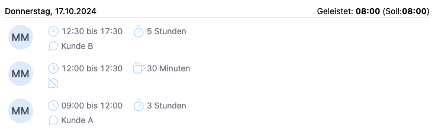

Im Release 2.10.0 der Zeiterfassung wurden kleine Veränderung in der Darstellung der Einträge im Bericht vorgenommen.
Neue Icons verdeutlichen ob es sich um eine Pause handelt und ob es einen Kommentar gibt.

<!-- more -->

## Neue Icons für die Beschreibung der Zeiteinträge in der Berichtübersicht

m Release 2.10.0 der Zeiterfassungssoftware wurden kleinere Anpassungen in der Darstellung der Berichte vorgenommen,
um die Benutzerfreundlichkeit zu verbessern. Besonders hervorzuheben ist die Einführung neuer Icons, die zusätzliche Informationen zu den Einträgen visuell unterstützen.

Zwei neue Icons bieten dabei mehr Klarheit:

Ein Pause-Icon zeigt auf einen Blick, wenn eine erfasste Zeit eine Pause darstellt.
Ein weiteres Kommentar-Icon macht deutlich, ob zu einem Zeiteintrag ein Kommentar hinterlegt wurde.
Durch diese visuellen Hinweise können Benutzer schneller erkennen, welche Einträge besondere Merkmale haben, was die Übersichtlichkeit der Berichte weiter steigert.

    <figure>
        <picture>
            <source srcset="KommentarPause.avif" type="image/avif" />
            <source srcset="KommentarPause.webp" type="image/webp" />
            
        </picture>
        <figcaption class="text-sm text-center">Zeiteinträge mit neuen Icons für Pausen und Kommentare</figcaption>
    </figure>

